# Online Shopper Intention Dataset

### CRIPS - DM Methodology
 1. Bussiness Understanding.
 2. Data Understanding. 
 3. Data Preparation.
 4. Modelling. 
 5. Evaluation. 
 6. Deplotment.

#### 1.Bussiness 
- The Data set hold user session data from an e-commerce website collected over a period of one year.
- The Session represent a unique user. 
- The goal is to 

#### 2.Data Understanding.


```python
import pandas as pd
import numpy as np
import matplotlib.pyplot as plt
import seaborn as sns
import os
from sklearn.model_selection import train_test_split
from sklearn.preprocessing import StandardScaler, OneHotEncoder, LabelEncoder
from sklearn.compose import ColumnTransformer
from sklearn.pipeline import Pipeline
from sklearn.ensemble import RandomForestClassifier
from sklearn.metrics import classification_report, confusion_matrix
from imblearn.over_sampling import SMOTE
from scipy.stats import chi2_contingency
from sklearn.impute import SimpleImputer
from sklearn.ensemble import GradientBoostingClassifier
from sklearn.metrics import classification_report, confusion_matrix, roc_auc_score, accuracy_score, roc_curve
from sklearn.metrics import silhouette_score

from sklearn.cluster import KMeans
```

##### 2.1 Load the dataset


```python
np.random.seed(96)
```


```python
df = pd.read_csv('../data/raw/online_shoppers_intention.csv')
```

##### 2.2 Display the basic information


```python
df.head(10)
```


<div>
<style scoped>
    .dataframe tbody tr th:only-of-type {
        vertical-align: middle;
    }

    .dataframe tbody tr th {
        vertical-align: top;
    }

    .dataframe thead th {
        text-align: right;
    }
</style>
<table border="1" class="dataframe">
  <thead>
    <tr style="text-align: right;">
      <th></th>
      <th>Administrative</th>
      <th>Administrative_Duration</th>
      <th>Informational</th>
      <th>Informational_Duration</th>
      <th>ProductRelated</th>
      <th>ProductRelated_Duration</th>
      <th>BounceRates</th>
      <th>ExitRates</th>
      <th>PageValues</th>
      <th>SpecialDay</th>
      <th>Month</th>
      <th>OperatingSystems</th>
      <th>Browser</th>
      <th>Region</th>
      <th>TrafficType</th>
      <th>VisitorType</th>
      <th>Weekend</th>
      <th>Revenue</th>
    </tr>
  </thead>
  <tbody>
    <tr>
      <th>0</th>
      <td>0</td>
      <td>0.0</td>
      <td>0</td>
      <td>0.0</td>
      <td>1</td>
      <td>0.000000</td>
      <td>0.200000</td>
      <td>0.200000</td>
      <td>0.0</td>
      <td>0.0</td>
      <td>Feb</td>
      <td>1</td>
      <td>1</td>
      <td>1</td>
      <td>1</td>
      <td>Returning_Visitor</td>
      <td>False</td>
      <td>False</td>
    </tr>
    <tr>
      <th>1</th>
      <td>0</td>
      <td>0.0</td>
      <td>0</td>
      <td>0.0</td>
      <td>2</td>
      <td>64.000000</td>
      <td>0.000000</td>
      <td>0.100000</td>
      <td>0.0</td>
      <td>0.0</td>
      <td>Feb</td>
      <td>2</td>
      <td>2</td>
      <td>1</td>
      <td>2</td>
      <td>Returning_Visitor</td>
      <td>False</td>
      <td>False</td>
    </tr>
    <tr>
      <th>2</th>
      <td>0</td>
      <td>0.0</td>
      <td>0</td>
      <td>0.0</td>
      <td>1</td>
      <td>0.000000</td>
      <td>0.200000</td>
      <td>0.200000</td>
      <td>0.0</td>
      <td>0.0</td>
      <td>Feb</td>
      <td>4</td>
      <td>1</td>
      <td>9</td>
      <td>3</td>
      <td>Returning_Visitor</td>
      <td>False</td>
      <td>False</td>
    </tr>
    <tr>
      <th>3</th>
      <td>0</td>
      <td>0.0</td>
      <td>0</td>
      <td>0.0</td>
      <td>2</td>
      <td>2.666667</td>
      <td>0.050000</td>
      <td>0.140000</td>
      <td>0.0</td>
      <td>0.0</td>
      <td>Feb</td>
      <td>3</td>
      <td>2</td>
      <td>2</td>
      <td>4</td>
      <td>Returning_Visitor</td>
      <td>False</td>
      <td>False</td>
    </tr>
    <tr>
      <th>4</th>
      <td>0</td>
      <td>0.0</td>
      <td>0</td>
      <td>0.0</td>
      <td>10</td>
      <td>627.500000</td>
      <td>0.020000</td>
      <td>0.050000</td>
      <td>0.0</td>
      <td>0.0</td>
      <td>Feb</td>
      <td>3</td>
      <td>3</td>
      <td>1</td>
      <td>4</td>
      <td>Returning_Visitor</td>
      <td>True</td>
      <td>False</td>
    </tr>
    <tr>
      <th>5</th>
      <td>0</td>
      <td>0.0</td>
      <td>0</td>
      <td>0.0</td>
      <td>19</td>
      <td>154.216667</td>
      <td>0.015789</td>
      <td>0.024561</td>
      <td>0.0</td>
      <td>0.0</td>
      <td>Feb</td>
      <td>2</td>
      <td>2</td>
      <td>1</td>
      <td>3</td>
      <td>Returning_Visitor</td>
      <td>False</td>
      <td>False</td>
    </tr>
    <tr>
      <th>6</th>
      <td>0</td>
      <td>0.0</td>
      <td>0</td>
      <td>0.0</td>
      <td>1</td>
      <td>0.000000</td>
      <td>0.200000</td>
      <td>0.200000</td>
      <td>0.0</td>
      <td>0.4</td>
      <td>Feb</td>
      <td>2</td>
      <td>4</td>
      <td>3</td>
      <td>3</td>
      <td>Returning_Visitor</td>
      <td>False</td>
      <td>False</td>
    </tr>
    <tr>
      <th>7</th>
      <td>1</td>
      <td>0.0</td>
      <td>0</td>
      <td>0.0</td>
      <td>0</td>
      <td>0.000000</td>
      <td>0.200000</td>
      <td>0.200000</td>
      <td>0.0</td>
      <td>0.0</td>
      <td>Feb</td>
      <td>1</td>
      <td>2</td>
      <td>1</td>
      <td>5</td>
      <td>Returning_Visitor</td>
      <td>True</td>
      <td>False</td>
    </tr>
    <tr>
      <th>8</th>
      <td>0</td>
      <td>0.0</td>
      <td>0</td>
      <td>0.0</td>
      <td>2</td>
      <td>37.000000</td>
      <td>0.000000</td>
      <td>0.100000</td>
      <td>0.0</td>
      <td>0.8</td>
      <td>Feb</td>
      <td>2</td>
      <td>2</td>
      <td>2</td>
      <td>3</td>
      <td>Returning_Visitor</td>
      <td>False</td>
      <td>False</td>
    </tr>
    <tr>
      <th>9</th>
      <td>0</td>
      <td>0.0</td>
      <td>0</td>
      <td>0.0</td>
      <td>3</td>
      <td>738.000000</td>
      <td>0.000000</td>
      <td>0.022222</td>
      <td>0.0</td>
      <td>0.4</td>
      <td>Feb</td>
      <td>2</td>
      <td>4</td>
      <td>1</td>
      <td>2</td>
      <td>Returning_Visitor</td>
      <td>False</td>
      <td>False</td>
    </tr>
  </tbody>
</table>
</div>


```python
df.tail()
```


<div>
<style scoped>
    .dataframe tbody tr th:only-of-type {
        vertical-align: middle;
    }

    .dataframe tbody tr th {
        vertical-align: top;
    }

    .dataframe thead th {
        text-align: right;
    }
</style>
<table border="1" class="dataframe">
  <thead>
    <tr style="text-align: right;">
      <th></th>
      <th>Administrative</th>
      <th>Administrative_Duration</th>
      <th>Informational</th>
      <th>Informational_Duration</th>
      <th>ProductRelated</th>
      <th>ProductRelated_Duration</th>
      <th>BounceRates</th>
      <th>ExitRates</th>
      <th>PageValues</th>
      <th>SpecialDay</th>
      <th>Month</th>
      <th>OperatingSystems</th>
      <th>Browser</th>
      <th>Region</th>
      <th>TrafficType</th>
      <th>VisitorType</th>
      <th>Weekend</th>
      <th>Revenue</th>
    </tr>
  </thead>
  <tbody>
    <tr>
      <th>12325</th>
      <td>3</td>
      <td>145.0</td>
      <td>0</td>
      <td>0.0</td>
      <td>53</td>
      <td>1783.791667</td>
      <td>0.007143</td>
      <td>0.029031</td>
      <td>12.241717</td>
      <td>0.0</td>
      <td>Dec</td>
      <td>4</td>
      <td>6</td>
      <td>1</td>
      <td>1</td>
      <td>Returning_Visitor</td>
      <td>True</td>
      <td>False</td>
    </tr>
    <tr>
      <th>12326</th>
      <td>0</td>
      <td>0.0</td>
      <td>0</td>
      <td>0.0</td>
      <td>5</td>
      <td>465.750000</td>
      <td>0.000000</td>
      <td>0.021333</td>
      <td>0.000000</td>
      <td>0.0</td>
      <td>Nov</td>
      <td>3</td>
      <td>2</td>
      <td>1</td>
      <td>8</td>
      <td>Returning_Visitor</td>
      <td>True</td>
      <td>False</td>
    </tr>
    <tr>
      <th>12327</th>
      <td>0</td>
      <td>0.0</td>
      <td>0</td>
      <td>0.0</td>
      <td>6</td>
      <td>184.250000</td>
      <td>0.083333</td>
      <td>0.086667</td>
      <td>0.000000</td>
      <td>0.0</td>
      <td>Nov</td>
      <td>3</td>
      <td>2</td>
      <td>1</td>
      <td>13</td>
      <td>Returning_Visitor</td>
      <td>True</td>
      <td>False</td>
    </tr>
    <tr>
      <th>12328</th>
      <td>4</td>
      <td>75.0</td>
      <td>0</td>
      <td>0.0</td>
      <td>15</td>
      <td>346.000000</td>
      <td>0.000000</td>
      <td>0.021053</td>
      <td>0.000000</td>
      <td>0.0</td>
      <td>Nov</td>
      <td>2</td>
      <td>2</td>
      <td>3</td>
      <td>11</td>
      <td>Returning_Visitor</td>
      <td>False</td>
      <td>False</td>
    </tr>
    <tr>
      <th>12329</th>
      <td>0</td>
      <td>0.0</td>
      <td>0</td>
      <td>0.0</td>
      <td>3</td>
      <td>21.250000</td>
      <td>0.000000</td>
      <td>0.066667</td>
      <td>0.000000</td>
      <td>0.0</td>
      <td>Nov</td>
      <td>3</td>
      <td>2</td>
      <td>1</td>
      <td>2</td>
      <td>New_Visitor</td>
      <td>True</td>
      <td>False</td>
    </tr>
  </tbody>
</table>
</div>


```python
df.info()
```

    <class 'pandas.core.frame.DataFrame'>
    RangeIndex: 12330 entries, 0 to 12329
    Data columns (total 18 columns):
     #   Column                   Non-Null Count  Dtype  
    ---  ------                   --------------  -----  
     0   Administrative           12330 non-null  int64  
     1   Administrative_Duration  12330 non-null  float64
     2   Informational            12330 non-null  int64  
     3   Informational_Duration   12330 non-null  float64
     4   ProductRelated           12330 non-null  int64  
     5   ProductRelated_Duration  12330 non-null  float64
     6   BounceRates              12330 non-null  float64
     7   ExitRates                12330 non-null  float64
     8   PageValues               12330 non-null  float64
     9   SpecialDay               12330 non-null  float64
     10  Month                    12330 non-null  object 
     11  OperatingSystems         12330 non-null  int64  
     12  Browser                  12330 non-null  int64  
     13  Region                   12330 non-null  int64  
     14  TrafficType              12330 non-null  int64  
     15  VisitorType              12330 non-null  object 
     16  Weekend                  12330 non-null  bool   
     17  Revenue                  12330 non-null  bool   
    dtypes: bool(2), float64(7), int64(7), object(2)
    memory usage: 1.5+ MB
    


```python
df.describe(include='all').T
```


<div>
<style scoped>
    .dataframe tbody tr th:only-of-type {
        vertical-align: middle;
    }

    .dataframe tbody tr th {
        vertical-align: top;
    }

    .dataframe thead th {
        text-align: right;
    }
</style>
<table border="1" class="dataframe">
  <thead>
    <tr style="text-align: right;">
      <th></th>
      <th>count</th>
      <th>unique</th>
      <th>top</th>
      <th>freq</th>
      <th>mean</th>
      <th>std</th>
      <th>min</th>
      <th>25%</th>
      <th>50%</th>
      <th>75%</th>
      <th>max</th>
    </tr>
  </thead>
  <tbody>
    <tr>
      <th>Administrative</th>
      <td>12330.0</td>
      <td>NaN</td>
      <td>NaN</td>
      <td>NaN</td>
      <td>2.315166</td>
      <td>3.321784</td>
      <td>0.0</td>
      <td>0.0</td>
      <td>1.0</td>
      <td>4.0</td>
      <td>27.0</td>
    </tr>
    <tr>
      <th>Administrative_Duration</th>
      <td>12330.0</td>
      <td>NaN</td>
      <td>NaN</td>
      <td>NaN</td>
      <td>80.818611</td>
      <td>176.779107</td>
      <td>0.0</td>
      <td>0.0</td>
      <td>7.5</td>
      <td>93.25625</td>
      <td>3398.75</td>
    </tr>
    <tr>
      <th>Informational</th>
      <td>12330.0</td>
      <td>NaN</td>
      <td>NaN</td>
      <td>NaN</td>
      <td>0.503569</td>
      <td>1.270156</td>
      <td>0.0</td>
      <td>0.0</td>
      <td>0.0</td>
      <td>0.0</td>
      <td>24.0</td>
    </tr>
    <tr>
      <th>Informational_Duration</th>
      <td>12330.0</td>
      <td>NaN</td>
      <td>NaN</td>
      <td>NaN</td>
      <td>34.472398</td>
      <td>140.749294</td>
      <td>0.0</td>
      <td>0.0</td>
      <td>0.0</td>
      <td>0.0</td>
      <td>2549.375</td>
    </tr>
    <tr>
      <th>ProductRelated</th>
      <td>12330.0</td>
      <td>NaN</td>
      <td>NaN</td>
      <td>NaN</td>
      <td>31.731468</td>
      <td>44.475503</td>
      <td>0.0</td>
      <td>7.0</td>
      <td>18.0</td>
      <td>38.0</td>
      <td>705.0</td>
    </tr>
    <tr>
      <th>ProductRelated_Duration</th>
      <td>12330.0</td>
      <td>NaN</td>
      <td>NaN</td>
      <td>NaN</td>
      <td>1194.74622</td>
      <td>1913.669288</td>
      <td>0.0</td>
      <td>184.1375</td>
      <td>598.936905</td>
      <td>1464.157214</td>
      <td>63973.52223</td>
    </tr>
    <tr>
      <th>BounceRates</th>
      <td>12330.0</td>
      <td>NaN</td>
      <td>NaN</td>
      <td>NaN</td>
      <td>0.022191</td>
      <td>0.048488</td>
      <td>0.0</td>
      <td>0.0</td>
      <td>0.003112</td>
      <td>0.016813</td>
      <td>0.2</td>
    </tr>
    <tr>
      <th>ExitRates</th>
      <td>12330.0</td>
      <td>NaN</td>
      <td>NaN</td>
      <td>NaN</td>
      <td>0.043073</td>
      <td>0.048597</td>
      <td>0.0</td>
      <td>0.014286</td>
      <td>0.025156</td>
      <td>0.05</td>
      <td>0.2</td>
    </tr>
    <tr>
      <th>PageValues</th>
      <td>12330.0</td>
      <td>NaN</td>
      <td>NaN</td>
      <td>NaN</td>
      <td>5.889258</td>
      <td>18.568437</td>
      <td>0.0</td>
      <td>0.0</td>
      <td>0.0</td>
      <td>0.0</td>
      <td>361.763742</td>
    </tr>
    <tr>
      <th>SpecialDay</th>
      <td>12330.0</td>
      <td>NaN</td>
      <td>NaN</td>
      <td>NaN</td>
      <td>0.061427</td>
      <td>0.198917</td>
      <td>0.0</td>
      <td>0.0</td>
      <td>0.0</td>
      <td>0.0</td>
      <td>1.0</td>
    </tr>
    <tr>
      <th>Month</th>
      <td>12330</td>
      <td>10</td>
      <td>May</td>
      <td>3364</td>
      <td>NaN</td>
      <td>NaN</td>
      <td>NaN</td>
      <td>NaN</td>
      <td>NaN</td>
      <td>NaN</td>
      <td>NaN</td>
    </tr>
    <tr>
      <th>OperatingSystems</th>
      <td>12330.0</td>
      <td>NaN</td>
      <td>NaN</td>
      <td>NaN</td>
      <td>2.124006</td>
      <td>0.911325</td>
      <td>1.0</td>
      <td>2.0</td>
      <td>2.0</td>
      <td>3.0</td>
      <td>8.0</td>
    </tr>
    <tr>
      <th>Browser</th>
      <td>12330.0</td>
      <td>NaN</td>
      <td>NaN</td>
      <td>NaN</td>
      <td>2.357097</td>
      <td>1.717277</td>
      <td>1.0</td>
      <td>2.0</td>
      <td>2.0</td>
      <td>2.0</td>
      <td>13.0</td>
    </tr>
    <tr>
      <th>Region</th>
      <td>12330.0</td>
      <td>NaN</td>
      <td>NaN</td>
      <td>NaN</td>
      <td>3.147364</td>
      <td>2.401591</td>
      <td>1.0</td>
      <td>1.0</td>
      <td>3.0</td>
      <td>4.0</td>
      <td>9.0</td>
    </tr>
    <tr>
      <th>TrafficType</th>
      <td>12330.0</td>
      <td>NaN</td>
      <td>NaN</td>
      <td>NaN</td>
      <td>4.069586</td>
      <td>4.025169</td>
      <td>1.0</td>
      <td>2.0</td>
      <td>2.0</td>
      <td>4.0</td>
      <td>20.0</td>
    </tr>
    <tr>
      <th>VisitorType</th>
      <td>12330</td>
      <td>3</td>
      <td>Returning_Visitor</td>
      <td>10551</td>
      <td>NaN</td>
      <td>NaN</td>
      <td>NaN</td>
      <td>NaN</td>
      <td>NaN</td>
      <td>NaN</td>
      <td>NaN</td>
    </tr>
    <tr>
      <th>Weekend</th>
      <td>12330</td>
      <td>2</td>
      <td>False</td>
      <td>9462</td>
      <td>NaN</td>
      <td>NaN</td>
      <td>NaN</td>
      <td>NaN</td>
      <td>NaN</td>
      <td>NaN</td>
      <td>NaN</td>
    </tr>
    <tr>
      <th>Revenue</th>
      <td>12330</td>
      <td>2</td>
      <td>False</td>
      <td>10422</td>
      <td>NaN</td>
      <td>NaN</td>
      <td>NaN</td>
      <td>NaN</td>
      <td>NaN</td>
      <td>NaN</td>
      <td>NaN</td>
    </tr>
  </tbody>
</table>
</div>


```python
print("Missing values")
print(df.isnull().sum())
```

    Missing values
    Administrative             0
    Administrative_Duration    0
    Informational              0
    Informational_Duration     0
    ProductRelated             0
    ProductRelated_Duration    0
    BounceRates                0
    ExitRates                  0
    PageValues                 0
    SpecialDay                 0
    Month                      0
    OperatingSystems           0
    Browser                    0
    Region                     0
    TrafficType                0
    VisitorType                0
    Weekend                    0
    Revenue                    0
    dtype: int64
    


```python
print("\nDuplicate values in rows:", df.duplicated().sum())
```

    
    Duplicate values in rows: 125
    


```python
print("\nUnique values in each column:")
print(df.nunique())
```

    
    Unique values in each column:
    Administrative               27
    Administrative_Duration    3335
    Informational                17
    Informational_Duration     1258
    ProductRelated              311
    ProductRelated_Duration    9551
    BounceRates                1872
    ExitRates                  4777
    PageValues                 2704
    SpecialDay                    6
    Month                        10
    OperatingSystems              8
    Browser                      13
    Region                        9
    TrafficType                  20
    VisitorType                   3
    Weekend                       2
    Revenue                       2
    dtype: int64
    


```python
# Set style for better visualizations
sns.set_style('darkgrid')

fig, axes = plt.subplots(2, 2, figsize=(15, 10))

# Month distribution
sns.countplot(data=df, x='Month', ax=axes[0,0])
axes[0,0].set_title('Distribution of Months')
axes[0,0].tick_params(axis='x', rotation=45)

# Visitor Type distribution
sns.countplot(data=df, x='VisitorType', ax=axes[0,1])
axes[0,1].set_title('Distribution of Visitor Types')

# Weekend distribution
sns.countplot(data=df, x='Weekend', ax=axes[1,0])
axes[1,0].set_title('Weekend vs Weekday Distribution')

# Traffic Type distribution
sns.countplot(data=df, x='TrafficType', ax=axes[1,1])
axes[1,1].set_title('Distribution of Traffic Types')

plt.tight_layout()
plt.show()
```


    
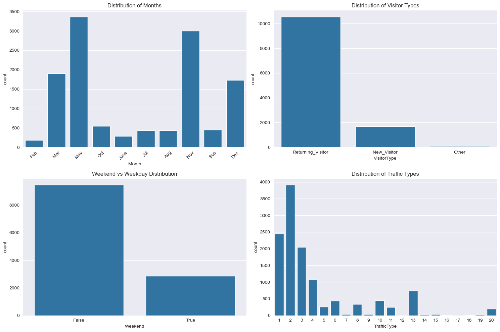
    


```python
# Create distribution plots for numerical variables
numerical_cols = ['Administrative', 'Administrative_Duration', 'Informational', 
                 'Informational_Duration', 'ProductRelated', 'ProductRelated_Duration',
                 'BounceRates', 'ExitRates', 'PageValues', 'SpecialDay']

plt.figure(figsize=(15, 20))
for i, col in enumerate(numerical_cols, 1):
    plt.subplot(5, 2, i)
    sns.histplot(data=df, x=col, kde=True)
    plt.title(f'Distribution of {col}')
plt.tight_layout()
plt.show()

# Box plots to check for outliers
plt.figure(figsize=(15, 20))
for i, col in enumerate(numerical_cols, 1):
    plt.subplot(5, 2, i)
    sns.boxplot(data=df, y=col)
    plt.title(f'Boxplot of {col}')
plt.tight_layout()
plt.show()
```


    
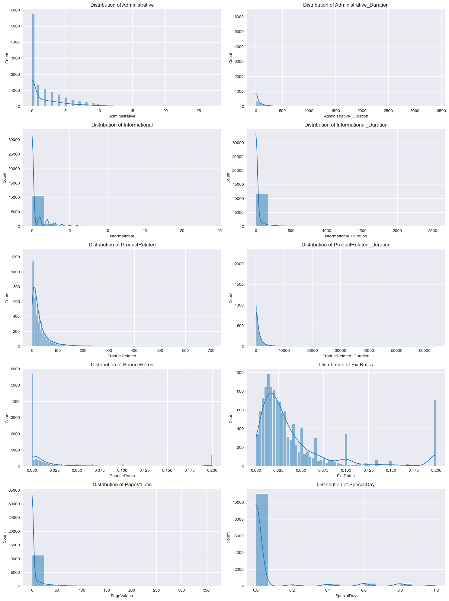
    


    
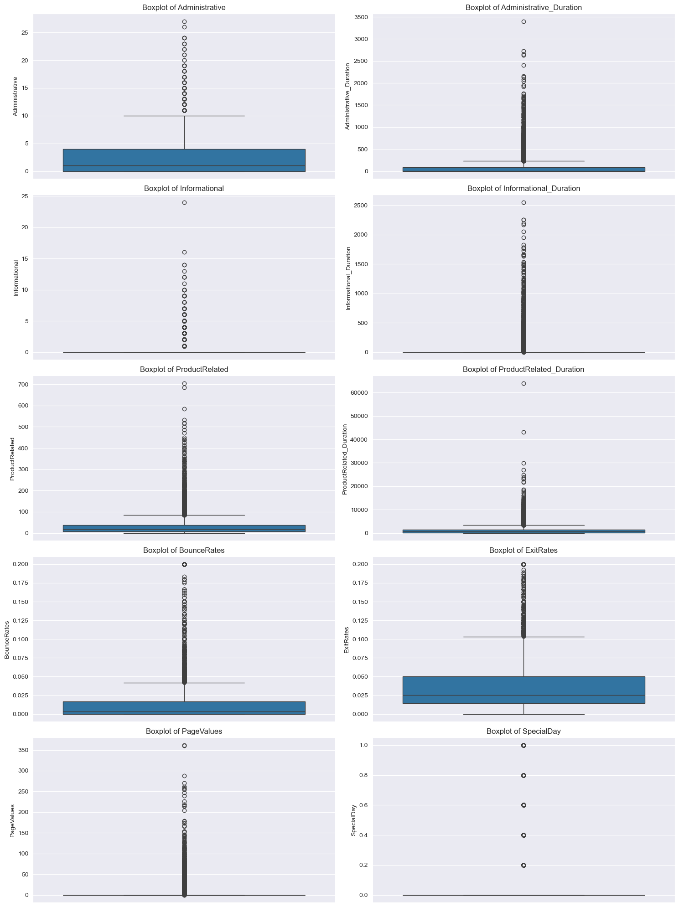
    


```python
# Correlation matrix for numerical variables
plt.figure(figsize=(12, 8))
sns.heatmap(df[numerical_cols].corr(), annot=True, cmap='Blues', center=0)
plt.title('Correlation Matrix of Numerical Variables')
plt.tight_layout()
plt.show()

# Pairplot for key numerical variables
sns.pairplot(df[['Administrative_Duration', 'Informational_Duration', 
                 'ProductRelated_Duration', 'BounceRates', 'ExitRates']])
plt.show()
```


    

    


    
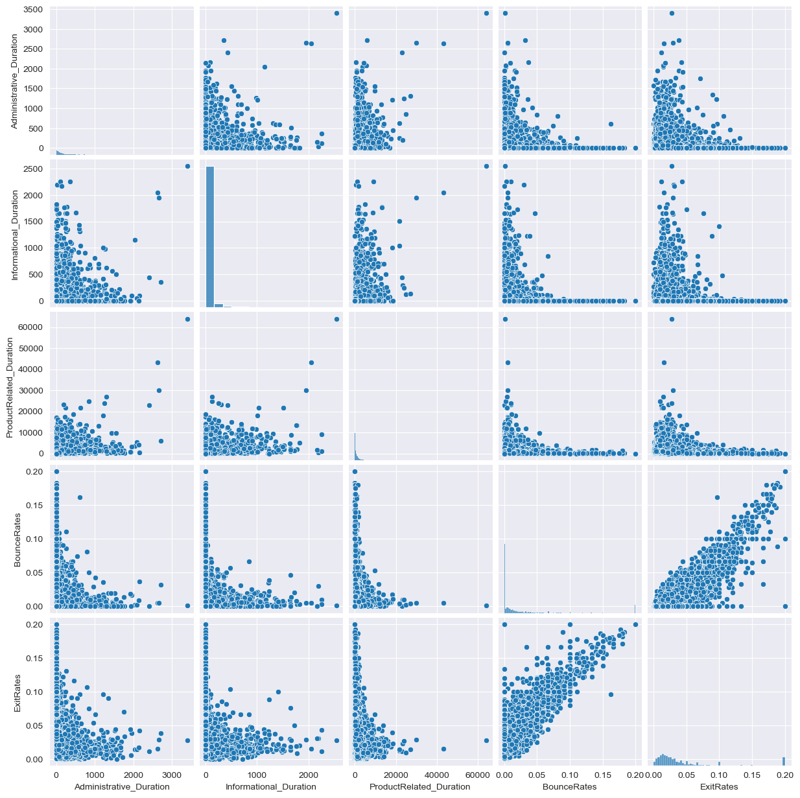
    


```python
# Create a comparison of different page types
page_metrics = df[['Administrative', 'Informational', 'ProductRelated']].mean()
plt.figure(figsize=(10, 6))
page_metrics.plot(kind='bar')
plt.title('Average Number of Page Visits by Type')
plt.ylabel('Average Number of Visits')
plt.tight_layout()
plt.show()

# Duration analysis
duration_metrics = df[['Administrative_Duration', 'Informational_Duration', 
                      'ProductRelated_Duration']].mean()
plt.figure(figsize=(10, 6))
duration_metrics.plot(kind='bar')
plt.title('Average Duration by Page Type')
plt.ylabel('Average Duration')
plt.tight_layout()
plt.show()
```


    
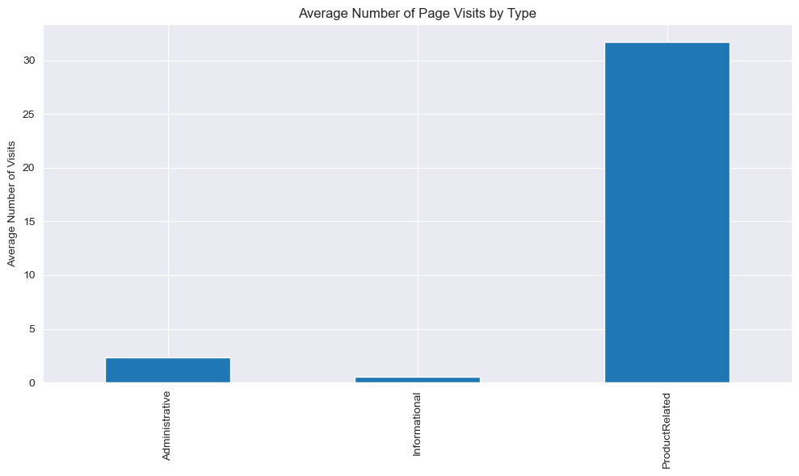
    


    

    


```python
# Special Day distribution by Month
plt.figure(figsize=(12, 6))
sns.boxplot(data=df, x='Month', y='SpecialDay')
plt.title('Special Day Distribution by Month')
plt.xticks(rotation=45)
plt.tight_layout()
plt.show()
```


    

    


```python
# Summary statistics for numerical variables by visitor type
print("Summary statistics by visitor type:\n")
print(df.groupby('VisitorType')[numerical_cols].mean())

# Summary statistics for weekend vs weekday
print("\nSummary statistics by weekend:")
print(df.groupby('Weekend')[numerical_cols].mean())
```

    Summary statistics by visitor type:
    
                       Administrative  Administrative_Duration  Informational  \
    VisitorType                                                                 
    New_Visitor              2.551948                91.911315       0.333530   
    Other                    1.470588                62.695588       0.176471   
    Returning_Visitor        2.283954                79.183639       0.533504   
    
                       Informational_Duration  ProductRelated  \
    VisitorType                                                 
    New_Visitor                     19.237472       18.054900   
    Other                           11.685490       12.470588   
    Returning_Visitor               37.101992       34.082457   
    
                       ProductRelated_Duration  BounceRates  ExitRates  \
    VisitorType                                                          
    New_Visitor                     636.393354     0.005261   0.020681   
    Other                           570.404862     0.038551   0.063349   
    Returning_Visitor              1289.421490     0.024778   0.046505   
    
                       PageValues  SpecialDay  
    VisitorType                                
    New_Visitor         10.772187    0.020189  
    Other               18.191812    0.000000  
    Returning_Visitor    5.006176    0.068543  
    
    Summary statistics by weekend:
             Administrative  Administrative_Duration  Informational  \
    Weekend                                                           
    False          2.266857                79.359739       0.478546   
    True           2.474547                85.631667       0.586123   
    
             Informational_Duration  ProductRelated  ProductRelated_Duration  \
    Weekend                                                                    
    False                 32.606637       31.337455              1187.044261   
    True                  40.627846       33.031381              1220.156240   
    
             BounceRates  ExitRates  PageValues  SpecialDay  
    Weekend                                                  
    False       0.023433   0.044747    5.766571    0.063264  
    True        0.018095   0.037549    6.294020    0.055370  
    


```python
# Calculate and display session duration statistics
df['TotalDuration'] = (df['Administrative_Duration'] + 
                       df['Informational_Duration'] + 
                       df['ProductRelated_Duration'])

print("Session Duration Statistics:")
print(df['TotalDuration'].describe())

# Visualize total duration distribution
plt.figure(figsize=(10, 6))
sns.histplot(data=df, x='TotalDuration', bins=50)
plt.title('Distribution of Total Session Duration')
plt.xlabel('Total Duration')
plt.show()
```

    Session Duration Statistics:
    count    12330.000000
    mean      1310.037228
    std       2037.801702
    min          0.000000
    25%        222.000000
    50%        680.000000
    75%       1626.908333
    max      69921.647230
    Name: TotalDuration, dtype: float64
    


    
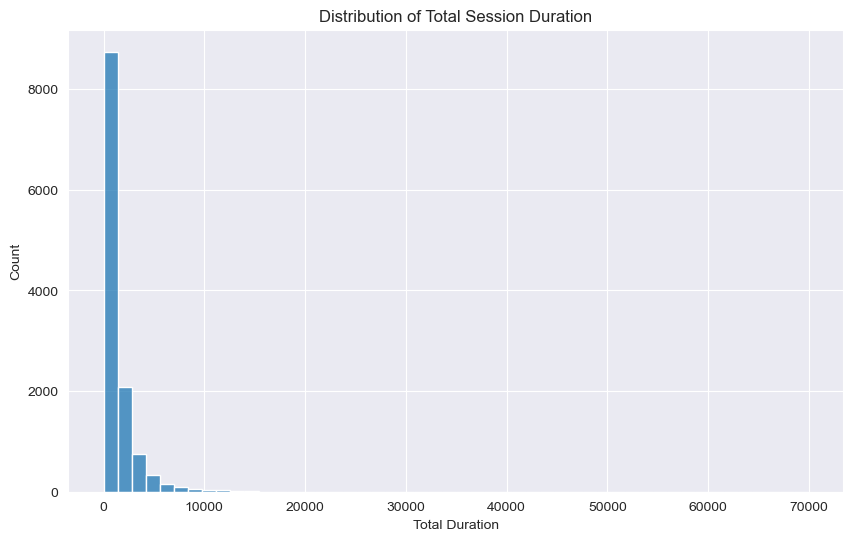
    


### 3.Data Preparation


```python
df.shape
```


    (12330, 19)


```python
# Feature Engineering
# Create new features for better clustering
# Calculate engagement ratios and page type preferences

# Create engagement ratios
df['avg_time_per_page'] = (df['Administrative_Duration'] + df['Informational_Duration'] + 
                          df['ProductRelated_Duration']) / (df['Administrative'] + 
                          df['Informational'] + df['ProductRelated'] + 1)
```


```python
# Create page type preference ratios
total_pages = df['Administrative'] + df['Informational'] + df['ProductRelated'] + 1
df['admin_ratio'] = df['Administrative'] / total_pages
df['info_ratio'] = df['Informational'] / total_pages
df['product_ratio'] = df['ProductRelated'] / total_pages
```


```python
# Create duration ratios
total_duration = df['Administrative_Duration'] + df['Informational_Duration'] + df['ProductRelated_Duration'] + 1
df['admin_duration_ratio'] = df['Administrative_Duration'] / total_duration
df['info_duration_ratio'] = df['Informational_Duration'] / total_duration
df['product_duration_ratio'] = df['ProductRelated_Duration'] / total_duration

```


```python
# Display new features
print("New features created. Sample of the engineered features:")
df[['avg_time_per_page', 'admin_ratio', 'info_ratio', 'product_ratio', 
    'admin_duration_ratio', 'info_duration_ratio', 'product_duration_ratio']].head()

```

    New features created. Sample of the engineered features:
    


<div>
<style scoped>
    .dataframe tbody tr th:only-of-type {
        vertical-align: middle;
    }

    .dataframe tbody tr th {
        vertical-align: top;
    }

    .dataframe thead th {
        text-align: right;
    }
</style>
<table border="1" class="dataframe">
  <thead>
    <tr style="text-align: right;">
      <th></th>
      <th>avg_time_per_page</th>
      <th>admin_ratio</th>
      <th>info_ratio</th>
      <th>product_ratio</th>
      <th>admin_duration_ratio</th>
      <th>info_duration_ratio</th>
      <th>product_duration_ratio</th>
    </tr>
  </thead>
  <tbody>
    <tr>
      <th>0</th>
      <td>0.000000</td>
      <td>0.0</td>
      <td>0.0</td>
      <td>0.500000</td>
      <td>0.0</td>
      <td>0.0</td>
      <td>0.000000</td>
    </tr>
    <tr>
      <th>1</th>
      <td>21.333333</td>
      <td>0.0</td>
      <td>0.0</td>
      <td>0.666667</td>
      <td>0.0</td>
      <td>0.0</td>
      <td>0.984615</td>
    </tr>
    <tr>
      <th>2</th>
      <td>0.000000</td>
      <td>0.0</td>
      <td>0.0</td>
      <td>0.500000</td>
      <td>0.0</td>
      <td>0.0</td>
      <td>0.000000</td>
    </tr>
    <tr>
      <th>3</th>
      <td>0.888889</td>
      <td>0.0</td>
      <td>0.0</td>
      <td>0.666667</td>
      <td>0.0</td>
      <td>0.0</td>
      <td>0.727273</td>
    </tr>
    <tr>
      <th>4</th>
      <td>57.045455</td>
      <td>0.0</td>
      <td>0.0</td>
      <td>0.909091</td>
      <td>0.0</td>
      <td>0.0</td>
      <td>0.998409</td>
    </tr>
  </tbody>
</table>
</div>


```python
clustering_features = [
    'avg_time_per_page', 
    'admin_ratio', 'info_ratio', 'product_ratio',
    'admin_duration_ratio', 'info_duration_ratio', 'product_duration_ratio',
    'BounceRates', 'ExitRates', 'PageValues'
]
```


```python
# Create feature matrix
X = df[clustering_features].copy()
```


```python
# Handle any missing values
X = X.fillna(0)

# Scale the features
scaler = StandardScaler()
X_scaled = scaler.fit_transform(X)

print("Features prepared for clustering.")
print("Feature matrix shape:", X_scaled.shape)
```

    Features prepared for clustering.
    Feature matrix shape: (12330, 10)
    


```python
# Perform Elbow Method Analysis


from sklearn.cluster import KMeans


max_clusters = 10
inertias = []
silhouette_scores = []

for k in range(2, max_clusters + 1):
    kmeans = KMeans(n_clusters=k, random_state=42)
    kmeans.fit(X_scaled)
    inertias.append(kmeans.inertia_)
    silhouette_scores.append(silhouette_score(X_scaled, kmeans.labels_))

# Plot elbow curve and silhouette scores
fig, (ax1, ax2) = plt.subplots(1, 2, figsize=(15, 5))

# Inertia plot
ax1.plot(range(2, max_clusters + 1), inertias, marker='o')
ax1.set_xlabel('Number of clusters (k)')
ax1.set_ylabel('Inertia')
ax1.set_title('Elbow Method')
ax1.grid(True)

# Silhouette score plot
ax2.plot(range(2, max_clusters + 1), silhouette_scores, marker='o')
ax2.set_xlabel('Number of clusters (k)')
ax2.set_ylabel('Silhouette Score')
ax2.set_title('Silhouette Score Analysis')
ax2.grid(True)

plt.tight_layout()
plt.show()

```


    
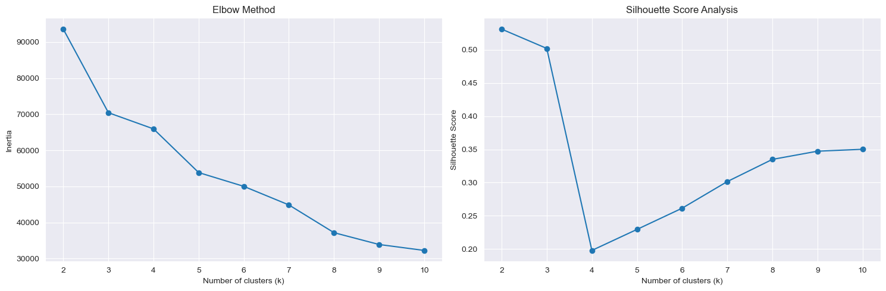
    


```python
# Print the scores
for k in range(len(inertias)):
    print(f"k={k+2}: Inertia={inertias[k]:.2f}, Silhouette Score={silhouette_scores[k]:.3f}")
```

    k=2: Inertia=93594.53, Silhouette Score=0.531
    k=3: Inertia=70434.91, Silhouette Score=0.502
    k=4: Inertia=65943.00, Silhouette Score=0.198
    k=5: Inertia=53842.70, Silhouette Score=0.230
    k=6: Inertia=50018.35, Silhouette Score=0.261
    k=7: Inertia=44868.63, Silhouette Score=0.302
    k=8: Inertia=37178.13, Silhouette Score=0.335
    k=9: Inertia=33899.42, Silhouette Score=0.347
    k=10: Inertia=32256.42, Silhouette Score=0.350
    


```python
# After analyzing the elbow plot, perform clustering with optimal k
# Replace optimal_k with the value you choose based on the elbow plot
optimal_k = 4  # This is an example, adjust based on your analysis
kmeans = KMeans(n_clusters=optimal_k, random_state=42)
cluster_labels = kmeans.fit_predict(X_scaled)
```


```python
df['Cluster'] = cluster_labels
```


```python
# Analyze cluster sizes
cluster_sizes = df['Cluster'].value_counts().sort_index()
print("\nCluster sizes:")
for cluster, size in cluster_sizes.items():
    print(f"Cluster {cluster}: {size} samples ({size/len(cluster_labels)*100:.2f}%)")
```

    
    Cluster sizes:
    Cluster 0: 7816 samples (63.39%)
    Cluster 1: 1761 samples (14.28%)
    Cluster 2: 2038 samples (16.53%)
    Cluster 3: 715 samples (5.80%)
    


```python
# Visualize cluster characteristics
plt.figure(figsize=(15, 8))
sns.boxplot(x='Cluster', y='avg_time_per_page', data=df)
plt.title('Average Time per Page by Cluster')
plt.show()
```


    
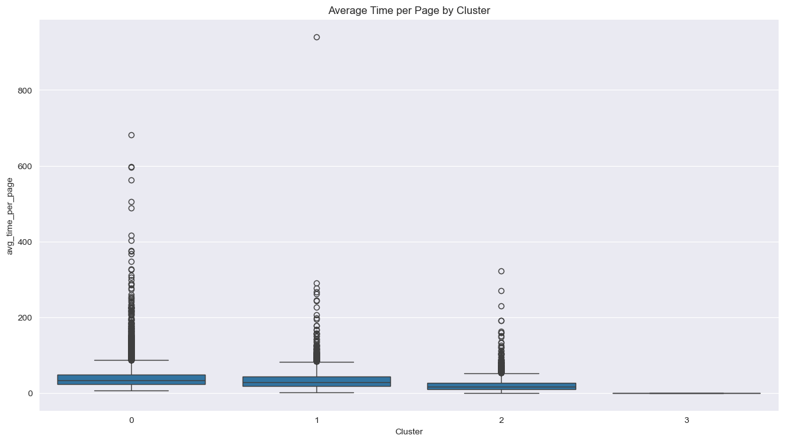
    


```python
# Create profile for each cluster
cluster_profiles = df.groupby('Cluster')[clustering_features].mean()
print("\nCluster Profiles:")
print(cluster_profiles)
```

    
    Cluster Profiles:
             avg_time_per_page  admin_ratio  info_ratio  product_ratio  \
    Cluster                                                              
    0                41.275887     0.052334    0.009406       0.892026   
    1                35.728322     0.273128    0.048886       0.599616   
    2                21.312836     0.008226    0.001583       0.829743   
    3                 0.000000     0.008205    0.003613       0.533278   
    
             admin_duration_ratio  info_duration_ratio  product_duration_ratio  \
    Cluster                                                                      
    0                    0.045214             0.011790                0.941378   
    1                    0.348012             0.079831                0.567189   
    2                    0.005842             0.000804                0.972828   
    3                    0.000000             0.000000                0.000000   
    
             BounceRates  ExitRates  PageValues  
    Cluster                                      
    0           0.005861   0.022178    8.164017  
    1           0.007983   0.027799    4.741994  
    2           0.035778   0.081446    0.222737  
    3           0.196970   0.199724    0.000000  
    


```python
output_path = '../data/processed/Task_2_processed/clustered_data.csv'
os.makedirs(os.path.dirname(output_path), exist_ok=True)
df.to_csv(output_path, index=False)
print(f"\nProcessed data saved to {output_path}")
```

    
    Processed data saved to ../data/processed/Task_2_processed/clustered_data.csv
    


```python
# Additional visualization: Cluster characteristics heatmap
plt.figure(figsize=(12, 8))
sns.heatmap(cluster_profiles.T, annot=True, cmap='Blues', center=0)
plt.title('Cluster Characteristics Heatmap')
plt.show()
```


    
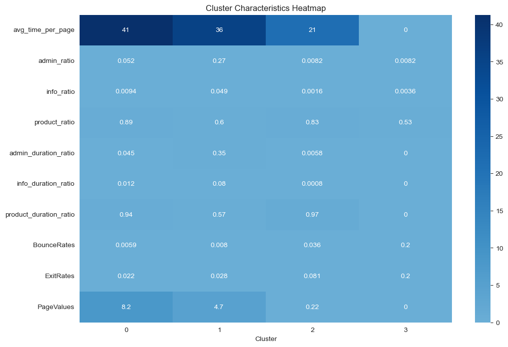
    


```python
# Scatter plot of two main components with cluster colors
plt.figure(figsize=(10, 8))
plt.scatter(X_scaled[:, 0], X_scaled[:, 1], c=cluster_labels, cmap='viridis')
plt.xlabel(clustering_features[0])
plt.ylabel(clustering_features[1])
plt.title('Cluster Distribution')
plt.colorbar(label='Cluster')
plt.show()
```


    
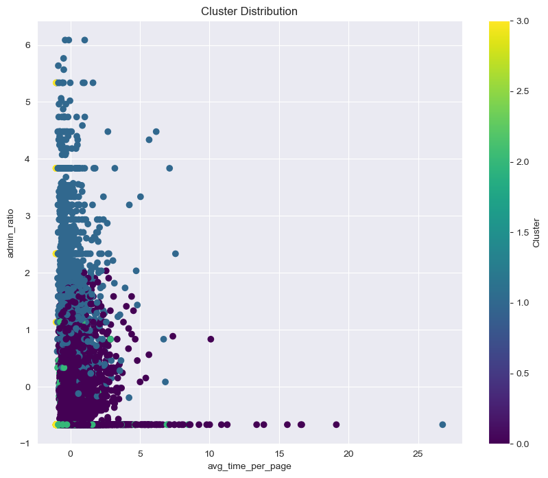
    


### 4.Modeling 


```python
# Enhanced statistical analysis for K-means clusters
def analyze_kmeans_clusters(df, cluster_labels):
    # Add temporal analysis
    df['Cluster'] = cluster_labels
    
    # Detailed cluster statistics
    cluster_stats = pd.DataFrame()
    
    for cluster in range(len(np.unique(cluster_labels))):
        cluster_data = df[df['Cluster'] == cluster]
        stats = {
            'Size': len(cluster_data),
            'Size_Percentage': len(cluster_data) / len(df) * 100,
            'Avg_Session_Duration': cluster_data['avg_time_per_page'].mean(),
            'Avg_Page_Value': cluster_data['PageValues'].mean(),
            'Weekend_Percentage': cluster_data['Weekend'].mean() * 100,
            'Revenue_Rate': cluster_data['Revenue'].mean() * 100,
            'Return_Visitor_Rate': (cluster_data['VisitorType'] == 'Returning_Visitor').mean() * 100
        }
        cluster_stats = pd.concat([cluster_stats, pd.DataFrame([stats])], ignore_index=True)
    
    cluster_stats.index = [f'Cluster_{i}' for i in range(len(cluster_stats))]
    return cluster_stats

# Visualize temporal patterns
def plot_temporal_patterns(df):
    plt.figure(figsize=(15, 5))
    sns.boxplot(x='Cluster', y='avg_time_per_page', hue='Weekend', data=df)
    plt.title('Average Time per Page by Cluster and Weekend Status')
    plt.show()
    
    plt.figure(figsize=(15, 5))
    sns.countplot(x='Month', hue='Cluster', data=df)
    plt.title('Cluster Distribution Across Months')
    plt.xticks(rotation=45)
    plt.show()

# Now let's implement DBSCAN
from sklearn.cluster import DBSCAN
from sklearn.neighbors import NearestNeighbors

def find_optimal_eps(X, n_neighbors=2):
    # Calculate distances to nearest neighbors
    neigh = NearestNeighbors(n_neighbors=n_neighbors)
    nbrs = neigh.fit(X)
    distances, indices = nbrs.kneighbors(X)
    
    # Sort and plot distances
    distances = np.sort(distances[:, n_neighbors-1])
    plt.figure(figsize=(10, 5))
    plt.plot(distances)
    plt.title('K-distance Graph')
    plt.xlabel('Points')
    plt.ylabel('Distance')
    plt.show()
    
    return distances

def apply_dbscan(X, eps, min_samples):
    dbscan = DBSCAN(eps=eps, min_samples=min_samples)
    dbscan_labels = dbscan.fit_predict(X)
    return dbscan_labels

# Compare clustering results
def compare_clustering_results(df, kmeans_labels, dbscan_labels):
    plt.figure(figsize=(15, 5))
    
    # K-means plot
    plt.subplot(1, 2, 1)
    plt.scatter(df['avg_time_per_page'], df['PageValues'], c=kmeans_labels, cmap='viridis')
    plt.title('K-means Clustering')
    plt.xlabel('Average Time per Page')
    plt.ylabel('Page Values')
    
    # DBSCAN plot
    plt.subplot(1, 2, 2)
    plt.scatter(df['avg_time_per_page'], df['PageValues'], c=dbscan_labels, cmap='viridis')
    plt.title('DBSCAN Clustering')
    plt.xlabel('Average Time per Page')
    plt.ylabel('Page Values')
    
    plt.tight_layout()
    plt.show()

# Evaluate clusters
def evaluate_clusters(X, kmeans_labels, dbscan_labels):
    # Silhouette score for K-means
    kmeans_silhouette = silhouette_score(X, kmeans_labels)
    
    # Silhouette score for DBSCAN (excluding noise points)
    dbscan_silhouette = silhouette_score(X[dbscan_labels != -1], 
                                       dbscan_labels[dbscan_labels != -1]) if len(np.unique(dbscan_labels)) > 1 else 0
    
    print(f"K-means Silhouette Score: {kmeans_silhouette:.3f}")
    print(f"DBSCAN Silhouette Score: {dbscan_silhouette:.3f}")
    
    return kmeans_silhouette, dbscan_silhouette

# Create cluster profiles
def create_cluster_profiles(df, labels, algorithm_name):
    profiles = df.groupby(labels).agg({
        'avg_time_per_page': 'mean',
        'PageValues': 'mean',
        'BounceRates': 'mean',
        'ExitRates': 'mean',
        'Revenue': 'mean',
        'Weekend': 'mean',
        'VisitorType': lambda x: (x == 'Returning_Visitor').mean()
    }).round(3)
    
    print(f"\n{algorithm_name} Cluster Profiles:")
    print(profiles)
    return profiles

# Let's execute all these analyses
# First, make sure we have our scaled features
X_scaled = StandardScaler().fit_transform(X)

# Find optimal eps for DBSCAN
distances = find_optimal_eps(X_scaled)

# Apply both clustering algorithms
kmeans_labels = kmeans.labels_
dbscan_labels = apply_dbscan(X_scaled, eps=0.3, min_samples=5)  # Adjust eps based on the k-distance graph

# Compare results
compare_clustering_results(df, kmeans_labels, dbscan_labels)

# Evaluate both algorithms
evaluate_clusters(X_scaled, kmeans_labels, dbscan_labels)

# Create profiles for both algorithms
kmeans_profiles = create_cluster_profiles(df, kmeans_labels, "K-means")
dbscan_profiles = create_cluster_profiles(df, dbscan_labels, "DBSCAN")

# Plot temporal patterns for both algorithms
plot_temporal_patterns(df)
```


    
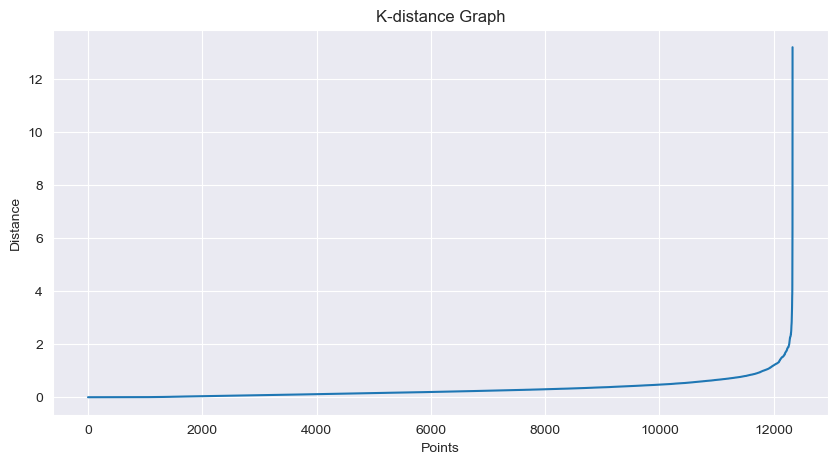
    


    
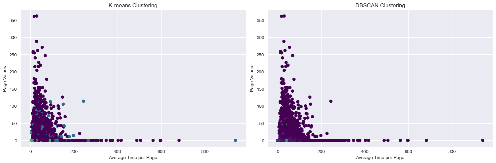
    


    K-means Silhouette Score: 0.198
    DBSCAN Silhouette Score: -0.091
    
    K-means Cluster Profiles:
       avg_time_per_page  PageValues  BounceRates  ExitRates  Revenue  Weekend  \
    0             41.276       8.164        0.006      0.022    0.205    0.243   
    1             35.728       4.742        0.008      0.028    0.148    0.256   
    2             21.313       0.223        0.036      0.081    0.019    0.193   
    3              0.000       0.000        0.197      0.200    0.004    0.178   
    
       VisitorType  
    0        0.863  
    1        0.672  
    2        0.960  
    3        0.937  
    
    DBSCAN Cluster Profiles:
         avg_time_per_page  PageValues  BounceRates  ExitRates  Revenue  Weekend  \
    -1              45.419      11.739        0.013      0.033    0.250    0.243   
     0               0.000       0.000        0.200      0.200    0.002    0.181   
     1              11.957       0.000        0.000      0.100    0.000    0.234   
     2              30.289       0.822        0.009      0.029    0.083    0.232   
     3               0.000       0.000        0.200      0.200    0.000    0.500   
     4               0.000       0.000        0.200      0.200    0.000    0.149   
     5              19.813       0.000        0.000      0.032    0.000    0.256   
     6              15.889       0.000        0.000      0.067    0.009    0.309   
     7              22.272       0.000        0.000      0.050    0.000    0.149   
     8              10.429       0.000        0.067      0.133    0.000    0.243   
     9              28.346      22.652        0.001      0.012    0.600    0.200   
     10              0.000       0.000        0.200      0.200    0.000    0.080   
     11             81.057       0.000        0.000      0.100    0.000    0.333   
     12              7.341       0.000        0.109      0.151    0.000    0.133   
     13             12.346       0.000        0.067      0.098    0.062    0.125   
     14              7.654       0.000        0.080      0.120    0.000    0.125   
     15              0.000       0.000        0.200      0.200    0.031    0.188   
     16             34.307      16.457        0.004      0.019    0.200    0.200   
     17             23.128       0.000        0.000      0.014    0.000    0.231   
     18             17.131       0.000        0.000      0.100    0.000    0.278   
     19             11.037       0.000        0.100      0.125    0.000    0.143   
     20             29.710      56.049        0.000      0.007    0.926    0.296   
     21             64.833       0.000        0.000      0.067    0.000    0.333   
     22             31.610      33.190        0.000      0.020    0.714    0.143   
     23             12.486       0.000        0.040      0.120    0.000    0.125   
     24             43.467      28.809        0.001      0.011    0.833    0.167   
     25             15.040       0.000        0.000      0.031    0.000    0.286   
     26             15.991       0.000        0.000      0.016    0.000    0.000   
     27             33.604       0.000        0.001      0.010    0.000    0.000   
     28              0.000       0.000        0.000      0.200    0.000    0.000   
     29             13.786       0.000        0.000      0.014    0.000    0.000   
     30             30.802       0.263        0.000      0.014    0.000    0.444   
     31             33.820       0.000        0.000      0.013    0.050    0.200   
     32             35.400       0.000        0.000      0.098    0.000    0.200   
     33             32.128       0.000        0.048      0.100    0.000    0.200   
     34             24.622      34.624        0.002      0.008    0.692    0.154   
     35             30.385       0.000        0.016      0.037    0.000    0.200   
     36              0.000       0.000        0.200      0.200    0.200    0.200   
     37             88.120       0.000        0.001      0.012    0.071    0.286   
     38             44.762       0.000        0.000      0.012    0.375    0.125   
     39              0.000       0.000        0.200      0.200    0.000    0.200   
     40             51.433       0.000        0.006      0.019    0.000    0.200   
     41             22.943       0.000        0.001      0.011    0.000    0.200   
     42             24.131       0.660        0.020      0.043    0.143    0.143   
     43             19.975       0.000        0.000      0.009    0.000    0.111   
     44              4.488       0.000        0.138      0.167    0.000    0.000   
     45             41.433      43.813        0.000      0.012    0.889    0.222   
     46             15.326       0.000        0.029      0.055    0.000    0.200   
     47             79.222       0.000        0.001      0.010    0.000    0.000   
     48             11.710       0.000        0.000      0.067    0.600    0.400   
     49             10.795       0.000        0.000      0.100    0.200    0.000   
     50             34.999       0.000        0.000      0.006    0.250    0.250   
     51             38.315       0.000        0.002      0.012    0.000    0.000   
     52              9.598       0.000        0.000      0.029    0.143    0.429   
     53             16.752       0.000        0.000      0.033    0.000    0.000   
     54             28.008       0.000        0.000      0.022    0.000    0.333   
     55             20.556       0.000        0.016      0.036    0.000    0.000   
     56             34.577       0.170        0.003      0.012    0.333    0.167   
     57             31.335       0.000        0.003      0.019    0.333    0.333   
    
         VisitorType  
    -1         0.817  
     0         0.920  
     1         0.930  
     2         0.884  
     3         1.000  
     4         0.979  
     5         0.923  
     6         0.936  
     7         0.830  
     8         1.000  
     9         0.800  
     10        1.000  
     11        0.889  
     12        1.000  
     13        0.875  
     14        1.000  
     15        1.000  
     16        1.000  
     17        0.615  
     18        0.889  
     19        1.000  
     20        0.556  
     21        1.000  
     22        0.571  
     23        1.000  
     24        0.833  
     25        1.000  
     26        0.600  
     27        0.667  
     28        1.000  
     29        0.800  
     30        0.444  
     31        0.650  
     32        0.800  
     33        1.000  
     34        0.692  
     35        1.000  
     36        1.000  
     37        0.857  
     38        0.625  
     39        1.000  
     40        1.000  
     41        0.800  
     42        1.000  
     43        0.556  
     44        1.000  
     45        0.611  
     46        1.000  
     47        1.000  
     48        0.600  
     49        1.000  
     50        0.500  
     51        0.600  
     52        0.429  
     53        0.600  
     54        0.667  
     55        1.000  
     56        1.000  
     57        0.667  
    


    
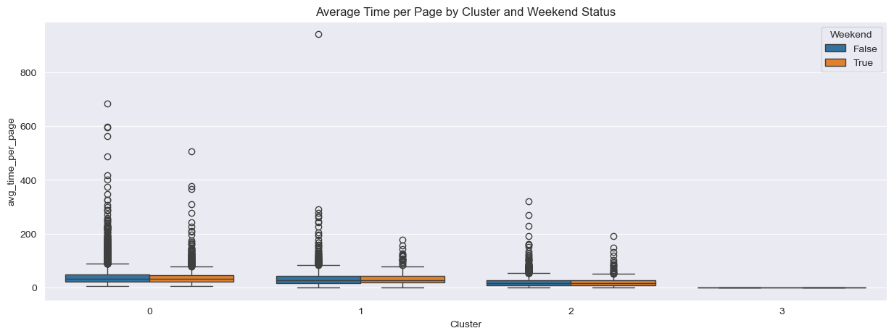
    


    
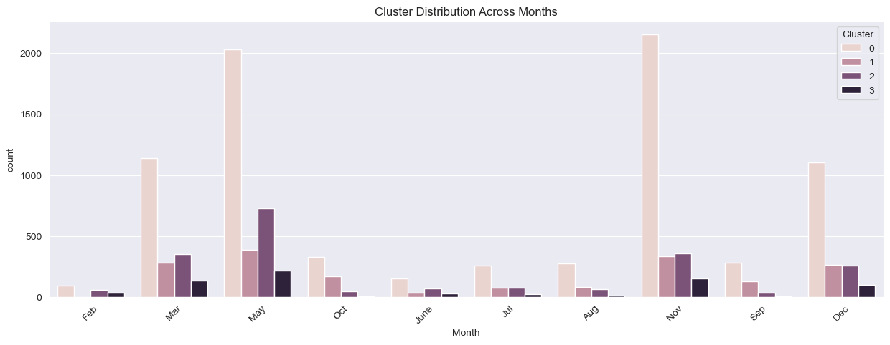
    


### 5.Evaluation


```python
# Import additional required libraries for evaluation
from sklearn.metrics import (
    silhouette_score,
    calinski_harabasz_score,
    davies_bouldin_score
)
import numpy as np
import pandas as pd
import matplotlib.pyplot as plt
import seaborn as sns
from scipy.stats import kruskal
from sklearn.preprocessing import StandardScaler

# Create comprehensive evaluation function
def evaluate_clustering(X, labels, algorithm_name):
    """
    Evaluate clustering results using multiple metrics
    """
    # Remove noise points (-1 labels) if present (for DBSCAN)
    if -1 in labels:
        mask = labels != -1
        X_clean = X[mask]
        labels_clean = labels[mask]
    else:
        X_clean = X
        labels_clean = labels
    
    # Calculate metrics only if we have at least 2 clusters
    if len(np.unique(labels_clean)) >= 2:
        metrics = {
            'Silhouette Score': silhouette_score(X_clean, labels_clean),
            'Calinski-Harabasz Score': calinski_harabasz_score(X_clean, labels_clean),
            'Davies-Bouldin Score': davies_bouldin_score(X_clean, labels_clean)
        }
        
        # Calculate cluster sizes and proportions
        cluster_sizes = pd.Series(labels).value_counts().sort_index()
        total_points = len(labels)
        cluster_props = cluster_sizes / total_points * 100
        
        print(f"\n{algorithm_name} Clustering Evaluation:")
        print("-" * 50)
        print(f"Number of clusters: {len(np.unique(labels))}")
        print(f"Number of noise points: {sum(labels == -1)}" if -1 in labels else "No noise points")
        print("\nCluster Sizes:")
        for cluster, size in cluster_sizes.items():
            print(f"Cluster {cluster}: {size} points ({cluster_props[cluster]:.2f}%)")
        
        print("\nValidation Metrics:")
        print(f"Silhouette Score: {metrics['Silhouette Score']:.3f}")
        print(f"Calinski-Harabasz Score: {metrics['Calinski-Harabasz Score']:.3f}")
        print(f"Davies-Bouldin Score: {metrics['Davies-Bouldin Score']:.3f}")
        
        return metrics
    else:
        print(f"\n{algorithm_name}: Not enough clusters for evaluation")
        return None

# Visualize evaluation metrics
def plot_evaluation_comparison(kmeans_metrics, dbscan_metrics):
    """
    Create comparative visualizations of evaluation metrics
    """
    metrics_df = pd.DataFrame({
        'K-means': kmeans_metrics,
        'DBSCAN': dbscan_metrics
    }).T
    
    fig, axes = plt.subplots(1, 3, figsize=(18, 5))
    
    # Plot each metric
    metrics = ['Silhouette Score', 'Calinski-Harabasz Score', 'Davies-Bouldin Score']
    colors = ['#2ecc71', '#e74c3c']
    
    for i, metric in enumerate(metrics):
        ax = axes[i]
        bars = ax.bar(['K-means', 'DBSCAN'], 
                     [kmeans_metrics[metric], dbscan_metrics[metric]],
                     color=colors)
        ax.set_title(metric)
        ax.set_ylabel('Score')
        
        # Add value labels on bars
        for bar in bars:
            height = bar.get_height()
            ax.text(bar.get_x() + bar.get_width()/2., height,
                   f'{height:.3f}',
                   ha='center', va='bottom')
    
    plt.tight_layout()
    plt.show()

# Analyze cluster stability
def analyze_cluster_stability(X, n_runs=10):
    """
    Analyze clustering stability across multiple runs
    """
    kmeans_silhouettes = []
    dbscan_silhouettes = []
    
    for i in range(n_runs):
        # K-means
        kmeans = KMeans(n_clusters=4, random_state=i)
        kmeans_labels = kmeans.fit_predict(X)
        kmeans_silhouettes.append(silhouette_score(X, kmeans_labels))
        
        # DBSCAN
        dbscan = DBSCAN(eps=0.3, min_samples=5)
        dbscan_labels = dbscan.fit_predict(X)
        if len(np.unique(dbscan_labels[dbscan_labels != -1])) >= 2:
            dbscan_silhouettes.append(silhouette_score(X[dbscan_labels != -1], 
                                                     dbscan_labels[dbscan_labels != -1]))
    
    # Plot stability results
    plt.figure(figsize=(10, 5))
    plt.boxplot([kmeans_silhouettes, dbscan_silhouettes], labels=['K-means', 'DBSCAN'])
    plt.title('Clustering Stability Analysis')
    plt.ylabel('Silhouette Score')
    plt.show()
    
    return kmeans_silhouettes, dbscan_silhouettes

# Analyze feature importance for clusters
def analyze_feature_importance(X, labels, feature_names):
    """
    Analyze which features are most important for cluster separation
    """
    importance_scores = {}
    
    for feature_idx, feature_name in enumerate(feature_names):
        # Perform Kruskal-Wallis H-test
        h_statistic, p_value = kruskal(*[X[labels == i, feature_idx] 
                                       for i in np.unique(labels) if i != -1])
        importance_scores[feature_name] = {'H-statistic': h_statistic, 'p-value': p_value}
    
    # Create feature importance visualization
    importance_df = pd.DataFrame(importance_scores).T
    importance_df['significance'] = -np.log10(importance_df['p-value'])
    
    plt.figure(figsize=(12, 6))
    plt.barh(importance_df.index, importance_df['significance'])
    plt.title('Feature Importance for Cluster Separation')
    plt.xlabel('-log10(p-value)')
    plt.tight_layout()
    plt.show()
    
    return importance_df

# Execute the evaluation
# Assuming X_scaled is your scaled feature matrix
kmeans_metrics = evaluate_clustering(X_scaled, kmeans_labels, "K-means")
dbscan_metrics = evaluate_clustering(X_scaled, dbscan_labels, "DBSCAN")

# Plot comparison of metrics
plot_evaluation_comparison(kmeans_metrics, dbscan_metrics)

# Analyze stability
kmeans_stability, dbscan_stability = analyze_cluster_stability(X_scaled)

# Analyze feature importance
feature_importance_kmeans = analyze_feature_importance(X_scaled, kmeans_labels, clustering_features)
feature_importance_dbscan = analyze_feature_importance(X_scaled, dbscan_labels, clustering_features)

# Print summary of evaluation
print("\nClustering Evaluation Summary:")
print("-" * 50)
print("\nK-means Stability:")
print(f"Mean Silhouette Score: {np.mean(kmeans_stability):.3f} ± {np.std(kmeans_stability):.3f}")

print("\nDBSCAN Stability:")
print(f"Mean Silhouette Score: {np.mean(dbscan_stability):.3f} ± {np.std(dbscan_stability):.3f}")

# Create a summary table of all metrics
summary_df = pd.DataFrame({
    'K-means': {
        'Mean Silhouette': np.mean(kmeans_stability),
        'Stability (std)': np.std(kmeans_stability),
        'Calinski-Harabasz': kmeans_metrics['Calinski-Harabasz Score'],
        'Davies-Bouldin': kmeans_metrics['Davies-Bouldin Score']
    },
    'DBSCAN': {
        'Mean Silhouette': np.mean(dbscan_stability),
        'Stability (std)': np.std(dbscan_stability),
        'Calinski-Harabasz': dbscan_metrics['Calinski-Harabasz Score'],
        'Davies-Bouldin': dbscan_metrics['Davies-Bouldin Score']
    }
})

print("\nFinal Comparison Summary:")
print(summary_df.round(3))
```

    
    K-means Clustering Evaluation:
    --------------------------------------------------
    Number of clusters: 4
    No noise points
    
    Cluster Sizes:
    Cluster 0: 7816 points (63.39%)
    Cluster 1: 1761 points (14.28%)
    Cluster 2: 2038 points (16.53%)
    Cluster 3: 715 points (5.80%)
    
    Validation Metrics:
    Silhouette Score: 0.198
    Calinski-Harabasz Score: 3573.714
    Davies-Bouldin Score: 1.317
    
    DBSCAN Clustering Evaluation:
    --------------------------------------------------
    Number of clusters: 59
    Number of noise points: 5527
    
    Cluster Sizes:
    Cluster -1: 5527 points (44.83%)
    Cluster 0: 525 points (4.26%)
    Cluster 1: 158 points (1.28%)
    Cluster 2: 5316 points (43.11%)
    Cluster 3: 6 points (0.05%)
    Cluster 4: 94 points (0.76%)
    Cluster 5: 39 points (0.32%)
    Cluster 6: 110 points (0.89%)
    Cluster 7: 47 points (0.38%)
    Cluster 8: 37 points (0.30%)
    Cluster 9: 5 points (0.04%)
    Cluster 10: 25 points (0.20%)
    Cluster 11: 9 points (0.07%)
    Cluster 12: 45 points (0.36%)
    Cluster 13: 16 points (0.13%)
    Cluster 14: 8 points (0.06%)
    Cluster 15: 32 points (0.26%)
    Cluster 16: 5 points (0.04%)
    Cluster 17: 13 points (0.11%)
    Cluster 18: 18 points (0.15%)
    Cluster 19: 7 points (0.06%)
    Cluster 20: 27 points (0.22%)
    Cluster 21: 6 points (0.05%)
    Cluster 22: 7 points (0.06%)
    Cluster 23: 8 points (0.06%)
    Cluster 24: 6 points (0.05%)
    Cluster 25: 7 points (0.06%)
    Cluster 26: 10 points (0.08%)
    Cluster 27: 6 points (0.05%)
    Cluster 28: 6 points (0.05%)
    Cluster 29: 5 points (0.04%)
    Cluster 30: 9 points (0.07%)
    Cluster 31: 20 points (0.16%)
    Cluster 32: 5 points (0.04%)
    Cluster 33: 5 points (0.04%)
    Cluster 34: 13 points (0.11%)
    Cluster 35: 5 points (0.04%)
    Cluster 36: 5 points (0.04%)
    Cluster 37: 14 points (0.11%)
    Cluster 38: 8 points (0.06%)
    Cluster 39: 5 points (0.04%)
    Cluster 40: 5 points (0.04%)
    Cluster 41: 5 points (0.04%)
    Cluster 42: 7 points (0.06%)
    Cluster 43: 9 points (0.07%)
    Cluster 44: 7 points (0.06%)
    Cluster 45: 18 points (0.15%)
    Cluster 46: 5 points (0.04%)
    Cluster 47: 5 points (0.04%)
    Cluster 48: 5 points (0.04%)
    Cluster 49: 5 points (0.04%)
    Cluster 50: 4 points (0.03%)
    Cluster 51: 5 points (0.04%)
    Cluster 52: 7 points (0.06%)
    Cluster 53: 5 points (0.04%)
    Cluster 54: 3 points (0.02%)
    Cluster 55: 7 points (0.06%)
    Cluster 56: 6 points (0.05%)
    Cluster 57: 3 points (0.02%)
    
    Validation Metrics:
    Silhouette Score: -0.091
    Calinski-Harabasz Score: 679.143
    Davies-Bouldin Score: 0.750
    


    

    


    C:\Users\geova\AppData\Local\Temp\ipykernel_4708\3899154916.py:116: MatplotlibDeprecationWarning: The 'labels' parameter of boxplot() has been renamed 'tick_labels' since Matplotlib 3.9; support for the old name will be dropped in 3.11.
      plt.boxplot([kmeans_silhouettes, dbscan_silhouettes], labels=['K-means', 'DBSCAN'])
    


    
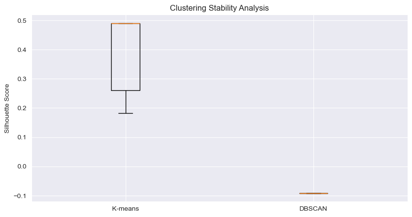
    


    c:\Users\geova\anaconda3\envs\ml_enviroment\lib\site-packages\pandas\core\arraylike.py:399: RuntimeWarning: divide by zero encountered in log10
      result = getattr(ufunc, method)(*inputs, **kwargs)
    


    
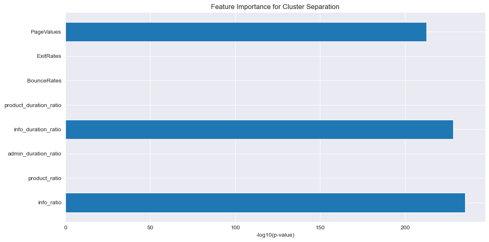
    


    c:\Users\geova\anaconda3\envs\ml_enviroment\lib\site-packages\pandas\core\arraylike.py:399: RuntimeWarning: divide by zero encountered in log10
      result = getattr(ufunc, method)(*inputs, **kwargs)
    


    
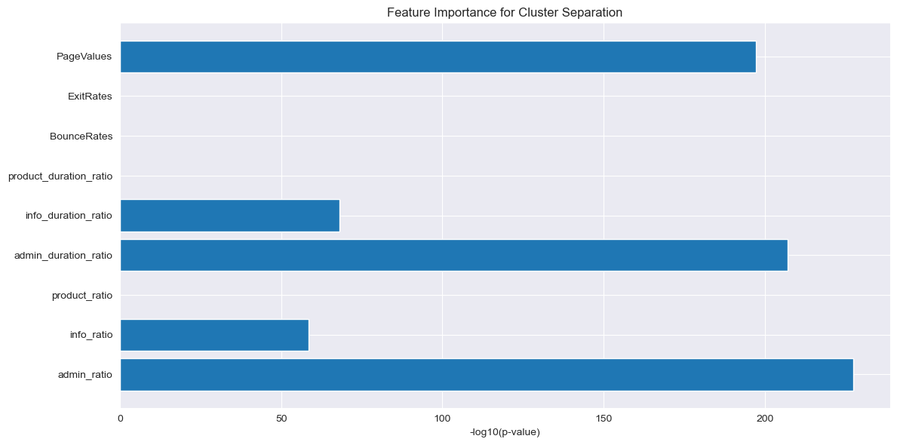
    


    
    Clustering Evaluation Summary:
    --------------------------------------------------
    
    K-means Stability:
    Mean Silhouette Score: 0.397 ± 0.134
    
    DBSCAN Stability:
    Mean Silhouette Score: -0.091 ± 0.000
    
    Final Comparison Summary:
                        K-means   DBSCAN
    Mean Silhouette       0.397   -0.091
    Stability (std)       0.134    0.000
    Calinski-Harabasz  3573.714  679.143
    Davies-Bouldin        1.317    0.750
    
