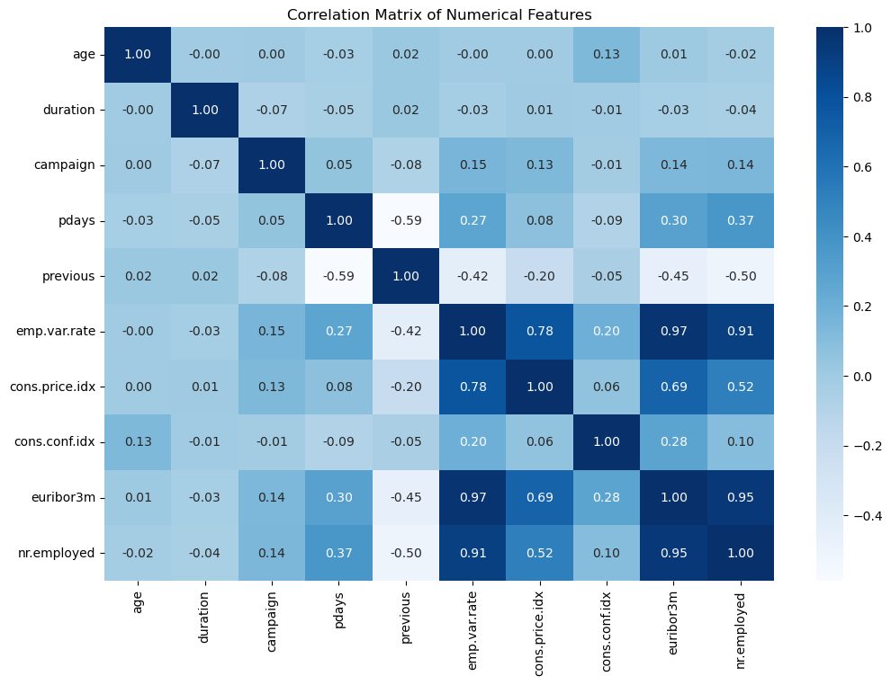

# Bank Marketing Dataset Anaysis

#### Author: Geovanny Tabango


# CRIPS - DM Methodology
 1. Bussiness Understanding.
 2. Data Understanding. 
 3. Data Preparation.
 4. Modelling. 
 5. Evaluation. 
 6. Deplotment.

### 1. Bussiness Understanding
 - Marketing campaing from 2008 to 2010 (2 Years Data Colleted).
 - The target value `y` describes wether the customer holds subscribe deposit in the bank or not.
 - Its expected to have the samples a larger distribution of `no` subscription compared to the `yes`.
 - The marketing team is to use the information extracted from the data set to better orginze a strategy to possitevely indentify costumers that are more likely to say `yes` to subscribe to the deposit.
 - The end objective is to better utilize the resources of the banking allowing a more room of improvements in the calls.

### 2. Data Understanding

##### 2.1 Imports needed for data analyis


```python
import pandas as pd
import numpy as np
import matplotlib.pyplot as plt
import seaborn as sns
from sklearn.model_selection import train_test_split
from sklearn.preprocessing import StandardScaler, OneHotEncoder, LabelEncoder
from sklearn.compose import ColumnTransformer
from sklearn.pipeline import Pipeline
from sklearn.ensemble import RandomForestClassifier
from sklearn.metrics import classification_report, confusion_matrix
from imblearn.over_sampling import SMOTE
from scipy.stats import chi2_contingency
from sklearn.impute import SimpleImputer
from sklearn.ensemble import GradientBoostingClassifier
from sklearn.metrics import classification_report, confusion_matrix, roc_auc_score, accuracy_score, roc_curve
from imblearn.pipeline import Pipeline as ImbPipeline
from sklearn.linear_model import LogisticRegression
```

#### 2.2 Load the dataset


```python
# Set a ramdom seed for reproducibility
# The random seed method hold and arbitrary number
np.random.seed(98)
```


```python
# Load the dataset in to a pandas dataframe.
# By exploring the dataset we can see that the data is a CSV file with a delimiter of semi-colon ';'.
df = pd.read_csv('../data/raw/bank-additional-full.csv', sep=';')
```

#### 2.3 Display the basic information of the dataset.

- By the description of the dataset there are 0 missing values. 


```python
#Double checking for missing values
df.isnull().sum()
```


    age               0
    job               0
    marital           0
    education         0
    default           0
    housing           0
    loan              0
    contact           0
    month             0
    day_of_week       0
    duration          0
    campaign          0
    pdays             0
    previous          0
    poutcome          0
    emp.var.rate      0
    cons.price.idx    0
    cons.conf.idx     0
    euribor3m         0
    nr.employed       0
    y                 0
    dtype: int64


```python
#Display the 5 firt rows of the dataset
df.head()
```


<div>
<style scoped>
    .dataframe tbody tr th:only-of-type {
        vertical-align: middle;
    }

    .dataframe tbody tr th {
        vertical-align: top;
    }

    .dataframe thead th {
        text-align: right;
    }
</style>
<table border="1" class="dataframe">
  <thead>
    <tr style="text-align: right;">
      <th></th>
      <th>age</th>
      <th>job</th>
      <th>marital</th>
      <th>education</th>
      <th>default</th>
      <th>housing</th>
      <th>loan</th>
      <th>contact</th>
      <th>month</th>
      <th>day_of_week</th>
      <th>...</th>
      <th>campaign</th>
      <th>pdays</th>
      <th>previous</th>
      <th>poutcome</th>
      <th>emp.var.rate</th>
      <th>cons.price.idx</th>
      <th>cons.conf.idx</th>
      <th>euribor3m</th>
      <th>nr.employed</th>
      <th>y</th>
    </tr>
  </thead>
  <tbody>
    <tr>
      <th>0</th>
      <td>56</td>
      <td>housemaid</td>
      <td>married</td>
      <td>basic.4y</td>
      <td>no</td>
      <td>no</td>
      <td>no</td>
      <td>telephone</td>
      <td>may</td>
      <td>mon</td>
      <td>...</td>
      <td>1</td>
      <td>999</td>
      <td>0</td>
      <td>nonexistent</td>
      <td>1.1</td>
      <td>93.994</td>
      <td>-36.4</td>
      <td>4.857</td>
      <td>5191.0</td>
      <td>no</td>
    </tr>
    <tr>
      <th>1</th>
      <td>57</td>
      <td>services</td>
      <td>married</td>
      <td>high.school</td>
      <td>unknown</td>
      <td>no</td>
      <td>no</td>
      <td>telephone</td>
      <td>may</td>
      <td>mon</td>
      <td>...</td>
      <td>1</td>
      <td>999</td>
      <td>0</td>
      <td>nonexistent</td>
      <td>1.1</td>
      <td>93.994</td>
      <td>-36.4</td>
      <td>4.857</td>
      <td>5191.0</td>
      <td>no</td>
    </tr>
    <tr>
      <th>2</th>
      <td>37</td>
      <td>services</td>
      <td>married</td>
      <td>high.school</td>
      <td>no</td>
      <td>yes</td>
      <td>no</td>
      <td>telephone</td>
      <td>may</td>
      <td>mon</td>
      <td>...</td>
      <td>1</td>
      <td>999</td>
      <td>0</td>
      <td>nonexistent</td>
      <td>1.1</td>
      <td>93.994</td>
      <td>-36.4</td>
      <td>4.857</td>
      <td>5191.0</td>
      <td>no</td>
    </tr>
    <tr>
      <th>3</th>
      <td>40</td>
      <td>admin.</td>
      <td>married</td>
      <td>basic.6y</td>
      <td>no</td>
      <td>no</td>
      <td>no</td>
      <td>telephone</td>
      <td>may</td>
      <td>mon</td>
      <td>...</td>
      <td>1</td>
      <td>999</td>
      <td>0</td>
      <td>nonexistent</td>
      <td>1.1</td>
      <td>93.994</td>
      <td>-36.4</td>
      <td>4.857</td>
      <td>5191.0</td>
      <td>no</td>
    </tr>
    <tr>
      <th>4</th>
      <td>56</td>
      <td>services</td>
      <td>married</td>
      <td>high.school</td>
      <td>no</td>
      <td>no</td>
      <td>yes</td>
      <td>telephone</td>
      <td>may</td>
      <td>mon</td>
      <td>...</td>
      <td>1</td>
      <td>999</td>
      <td>0</td>
      <td>nonexistent</td>
      <td>1.1</td>
      <td>93.994</td>
      <td>-36.4</td>
      <td>4.857</td>
      <td>5191.0</td>
      <td>no</td>
    </tr>
  </tbody>
</table>
<p>5 rows × 21 columns</p>
</div>


```python
#Display the 5 last rows of the dataset
df.tail()
```


<div>
<style scoped>
    .dataframe tbody tr th:only-of-type {
        vertical-align: middle;
    }

    .dataframe tbody tr th {
        vertical-align: top;
    }

    .dataframe thead th {
        text-align: right;
    }
</style>
<table border="1" class="dataframe">
  <thead>
    <tr style="text-align: right;">
      <th></th>
      <th>age</th>
      <th>job</th>
      <th>marital</th>
      <th>education</th>
      <th>default</th>
      <th>housing</th>
      <th>loan</th>
      <th>contact</th>
      <th>month</th>
      <th>day_of_week</th>
      <th>...</th>
      <th>campaign</th>
      <th>pdays</th>
      <th>previous</th>
      <th>poutcome</th>
      <th>emp.var.rate</th>
      <th>cons.price.idx</th>
      <th>cons.conf.idx</th>
      <th>euribor3m</th>
      <th>nr.employed</th>
      <th>y</th>
    </tr>
  </thead>
  <tbody>
    <tr>
      <th>41183</th>
      <td>73</td>
      <td>retired</td>
      <td>married</td>
      <td>professional.course</td>
      <td>no</td>
      <td>yes</td>
      <td>no</td>
      <td>cellular</td>
      <td>nov</td>
      <td>fri</td>
      <td>...</td>
      <td>1</td>
      <td>999</td>
      <td>0</td>
      <td>nonexistent</td>
      <td>-1.1</td>
      <td>94.767</td>
      <td>-50.8</td>
      <td>1.028</td>
      <td>4963.6</td>
      <td>yes</td>
    </tr>
    <tr>
      <th>41184</th>
      <td>46</td>
      <td>blue-collar</td>
      <td>married</td>
      <td>professional.course</td>
      <td>no</td>
      <td>no</td>
      <td>no</td>
      <td>cellular</td>
      <td>nov</td>
      <td>fri</td>
      <td>...</td>
      <td>1</td>
      <td>999</td>
      <td>0</td>
      <td>nonexistent</td>
      <td>-1.1</td>
      <td>94.767</td>
      <td>-50.8</td>
      <td>1.028</td>
      <td>4963.6</td>
      <td>no</td>
    </tr>
    <tr>
      <th>41185</th>
      <td>56</td>
      <td>retired</td>
      <td>married</td>
      <td>university.degree</td>
      <td>no</td>
      <td>yes</td>
      <td>no</td>
      <td>cellular</td>
      <td>nov</td>
      <td>fri</td>
      <td>...</td>
      <td>2</td>
      <td>999</td>
      <td>0</td>
      <td>nonexistent</td>
      <td>-1.1</td>
      <td>94.767</td>
      <td>-50.8</td>
      <td>1.028</td>
      <td>4963.6</td>
      <td>no</td>
    </tr>
    <tr>
      <th>41186</th>
      <td>44</td>
      <td>technician</td>
      <td>married</td>
      <td>professional.course</td>
      <td>no</td>
      <td>no</td>
      <td>no</td>
      <td>cellular</td>
      <td>nov</td>
      <td>fri</td>
      <td>...</td>
      <td>1</td>
      <td>999</td>
      <td>0</td>
      <td>nonexistent</td>
      <td>-1.1</td>
      <td>94.767</td>
      <td>-50.8</td>
      <td>1.028</td>
      <td>4963.6</td>
      <td>yes</td>
    </tr>
    <tr>
      <th>41187</th>
      <td>74</td>
      <td>retired</td>
      <td>married</td>
      <td>professional.course</td>
      <td>no</td>
      <td>yes</td>
      <td>no</td>
      <td>cellular</td>
      <td>nov</td>
      <td>fri</td>
      <td>...</td>
      <td>3</td>
      <td>999</td>
      <td>1</td>
      <td>failure</td>
      <td>-1.1</td>
      <td>94.767</td>
      <td>-50.8</td>
      <td>1.028</td>
      <td>4963.6</td>
      <td>no</td>
    </tr>
  </tbody>
</table>
<p>5 rows × 21 columns</p>
</div>


```python
df.info()
```

    <class 'pandas.core.frame.DataFrame'>
    RangeIndex: 41188 entries, 0 to 41187
    Data columns (total 21 columns):
     #   Column          Non-Null Count  Dtype  
    ---  ------          --------------  -----  
     0   age             41188 non-null  int64  
     1   job             41188 non-null  object 
     2   marital         41188 non-null  object 
     3   education       41188 non-null  object 
     4   default         41188 non-null  object 
     5   housing         41188 non-null  object 
     6   loan            41188 non-null  object 
     7   contact         41188 non-null  object 
     8   month           41188 non-null  object 
     9   day_of_week     41188 non-null  object 
     10  duration        41188 non-null  int64  
     11  campaign        41188 non-null  int64  
     12  pdays           41188 non-null  int64  
     13  previous        41188 non-null  int64  
     14  poutcome        41188 non-null  object 
     15  emp.var.rate    41188 non-null  float64
     16  cons.price.idx  41188 non-null  float64
     17  cons.conf.idx   41188 non-null  float64
     18  euribor3m       41188 non-null  float64
     19  nr.employed     41188 non-null  float64
     20  y               41188 non-null  object 
    dtypes: float64(5), int64(5), object(11)
    memory usage: 6.6+ MB
    


```python
# Display the columns of the dataset
df.columns
```


    Index(['age', 'job', 'marital', 'education', 'default', 'housing', 'loan',
           'contact', 'month', 'day_of_week', 'duration', 'campaign', 'pdays',
           'previous', 'poutcome', 'emp.var.rate', 'cons.price.idx',
           'cons.conf.idx', 'euribor3m', 'nr.employed', 'y'],
          dtype='object')


```python
# Display the shape of the dataset
df.describe(include='all').T
```


<div>
<style scoped>
    .dataframe tbody tr th:only-of-type {
        vertical-align: middle;
    }

    .dataframe tbody tr th {
        vertical-align: top;
    }

    .dataframe thead th {
        text-align: right;
    }
</style>
<table border="1" class="dataframe">
  <thead>
    <tr style="text-align: right;">
      <th></th>
      <th>count</th>
      <th>unique</th>
      <th>top</th>
      <th>freq</th>
      <th>mean</th>
      <th>std</th>
      <th>min</th>
      <th>25%</th>
      <th>50%</th>
      <th>75%</th>
      <th>max</th>
    </tr>
  </thead>
  <tbody>
    <tr>
      <th>age</th>
      <td>41188.0</td>
      <td>NaN</td>
      <td>NaN</td>
      <td>NaN</td>
      <td>40.02406</td>
      <td>10.42125</td>
      <td>17.0</td>
      <td>32.0</td>
      <td>38.0</td>
      <td>47.0</td>
      <td>98.0</td>
    </tr>
    <tr>
      <th>job</th>
      <td>41188</td>
      <td>12</td>
      <td>admin.</td>
      <td>10422</td>
      <td>NaN</td>
      <td>NaN</td>
      <td>NaN</td>
      <td>NaN</td>
      <td>NaN</td>
      <td>NaN</td>
      <td>NaN</td>
    </tr>
    <tr>
      <th>marital</th>
      <td>41188</td>
      <td>4</td>
      <td>married</td>
      <td>24928</td>
      <td>NaN</td>
      <td>NaN</td>
      <td>NaN</td>
      <td>NaN</td>
      <td>NaN</td>
      <td>NaN</td>
      <td>NaN</td>
    </tr>
    <tr>
      <th>education</th>
      <td>41188</td>
      <td>8</td>
      <td>university.degree</td>
      <td>12168</td>
      <td>NaN</td>
      <td>NaN</td>
      <td>NaN</td>
      <td>NaN</td>
      <td>NaN</td>
      <td>NaN</td>
      <td>NaN</td>
    </tr>
    <tr>
      <th>default</th>
      <td>41188</td>
      <td>3</td>
      <td>no</td>
      <td>32588</td>
      <td>NaN</td>
      <td>NaN</td>
      <td>NaN</td>
      <td>NaN</td>
      <td>NaN</td>
      <td>NaN</td>
      <td>NaN</td>
    </tr>
    <tr>
      <th>housing</th>
      <td>41188</td>
      <td>3</td>
      <td>yes</td>
      <td>21576</td>
      <td>NaN</td>
      <td>NaN</td>
      <td>NaN</td>
      <td>NaN</td>
      <td>NaN</td>
      <td>NaN</td>
      <td>NaN</td>
    </tr>
    <tr>
      <th>loan</th>
      <td>41188</td>
      <td>3</td>
      <td>no</td>
      <td>33950</td>
      <td>NaN</td>
      <td>NaN</td>
      <td>NaN</td>
      <td>NaN</td>
      <td>NaN</td>
      <td>NaN</td>
      <td>NaN</td>
    </tr>
    <tr>
      <th>contact</th>
      <td>41188</td>
      <td>2</td>
      <td>cellular</td>
      <td>26144</td>
      <td>NaN</td>
      <td>NaN</td>
      <td>NaN</td>
      <td>NaN</td>
      <td>NaN</td>
      <td>NaN</td>
      <td>NaN</td>
    </tr>
    <tr>
      <th>month</th>
      <td>41188</td>
      <td>10</td>
      <td>may</td>
      <td>13769</td>
      <td>NaN</td>
      <td>NaN</td>
      <td>NaN</td>
      <td>NaN</td>
      <td>NaN</td>
      <td>NaN</td>
      <td>NaN</td>
    </tr>
    <tr>
      <th>day_of_week</th>
      <td>41188</td>
      <td>5</td>
      <td>thu</td>
      <td>8623</td>
      <td>NaN</td>
      <td>NaN</td>
      <td>NaN</td>
      <td>NaN</td>
      <td>NaN</td>
      <td>NaN</td>
      <td>NaN</td>
    </tr>
    <tr>
      <th>duration</th>
      <td>41188.0</td>
      <td>NaN</td>
      <td>NaN</td>
      <td>NaN</td>
      <td>258.28501</td>
      <td>259.279249</td>
      <td>0.0</td>
      <td>102.0</td>
      <td>180.0</td>
      <td>319.0</td>
      <td>4918.0</td>
    </tr>
    <tr>
      <th>campaign</th>
      <td>41188.0</td>
      <td>NaN</td>
      <td>NaN</td>
      <td>NaN</td>
      <td>2.567593</td>
      <td>2.770014</td>
      <td>1.0</td>
      <td>1.0</td>
      <td>2.0</td>
      <td>3.0</td>
      <td>56.0</td>
    </tr>
    <tr>
      <th>pdays</th>
      <td>41188.0</td>
      <td>NaN</td>
      <td>NaN</td>
      <td>NaN</td>
      <td>962.475454</td>
      <td>186.910907</td>
      <td>0.0</td>
      <td>999.0</td>
      <td>999.0</td>
      <td>999.0</td>
      <td>999.0</td>
    </tr>
    <tr>
      <th>previous</th>
      <td>41188.0</td>
      <td>NaN</td>
      <td>NaN</td>
      <td>NaN</td>
      <td>0.172963</td>
      <td>0.494901</td>
      <td>0.0</td>
      <td>0.0</td>
      <td>0.0</td>
      <td>0.0</td>
      <td>7.0</td>
    </tr>
    <tr>
      <th>poutcome</th>
      <td>41188</td>
      <td>3</td>
      <td>nonexistent</td>
      <td>35563</td>
      <td>NaN</td>
      <td>NaN</td>
      <td>NaN</td>
      <td>NaN</td>
      <td>NaN</td>
      <td>NaN</td>
      <td>NaN</td>
    </tr>
    <tr>
      <th>emp.var.rate</th>
      <td>41188.0</td>
      <td>NaN</td>
      <td>NaN</td>
      <td>NaN</td>
      <td>0.081886</td>
      <td>1.57096</td>
      <td>-3.4</td>
      <td>-1.8</td>
      <td>1.1</td>
      <td>1.4</td>
      <td>1.4</td>
    </tr>
    <tr>
      <th>cons.price.idx</th>
      <td>41188.0</td>
      <td>NaN</td>
      <td>NaN</td>
      <td>NaN</td>
      <td>93.575664</td>
      <td>0.57884</td>
      <td>92.201</td>
      <td>93.075</td>
      <td>93.749</td>
      <td>93.994</td>
      <td>94.767</td>
    </tr>
    <tr>
      <th>cons.conf.idx</th>
      <td>41188.0</td>
      <td>NaN</td>
      <td>NaN</td>
      <td>NaN</td>
      <td>-40.5026</td>
      <td>4.628198</td>
      <td>-50.8</td>
      <td>-42.7</td>
      <td>-41.8</td>
      <td>-36.4</td>
      <td>-26.9</td>
    </tr>
    <tr>
      <th>euribor3m</th>
      <td>41188.0</td>
      <td>NaN</td>
      <td>NaN</td>
      <td>NaN</td>
      <td>3.621291</td>
      <td>1.734447</td>
      <td>0.634</td>
      <td>1.344</td>
      <td>4.857</td>
      <td>4.961</td>
      <td>5.045</td>
    </tr>
    <tr>
      <th>nr.employed</th>
      <td>41188.0</td>
      <td>NaN</td>
      <td>NaN</td>
      <td>NaN</td>
      <td>5167.035911</td>
      <td>72.251528</td>
      <td>4963.6</td>
      <td>5099.1</td>
      <td>5191.0</td>
      <td>5228.1</td>
      <td>5228.1</td>
    </tr>
    <tr>
      <th>y</th>
      <td>41188</td>
      <td>2</td>
      <td>no</td>
      <td>36548</td>
      <td>NaN</td>
      <td>NaN</td>
      <td>NaN</td>
      <td>NaN</td>
      <td>NaN</td>
      <td>NaN</td>
      <td>NaN</td>
    </tr>
  </tbody>
</table>
</div>


```python
# The skew method is to determine the skewness of the dataset.
# This method is only applied to the numerical type of data.
# 0 means the data is normally distributed.
# values close to 1 means the data is skewed to the right.
# values close to -1 means the data is skewed to the left.
df.skew(numeric_only=True)
```


    age               0.784697
    duration          3.263141
    campaign          4.762507
    pdays            -4.922190
    previous          3.832042
    emp.var.rate     -0.724096
    cons.price.idx   -0.230888
    cons.conf.idx     0.303180
    euribor3m        -0.709188
    nr.employed      -1.044262
    dtype: float64


```python
# Display the unique values of the dataset.
# Selet all the 'object' type of columns and apply the values_counts method which will display the unique values of the columns.

categorical_columns = df.select_dtypes(include=['object']).columns

for column in categorical_columns:
    print(f"Value counts for column '{column}':")
    print(df[column].value_counts())
    print("\n")
```

    Value counts for column 'job':
    job
    admin.           10422
    blue-collar       9254
    technician        6743
    services          3969
    management        2924
    retired           1720
    entrepreneur      1456
    self-employed     1421
    housemaid         1060
    unemployed        1014
    student            875
    unknown            330
    Name: count, dtype: int64
    
    
    Value counts for column 'marital':
    marital
    married     24928
    single      11568
    divorced     4612
    unknown        80
    Name: count, dtype: int64
    
    
    Value counts for column 'education':
    education
    university.degree      12168
    high.school             9515
    basic.9y                6045
    professional.course     5243
    basic.4y                4176
    basic.6y                2292
    unknown                 1731
    illiterate                18
    Name: count, dtype: int64
    
    
    Value counts for column 'default':
    default
    no         32588
    unknown     8597
    yes            3
    Name: count, dtype: int64
    
    
    Value counts for column 'housing':
    housing
    yes        21576
    no         18622
    unknown      990
    Name: count, dtype: int64
    
    
    Value counts for column 'loan':
    loan
    no         33950
    yes         6248
    unknown      990
    Name: count, dtype: int64
    
    
    Value counts for column 'contact':
    contact
    cellular     26144
    telephone    15044
    Name: count, dtype: int64
    
    
    Value counts for column 'month':
    month
    may    13769
    jul     7174
    aug     6178
    jun     5318
    nov     4101
    apr     2632
    oct      718
    sep      570
    mar      546
    dec      182
    Name: count, dtype: int64
    
    
    Value counts for column 'day_of_week':
    day_of_week
    thu    8623
    mon    8514
    wed    8134
    tue    8090
    fri    7827
    Name: count, dtype: int64
    
    
    Value counts for column 'poutcome':
    poutcome
    nonexistent    35563
    failure         4252
    success         1373
    Name: count, dtype: int64
    
    
    Value counts for column 'y':
    y
    no     36548
    yes     4640
    Name: count, dtype: int64
    
    
    


```python
# Display the unique values in the dataset.

for column in df.columns:
    print(f"Unique values in column '{column}':")
    print(df[column].unique())
    print("\n")
```

    Unique values in column 'age':
    [56 57 37 40 45 59 41 24 25 29 35 54 46 50 39 30 55 49 34 52 58 32 38 44
     42 60 53 47 51 48 33 31 43 36 28 27 26 22 23 20 21 61 19 18 70 66 76 67
     73 88 95 77 68 75 63 80 62 65 72 82 64 71 69 78 85 79 83 81 74 17 87 91
     86 98 94 84 92 89]
    
    
    Unique values in column 'job':
    ['housemaid' 'services' 'admin.' 'blue-collar' 'technician' 'retired'
     'management' 'unemployed' 'self-employed' 'unknown' 'entrepreneur'
     'student']
    
    
    Unique values in column 'marital':
    ['married' 'single' 'divorced' 'unknown']
    
    
    Unique values in column 'education':
    ['basic.4y' 'high.school' 'basic.6y' 'basic.9y' 'professional.course'
     'unknown' 'university.degree' 'illiterate']
    
    
    Unique values in column 'default':
    ['no' 'unknown' 'yes']
    
    
    Unique values in column 'housing':
    ['no' 'yes' 'unknown']
    
    
    Unique values in column 'loan':
    ['no' 'yes' 'unknown']
    
    
    Unique values in column 'contact':
    ['telephone' 'cellular']
    
    
    Unique values in column 'month':
    ['may' 'jun' 'jul' 'aug' 'oct' 'nov' 'dec' 'mar' 'apr' 'sep']
    
    
    Unique values in column 'day_of_week':
    ['mon' 'tue' 'wed' 'thu' 'fri']
    
    
    Unique values in column 'duration':
    [ 261  149  226 ... 1246 1556 1868]
    
    
    Unique values in column 'campaign':
    [ 1  2  3  4  5  6  7  8  9 10 11 12 13 19 18 23 14 22 25 16 17 15 20 56
     39 35 42 28 26 27 32 21 24 29 31 30 41 37 40 33 34 43]
    
    
    Unique values in column 'pdays':
    [999   6   4   3   5   1   0  10   7   8   9  11   2  12  13  14  15  16
      21  17  18  22  25  26  19  27  20]
    
    
    Unique values in column 'previous':
    [0 1 2 3 4 5 6 7]
    
    
    Unique values in column 'poutcome':
    ['nonexistent' 'failure' 'success']
    
    
    Unique values in column 'emp.var.rate':
    [ 1.1  1.4 -0.1 -0.2 -1.8 -2.9 -3.4 -3.  -1.7 -1.1]
    
    
    Unique values in column 'cons.price.idx':
    [93.994 94.465 93.918 93.444 93.798 93.2   92.756 92.843 93.075 92.893
     92.963 92.469 92.201 92.379 92.431 92.649 92.713 93.369 93.749 93.876
     94.055 94.215 94.027 94.199 94.601 94.767]
    
    
    Unique values in column 'cons.conf.idx':
    [-36.4 -41.8 -42.7 -36.1 -40.4 -42.  -45.9 -50.  -47.1 -46.2 -40.8 -33.6
     -31.4 -29.8 -26.9 -30.1 -33.  -34.8 -34.6 -40.  -39.8 -40.3 -38.3 -37.5
     -49.5 -50.8]
    
    
    Unique values in column 'euribor3m':
    [4.857 4.856 4.855 4.859 4.86  4.858 4.864 4.865 4.866 4.967 4.961 4.959
     4.958 4.96  4.962 4.955 4.947 4.956 4.966 4.963 4.957 4.968 4.97  4.965
     4.964 5.045 5.    4.936 4.921 4.918 4.912 4.827 4.794 4.76  4.733 4.7
     4.663 4.592 4.474 4.406 4.343 4.286 4.245 4.223 4.191 4.153 4.12  4.076
     4.021 3.901 3.879 3.853 3.816 3.743 3.669 3.563 3.488 3.428 3.329 3.282
     3.053 1.811 1.799 1.778 1.757 1.726 1.703 1.687 1.663 1.65  1.64  1.629
     1.614 1.602 1.584 1.574 1.56  1.556 1.548 1.538 1.531 1.52  1.51  1.498
     1.483 1.479 1.466 1.453 1.445 1.435 1.423 1.415 1.41  1.405 1.406 1.4
     1.392 1.384 1.372 1.365 1.354 1.344 1.334 1.327 1.313 1.299 1.291 1.281
     1.266 1.25  1.244 1.259 1.264 1.27  1.262 1.26  1.268 1.286 1.252 1.235
     1.224 1.215 1.206 1.099 1.085 1.072 1.059 1.048 1.044 1.029 1.018 1.007
     0.996 0.979 0.969 0.944 0.937 0.933 0.927 0.921 0.914 0.908 0.903 0.899
     0.884 0.883 0.881 0.879 0.873 0.869 0.861 0.859 0.854 0.851 0.849 0.843
     0.838 0.834 0.829 0.825 0.821 0.819 0.813 0.809 0.803 0.797 0.788 0.781
     0.778 0.773 0.771 0.77  0.768 0.766 0.762 0.755 0.749 0.743 0.741 0.739
     0.75  0.753 0.754 0.752 0.744 0.74  0.742 0.737 0.735 0.733 0.73  0.731
     0.728 0.724 0.722 0.72  0.719 0.716 0.715 0.714 0.718 0.721 0.717 0.712
     0.71  0.709 0.708 0.706 0.707 0.7   0.655 0.654 0.653 0.652 0.651 0.65
     0.649 0.646 0.644 0.643 0.639 0.637 0.635 0.636 0.634 0.638 0.64  0.642
     0.645 0.659 0.663 0.668 0.672 0.677 0.682 0.683 0.684 0.685 0.688 0.69
     0.692 0.695 0.697 0.699 0.701 0.702 0.704 0.711 0.713 0.723 0.727 0.729
     0.732 0.748 0.761 0.767 0.782 0.79  0.793 0.802 0.81  0.822 0.827 0.835
     0.84  0.846 0.87  0.876 0.885 0.889 0.893 0.896 0.898 0.9   0.904 0.905
     0.895 0.894 0.891 0.89  0.888 0.886 0.882 0.88  0.878 0.877 0.942 0.953
     0.956 0.959 0.965 0.972 0.977 0.982 0.985 0.987 0.993 1.    1.008 1.016
     1.025 1.032 1.037 1.043 1.045 1.047 1.05  1.049 1.046 1.041 1.04  1.039
     1.035 1.03  1.031 1.028]
    
    
    Unique values in column 'nr.employed':
    [5191.  5228.1 5195.8 5176.3 5099.1 5076.2 5017.5 5023.5 5008.7 4991.6
     4963.6]
    
    
    Unique values in column 'y':
    ['no' 'yes']
    
    
    

### 2.5 Exploratory Data Analysis (EDA)


```python
# Step 1: Examine our dataset structure
print("Dataset Shape:", df.shape)
print("\nColumns in dataset:")
print(df.columns.tolist())
```

    Dataset Shape: (41188, 21)
    
    Columns in dataset:
    ['age', 'job', 'marital', 'education', 'default', 'housing', 'loan', 'contact', 'month', 'day_of_week', 'duration', 'campaign', 'pdays', 'previous', 'poutcome', 'emp.var.rate', 'cons.price.idx', 'cons.conf.idx', 'euribor3m', 'nr.employed', 'y']
    


```python
# Step 2: Target Variable Analysis
def analyze_target_distribution(df):
    plt.figure(figsize=(10, 6))
    target_dist = df['y'].value_counts()
    
    # Create bar plot
    plt.bar(target_dist.index, target_dist.values)
    plt.title('Distribution of Term Deposit Subscription')
    plt.xlabel('Subscription')
    plt.ylabel('Count')
    
    # Add percentage labels
    total = len(df)
    for i, v in enumerate(target_dist.values):
        percentage = (v/total) * 100
        plt.text(i, v, f'{percentage:.1f}%', ha='center', va='bottom')
    
    plt.savefig('../reports/figures/Task_1/target_variable_distribution.png')
    plt.show()
    plt.close()
    
    # Print summary statistics
    print("\nTarget Variable Distribution:")
    print(df['y'].value_counts(normalize=True).mul(100).round(2).astype(str) + '%')

analyze_target_distribution(df)
```


    

    


    
    Target Variable Distribution:
    y
    no     88.73%
    yes    11.27%
    Name: proportion, dtype: object
    


```python
# Step 3: Numerical Features Analysis
def analyze_numerical_features(df):
    # Get numerical features
    numerical_features = df.select_dtypes(include=['int64', 'float64']).columns
    print("\nNumerical Features:", numerical_features.tolist())
    
    # Create distribution plots
    num_features = len(numerical_features)
    num_rows = (num_features + 1) // 2
    
    fig, axes = plt.subplots(num_rows, 2, figsize=(20, num_rows * 5))
    axes = axes.flatten()
    
    for i, feature in enumerate(numerical_features):
        # Plot histogram with KDE
        sns.histplot(data=df, x=feature, kde=True, ax=axes[i])
        axes[i].set_title(f'Distribution of {feature}')
        
        # Add descriptive statistics
        mean_val = df[feature].mean()
        median_val = df[feature].median()
        axes[i].axvline(mean_val, color='r', linestyle='--', 
                       label=f'Mean: {mean_val:.2f}')
        axes[i].axvline(median_val, color='g', linestyle='--', 
                       label=f'Median: {median_val:.2f}')
        axes[i].legend()
    
    # Remove empty subplots
    for j in range(i + 1, len(axes)):
        fig.delaxes(axes[j])
    
    plt.tight_layout()
    plt.savefig('../reports/figures/Task_1/numerical_features_distribution.png')
    plt.show()
    plt.close()
    
    # Print summary statistics
    print("\nNumerical Features Summary Statistics:")
    print(df[numerical_features].describe())

analyze_numerical_features(df)
```

    
    Numerical Features: ['age', 'duration', 'campaign', 'pdays', 'previous', 'emp.var.rate', 'cons.price.idx', 'cons.conf.idx', 'euribor3m', 'nr.employed']
    


    

    


    
    Numerical Features Summary Statistics:
                   age      duration      campaign         pdays      previous  \
    count  41188.00000  41188.000000  41188.000000  41188.000000  41188.000000   
    mean      40.02406    258.285010      2.567593    962.475454      0.172963   
    std       10.42125    259.279249      2.770014    186.910907      0.494901   
    min       17.00000      0.000000      1.000000      0.000000      0.000000   
    25%       32.00000    102.000000      1.000000    999.000000      0.000000   
    50%       38.00000    180.000000      2.000000    999.000000      0.000000   
    75%       47.00000    319.000000      3.000000    999.000000      0.000000   
    max       98.00000   4918.000000     56.000000    999.000000      7.000000   
    
           emp.var.rate  cons.price.idx  cons.conf.idx     euribor3m   nr.employed  
    count  41188.000000    41188.000000   41188.000000  41188.000000  41188.000000  
    mean       0.081886       93.575664     -40.502600      3.621291   5167.035911  
    std        1.570960        0.578840       4.628198      1.734447     72.251528  
    min       -3.400000       92.201000     -50.800000      0.634000   4963.600000  
    25%       -1.800000       93.075000     -42.700000      1.344000   5099.100000  
    50%        1.100000       93.749000     -41.800000      4.857000   5191.000000  
    75%        1.400000       93.994000     -36.400000      4.961000   5228.100000  
    max        1.400000       94.767000     -26.900000      5.045000   5228.100000  
    


```python
# Step 4: Categorical Features Analysis
def analyze_categorical_features(df):
    # Get categorical features
    categorical_features = df.select_dtypes(include=['object']).columns
    print("\nCategorical Features:", categorical_features.tolist())
    
    # Create distribution plots
    for feature in categorical_features:
        plt.figure(figsize=(12, 6))
        
        # Create count plot
        sns.countplot(y=df[feature], order=df[feature].value_counts().index)
        plt.title(f'Distribution of {feature}')
        
        # Add percentage labels
        total = len(df)
        for p in plt.gca().patches:
            percentage = 100 * p.get_width()/total
            plt.gca().annotate(f'{percentage:.1f}%', 
                             (p.get_width(), p.get_y()+p.get_height()/2),
                             ha='left', va='center')
        
        plt.tight_layout()
        plt.savefig(f'../reports/figures/Task_1/categorical_{feature}_distribution.png')
        plt.show()
        plt.close()
        
        # Print value counts and percentages
        print(f"\nDistribution of {feature}:")
        print(df[feature].value_counts(normalize=True).mul(100).round(2).astype(str) + '%')

analyze_categorical_features(df)
```

    
    Categorical Features: ['job', 'marital', 'education', 'default', 'housing', 'loan', 'contact', 'month', 'day_of_week', 'poutcome', 'y']
    


    

    


    
    Distribution of job:
    job
    admin.            25.3%
    blue-collar      22.47%
    technician       16.37%
    services          9.64%
    management         7.1%
    retired           4.18%
    entrepreneur      3.54%
    self-employed     3.45%
    housemaid         2.57%
    unemployed        2.46%
    student           2.12%
    unknown            0.8%
    Name: proportion, dtype: object
    


    

    


    
    Distribution of marital:
    marital
    married     60.52%
    single      28.09%
    divorced     11.2%
    unknown      0.19%
    Name: proportion, dtype: object
    


    

    


    
    Distribution of education:
    education
    university.degree      29.54%
    high.school             23.1%
    basic.9y               14.68%
    professional.course    12.73%
    basic.4y               10.14%
    basic.6y                5.56%
    unknown                  4.2%
    illiterate              0.04%
    Name: proportion, dtype: object
    


    

    


    
    Distribution of default:
    default
    no         79.12%
    unknown    20.87%
    yes         0.01%
    Name: proportion, dtype: object
    


    

    


    
    Distribution of housing:
    housing
    yes        52.38%
    no         45.21%
    unknown      2.4%
    Name: proportion, dtype: object
    


    

    


    
    Distribution of loan:
    loan
    no         82.43%
    yes        15.17%
    unknown      2.4%
    Name: proportion, dtype: object
    


    

    


    
    Distribution of contact:
    contact
    cellular     63.47%
    telephone    36.53%
    Name: proportion, dtype: object
    


    

    


    
    Distribution of month:
    month
    may    33.43%
    jul    17.42%
    aug     15.0%
    jun    12.91%
    nov     9.96%
    apr     6.39%
    oct     1.74%
    sep     1.38%
    mar     1.33%
    dec     0.44%
    Name: proportion, dtype: object
    


    

    


    
    Distribution of day_of_week:
    day_of_week
    thu    20.94%
    mon    20.67%
    wed    19.75%
    tue    19.64%
    fri     19.0%
    Name: proportion, dtype: object
    


    

    


    
    Distribution of poutcome:
    poutcome
    nonexistent    86.34%
    failure        10.32%
    success         3.33%
    Name: proportion, dtype: object
    


    

    


    
    Distribution of y:
    y
    no     88.73%
    yes    11.27%
    Name: proportion, dtype: object
    


```python
# Step 5: Correlation Analysis
def analyze_correlations(df):
    # Numerical correlations
    numerical_features = df.select_dtypes(include=['int64', 'float64']).columns
    correlation_matrix = df[numerical_features].corr()
    
    plt.figure(figsize=(12, 8))
    sns.heatmap(correlation_matrix, annot=True, cmap='Blues', fmt='.2f')
    plt.title('Correlation Matrix of Numerical Features')
    plt.savefig('../reports/figures/Task_1/correlation_matrix.png')
    plt.show()
    plt.close()
    
    # Print strong correlations
    print("\nStrong Correlations (|correlation| > 0.5):")
    strong_corr = []
    for i in range(len(correlation_matrix.columns)):
        for j in range(i):
            if abs(correlation_matrix.iloc[i, j]) > 0.5:
                strong_corr.append(f"{correlation_matrix.columns[i]} - "
                                 f"{correlation_matrix.columns[j]}: "
                                 f"{correlation_matrix.iloc[i, j]:.2f}")
    for corr in strong_corr:
        print(corr)

analyze_correlations(df)
```


    

    


    
    Strong Correlations (|correlation| > 0.5):
    previous - pdays: -0.59
    cons.price.idx - emp.var.rate: 0.78
    euribor3m - emp.var.rate: 0.97
    euribor3m - cons.price.idx: 0.69
    nr.employed - previous: -0.50
    nr.employed - emp.var.rate: 0.91
    nr.employed - cons.price.idx: 0.52
    nr.employed - euribor3m: 0.95
    

### 3. Data Preparation

##### - The are features that are not label or do not have a definition in the documentation of the dataset.
##### - Therefore, in this steps the features that are not documented in the dataset will be drop from the dataset and keep the data features that had been labeled.
##### - The `duration` feature, the documentation specifically mentions that should be removed for a realistic predictive model. Since the data is known after a called is performed.

##### 3.1 Feature Organization


```python
# Organize the dataset features
# Client Profile Features (Available before campaign)
client_features = [
    'age',          # Integer
    'job',          # Categorical
    'marital',      # Categorical
    'education',    # Categorical
    'default',      # Binary
    'housing',      # Binary
    'loan'          # Binary
]

# Campaign Information Features
campaign_features = [
    'contact',      # Categorical
    'day_of_week',  # Date
    'month',        # Date
    'campaign',     # Integer
    'pdays',        # Integer (special value: -1)
    'previous',     # Integer
    'poutcome'      # Categorical
]

# Target Variable
target = ['y']      # Binary
```


```python
# Define features based on documentation
features_to_keep = [
    # Bank client data
    'age', 'job', 'marital', 'education', 'default', 'housing', 'loan',
    
    # Campaign related
    'contact', 'day_of_week', 'month', 'duration',
    
    # Other attributes
    'campaign', 'pdays', 'previous', 'poutcome',
    
    # Target
    'y'
]

# Create new dataframe with only the documented features
df_clean = df[features_to_keep].copy()

# Verify the new structure
print("Clean dataset shape:", df_clean.shape)
print("\nFeatures in cleaned dataset:")
for col in df_clean.columns:
    print(f"- {col}")
```

    Clean dataset shape: (41188, 16)
    
    Features in cleaned dataset:
    - age
    - job
    - marital
    - education
    - default
    - housing
    - loan
    - contact
    - day_of_week
    - month
    - duration
    - campaign
    - pdays
    - previous
    - poutcome
    - y
    


```python
# Remove `duration` as per documentation recommendation
df_model = df_clean.drop('duration', axis=1)

# Verify final features for modeling
print("Final dataset shape:", df_model.shape)
print("\nFeatures for modeling:")
for col in df_model.columns:
    print(f"- {col}")
```

    Final dataset shape: (41188, 15)
    
    Features for modeling:
    - age
    - job
    - marital
    - education
    - default
    - housing
    - loan
    - contact
    - day_of_week
    - month
    - campaign
    - pdays
    - previous
    - poutcome
    - y
    


```python
# 3.2 Data Analysis and Preprocessing

# 1. Analyze Binary Features with 'unknown' values
print("Binary Features Analysis:")
for feature in ['default', 'housing', 'loan']:
    print(f"\n{feature} value distribution:")
    value_counts = df_model[feature].value_counts()
    percentages = df_model[feature].value_counts(normalize=True) * 100
    for value, count in value_counts.items():
        print(f"{value}: {count} ({percentages[value]:.2f}%)")
```

    Binary Features Analysis:
    
    default value distribution:
    no: 32588 (79.12%)
    unknown: 8597 (20.87%)
    yes: 3 (0.01%)
    
    housing value distribution:
    yes: 21576 (52.38%)
    no: 18622 (45.21%)
    unknown: 990 (2.40%)
    
    loan value distribution:
    no: 33950 (82.43%)
    yes: 6248 (15.17%)
    unknown: 990 (2.40%)
    


```python
# 2. Analyze Categorical Features
print("\nCategorical Features Analysis:")
for feature in ['job', 'marital', 'education', 'contact', 'poutcome']:
    print(f"\n{feature} unique values:")
    value_counts = df_model[feature].value_counts()
    percentages = df_model[feature].value_counts(normalize=True) * 100
    print(f"Number of unique values: {len(value_counts)}")
    print("Distribution:")
    for value, count in value_counts.items():
        print(f"{value}: {count} ({percentages[value]:.2f}%)")
```

    
    Categorical Features Analysis:
    
    job unique values:
    Number of unique values: 12
    Distribution:
    admin.: 10422 (25.30%)
    blue-collar: 9254 (22.47%)
    technician: 6743 (16.37%)
    services: 3969 (9.64%)
    management: 2924 (7.10%)
    retired: 1720 (4.18%)
    entrepreneur: 1456 (3.54%)
    self-employed: 1421 (3.45%)
    housemaid: 1060 (2.57%)
    unemployed: 1014 (2.46%)
    student: 875 (2.12%)
    unknown: 330 (0.80%)
    
    marital unique values:
    Number of unique values: 4
    Distribution:
    married: 24928 (60.52%)
    single: 11568 (28.09%)
    divorced: 4612 (11.20%)
    unknown: 80 (0.19%)
    
    education unique values:
    Number of unique values: 8
    Distribution:
    university.degree: 12168 (29.54%)
    high.school: 9515 (23.10%)
    basic.9y: 6045 (14.68%)
    professional.course: 5243 (12.73%)
    basic.4y: 4176 (10.14%)
    basic.6y: 2292 (5.56%)
    unknown: 1731 (4.20%)
    illiterate: 18 (0.04%)
    
    contact unique values:
    Number of unique values: 2
    Distribution:
    cellular: 26144 (63.47%)
    telephone: 15044 (36.53%)
    
    poutcome unique values:
    Number of unique values: 3
    Distribution:
    nonexistent: 35563 (86.34%)
    failure: 4252 (10.32%)
    success: 1373 (3.33%)
    


```python
# 3. Analyze Special Numerical Feature (pdays)
print("\npdays Analysis:")
print("Value counts for special value -1:")
print(df_model['pdays'].value_counts().head())
print("\nBasic statistics excluding -1:")
print(df_model[df_model['pdays'] != -1]['pdays'].describe())
```

    
    pdays Analysis:
    Value counts for special value -1:
    pdays
    999    39673
    3        439
    6        412
    4        118
    9         64
    Name: count, dtype: int64
    
    Basic statistics excluding -1:
    count    41188.000000
    mean       962.475454
    std        186.910907
    min          0.000000
    25%        999.000000
    50%        999.000000
    75%        999.000000
    max        999.000000
    Name: pdays, dtype: float64
    


```python
# 4. Analyze Date Features
print("\nDate Features Analysis:")
for feature in ['month', 'day_of_week']:
    print(f"\n{feature} distribution:")
    value_counts = df_model[feature].value_counts().sort_index()
    percentages = df_model[feature].value_counts(normalize=True).sort_index() * 100
    for value, count in value_counts.items():
        print(f"{value}: {count} ({percentages[value]:.2f}%)")
```

    
    Date Features Analysis:
    
    month distribution:
    apr: 2632 (6.39%)
    aug: 6178 (15.00%)
    dec: 182 (0.44%)
    jul: 7174 (17.42%)
    jun: 5318 (12.91%)
    mar: 546 (1.33%)
    may: 13769 (33.43%)
    nov: 4101 (9.96%)
    oct: 718 (1.74%)
    sep: 570 (1.38%)
    
    day_of_week distribution:
    fri: 7827 (19.00%)
    mon: 8514 (20.67%)
    thu: 8623 (20.94%)
    tue: 8090 (19.64%)
    wed: 8134 (19.75%)
    


```python
# 5. Analyze Regular Numerical Features
print("\nRegular Numerical Features Analysis:")
for feature in ['age', 'campaign', 'previous']:
    print(f"\n{feature} statistics:")
    print(df_model[feature].describe())
    
    # Check for outliers using IQR method
    Q1 = df_model[feature].quantile(0.25)
    Q3 = df_model[feature].quantile(0.75)
    IQR = Q3 - Q1
    outliers = df_model[(df_model[feature] < (Q1 - 1.5 * IQR)) | 
                        (df_model[feature] > (Q3 + 1.5 * IQR))][feature]
    print(f"Number of outliers: {len(outliers)}")
    print(f"Percentage of outliers: {(len(outliers)/len(df_model))*100:.2f}%")
```

    
    Regular Numerical Features Analysis:
    
    age statistics:
    count    41188.00000
    mean        40.02406
    std         10.42125
    min         17.00000
    25%         32.00000
    50%         38.00000
    75%         47.00000
    max         98.00000
    Name: age, dtype: float64
    Number of outliers: 469
    Percentage of outliers: 1.14%
    
    campaign statistics:
    count    41188.000000
    mean         2.567593
    std          2.770014
    min          1.000000
    25%          1.000000
    50%          2.000000
    75%          3.000000
    max         56.000000
    Name: campaign, dtype: float64
    Number of outliers: 2406
    Percentage of outliers: 5.84%
    
    previous statistics:
    count    41188.000000
    mean         0.172963
    std          0.494901
    min          0.000000
    25%          0.000000
    50%          0.000000
    75%          0.000000
    max          7.000000
    Name: previous, dtype: float64
    Number of outliers: 5625
    Percentage of outliers: 13.66%
    

# 3.2 Feature Analysis and Preprocessing Decisions

## Binary Features Analysis ('default', 'housing', 'loan')

### Key Findings:
- All three features contain 'unknown' values, but in different proportions:
  * 'default': High proportion of unknowns (20.87%)
  * 'housing' and 'loan': Lower proportion of unknowns (2.40%)
- 'default' shows extreme imbalance: only 3 'yes' values (0.01%)
- 'housing' is fairly balanced between 'yes' (52.38%) and 'no' (45.21%)
- 'loan' shows moderate imbalance: 'no' (82.43%) vs 'yes' (15.17%)

### Preprocessing Decisions:
1. 'default': Due to extreme imbalance and high unknown rate, consider:
   - Dropping the feature or
   - Combining 'yes' with 'unknown' category
2. 'housing' and 'loan': Create separate flag for 'unknown' values

## Categorical Features Analysis

### Key Findings:
1. 'job' (12 categories):
   - Most common: admin (25.30%), blue-collar (22.47%)
   - Least common: unknown (0.80%), student (2.12%)

2. 'marital' (4 categories):
   - Clear majority: married (60.52%)
   - Very few unknowns (0.19%)

3. 'education' (8 categories):
   - Well distributed among major categories
   - Very few illiterate (0.04%)
   - Moderate unknown rate (4.20%)

4. 'contact' (2 categories):
   - Binary feature: cellular (63.47%) vs telephone (36.53%)
   - No missing values

5. 'poutcome' (3 categories):
   - Highly imbalanced: nonexistent (86.34%)
   - Important success/failure information

### Preprocessing Decisions:
- Use one-hot encoding for all categorical features
- Consider grouping:
  * Education levels (basic.4y, basic.6y, basic.9y)
  * Low-frequency job categories

## Special Numerical Feature (pdays)

### Key Findings:
- Dominated by value 999 (not previously contacted)
- Non-999 values range from 0 to 9
- Very imbalanced distribution

### Preprocessing Decision:
- Convert to binary flag: "previously contacted" (yes/no)
- Create separate feature for actual days if previously contacted

## Date Features Analysis

### Key Findings:
1. 'month':
   - Highly uneven distribution
   - May (33.43%), Jul (17.42%), Aug (15.00%) most common
   - Dec (0.44%), Mar (1.33%), Sep (1.38%) least common

2. 'day_of_week':
   - Very even distribution (19-21% each day)
   - No weekend days in dataset

### Preprocessing Decisions:
- 'month': Create seasonal groupings or cyclical encoding
- 'day_of_week': Consider keeping as is or binary (start/end of week)

## Regular Numerical Features Analysis

### Key Findings:
1. 'age':
   - Range: 17-98 years
   - Mean: 40 years
   - Low outlier percentage (1.14%)

2. 'campaign':
   - Range: 1-56 contacts
   - Highly skewed (75% ≤ 3 contacts)
   - Moderate outliers (5.84%)

3. 'previous':
   - Range: 0-7 contacts
   - Highly skewed (75% = 0)
   - High outlier percentage (13.66%)

### Preprocessing Decisions:
- 'age': Standard scaling, keep outliers
- 'campaign': Log transformation or binning due to skewness
- 'previous': Convert to binary or create categories due to high zero count

## Next Steps
1. Implement preprocessing pipeline based on these decisions
2. Document the impact of each preprocessing step
3. Validate preprocessing decisions through initial model testing

### 3.3 Data Pre-Processing


```python
df_processed = df_model.copy()

print("Initial Data Shape:", df_processed.shape)
```

    Initial Data Shape: (41188, 15)
    


```python
df_model.columns
```


    Index(['age', 'job', 'marital', 'education', 'default', 'housing', 'loan',
           'contact', 'day_of_week', 'month', 'campaign', 'pdays', 'previous',
           'poutcome', 'y'],
          dtype='object')


```python
# Second cell - Create previously_contacted and had_previous_contact features
print("\nCreating Contact Features...")

# Create previously_contacted from pdays
df_processed['previously_contacted'] = (df_processed['pdays'] != 999).astype(int)

# Create had_previous_contact from previous
df_processed['had_previous_contact'] = (df_processed['previous'] > 0).astype(int)

print("Contact features created")
```

    
    Creating Contact Features...
    


    ---------------------------------------------------------------------------

    KeyError                                  Traceback (most recent call last)

    File c:\Users\geova\anaconda3\envs\ml_enviroment\lib\site-packages\pandas\core\indexes\base.py:3805, in Index.get_loc(self, key)
       3804 try:
    -> 3805     return self._engine.get_loc(casted_key)
       3806 except KeyError as err:
    

    File index.pyx:167, in pandas._libs.index.IndexEngine.get_loc()
    

    File index.pyx:196, in pandas._libs.index.IndexEngine.get_loc()
    

    File pandas\\_libs\\hashtable_class_helper.pxi:7081, in pandas._libs.hashtable.PyObjectHashTable.get_item()
    

    File pandas\\_libs\\hashtable_class_helper.pxi:7089, in pandas._libs.hashtable.PyObjectHashTable.get_item()
    

    KeyError: 'pdays'

    
    The above exception was the direct cause of the following exception:
    

    KeyError                                  Traceback (most recent call last)

    Cell In[61], line 5
          2 print("\nCreating Contact Features...")
          4 # Create previously_contacted from pdays
    ----> 5 df_processed['previously_contacted'] = (df_processed['pdays'] != 999).astype(int)
          7 # Create had_previous_contact from previous
          8 df_processed['had_previous_contact'] = (df_processed['previous'] > 0).astype(int)
    

    File c:\Users\geova\anaconda3\envs\ml_enviroment\lib\site-packages\pandas\core\frame.py:4102, in DataFrame.__getitem__(self, key)
       4100 if self.columns.nlevels > 1:
       4101     return self._getitem_multilevel(key)
    -> 4102 indexer = self.columns.get_loc(key)
       4103 if is_integer(indexer):
       4104     indexer = [indexer]
    

    File c:\Users\geova\anaconda3\envs\ml_enviroment\lib\site-packages\pandas\core\indexes\base.py:3812, in Index.get_loc(self, key)
       3807     if isinstance(casted_key, slice) or (
       3808         isinstance(casted_key, abc.Iterable)
       3809         and any(isinstance(x, slice) for x in casted_key)
       3810     ):
       3811         raise InvalidIndexError(key)
    -> 3812     raise KeyError(key) from err
       3813 except TypeError:
       3814     # If we have a listlike key, _check_indexing_error will raise
       3815     #  InvalidIndexError. Otherwise we fall through and re-raise
       3816     #  the TypeError.
       3817     self._check_indexing_error(key)
    

    KeyError: 'pdays'


```python
# 3.3 Data Preprocessing - Binary Features
print("\nProcessing Binary Features...")

# Handle 'unknown' values in binary features
binary_features = ['default', 'housing', 'loan']
for feature in binary_features:
    # Create flag for unknown values
    df_processed[f'{feature}_unknown'] = (df_processed[feature] == 'unknown').astype(int)
    # Replace 'unknown' with mode
    df_processed[feature] = df_processed[feature].replace('unknown', df_processed[feature].mode()[0])
    # Convert to numeric
    le = LabelEncoder()
    df_processed[feature] = le.fit_transform(df_processed[feature])

print("Binary Features Processed")
print("Current Shape:", df_processed.shape)
```

    
    Processing Binary Features...
    Binary Features Processed
    Current Shape: (41188, 18)
    


```python
#Combine previously_contacted and had_previous_contact
df_processed['contact_history'] = df_processed.apply(
    lambda x: 2 if (x['previously_contacted'] == 1 and x['had_previous_contact'] == 1)
    else 1 if (x['previously_contacted'] == 1 or x['had_previous_contact'] == 1)
    else 0, axis=1
)
# Drop original features
df_processed = df_processed.drop(['previously_contacted', 'had_previous_contact'], axis=1)

print("Contact history feature created")
print("\nContact History Distribution:")
print(df_processed['contact_history'].value_counts(normalize=True).sort_index())

```


    ---------------------------------------------------------------------------

    KeyError                                  Traceback (most recent call last)

    File c:\Users\geova\anaconda3\envs\ml_enviroment\lib\site-packages\pandas\core\indexes\base.py:3805, in Index.get_loc(self, key)
       3804 try:
    -> 3805     return self._engine.get_loc(casted_key)
       3806 except KeyError as err:
    

    File index.pyx:167, in pandas._libs.index.IndexEngine.get_loc()
    

    File index.pyx:196, in pandas._libs.index.IndexEngine.get_loc()
    

    File pandas\\_libs\\hashtable_class_helper.pxi:7081, in pandas._libs.hashtable.PyObjectHashTable.get_item()
    

    File pandas\\_libs\\hashtable_class_helper.pxi:7089, in pandas._libs.hashtable.PyObjectHashTable.get_item()
    

    KeyError: 'previously_contacted'

    
    The above exception was the direct cause of the following exception:
    

    KeyError                                  Traceback (most recent call last)

    Cell In[60], line 2
          1 #Combine previously_contacted and had_previous_contact
    ----> 2 df_processed['contact_history'] = df_processed.apply(
          3     lambda x: 2 if (x['previously_contacted'] == 1 and x['had_previous_contact'] == 1)
          4     else 1 if (x['previously_contacted'] == 1 or x['had_previous_contact'] == 1)
          5     else 0, axis=1
          6 )
          7 # Drop original features
          8 df_processed = df_processed.drop(['previously_contacted', 'had_previous_contact'], axis=1)
    

    File c:\Users\geova\anaconda3\envs\ml_enviroment\lib\site-packages\pandas\core\frame.py:10374, in DataFrame.apply(self, func, axis, raw, result_type, args, by_row, engine, engine_kwargs, **kwargs)
      10360 from pandas.core.apply import frame_apply
      10362 op = frame_apply(
      10363     self,
      10364     func=func,
       (...)
      10372     kwargs=kwargs,
      10373 )
    > 10374 return op.apply().__finalize__(self, method="apply")
    

    File c:\Users\geova\anaconda3\envs\ml_enviroment\lib\site-packages\pandas\core\apply.py:916, in FrameApply.apply(self)
        913 elif self.raw:
        914     return self.apply_raw(engine=self.engine, engine_kwargs=self.engine_kwargs)
    --> 916 return self.apply_standard()
    

    File c:\Users\geova\anaconda3\envs\ml_enviroment\lib\site-packages\pandas\core\apply.py:1063, in FrameApply.apply_standard(self)
       1061 def apply_standard(self):
       1062     if self.engine == "python":
    -> 1063         results, res_index = self.apply_series_generator()
       1064     else:
       1065         results, res_index = self.apply_series_numba()
    

    File c:\Users\geova\anaconda3\envs\ml_enviroment\lib\site-packages\pandas\core\apply.py:1081, in FrameApply.apply_series_generator(self)
       1078 with option_context("mode.chained_assignment", None):
       1079     for i, v in enumerate(series_gen):
       1080         # ignore SettingWithCopy here in case the user mutates
    -> 1081         results[i] = self.func(v, *self.args, **self.kwargs)
       1082         if isinstance(results[i], ABCSeries):
       1083             # If we have a view on v, we need to make a copy because
       1084             #  series_generator will swap out the underlying data
       1085             results[i] = results[i].copy(deep=False)
    

    Cell In[60], line 3, in <lambda>(x)
          1 #Combine previously_contacted and had_previous_contact
          2 df_processed['contact_history'] = df_processed.apply(
    ----> 3     lambda x: 2 if (x['previously_contacted'] == 1 and x['had_previous_contact'] == 1)
          4     else 1 if (x['previously_contacted'] == 1 or x['had_previous_contact'] == 1)
          5     else 0, axis=1
          6 )
          7 # Drop original features
          8 df_processed = df_processed.drop(['previously_contacted', 'had_previous_contact'], axis=1)
    

    File c:\Users\geova\anaconda3\envs\ml_enviroment\lib\site-packages\pandas\core\series.py:1121, in Series.__getitem__(self, key)
       1118     return self._values[key]
       1120 elif key_is_scalar:
    -> 1121     return self._get_value(key)
       1123 # Convert generator to list before going through hashable part
       1124 # (We will iterate through the generator there to check for slices)
       1125 if is_iterator(key):
    

    File c:\Users\geova\anaconda3\envs\ml_enviroment\lib\site-packages\pandas\core\series.py:1237, in Series._get_value(self, label, takeable)
       1234     return self._values[label]
       1236 # Similar to Index.get_value, but we do not fall back to positional
    -> 1237 loc = self.index.get_loc(label)
       1239 if is_integer(loc):
       1240     return self._values[loc]
    

    File c:\Users\geova\anaconda3\envs\ml_enviroment\lib\site-packages\pandas\core\indexes\base.py:3812, in Index.get_loc(self, key)
       3807     if isinstance(casted_key, slice) or (
       3808         isinstance(casted_key, abc.Iterable)
       3809         and any(isinstance(x, slice) for x in casted_key)
       3810     ):
       3811         raise InvalidIndexError(key)
    -> 3812     raise KeyError(key) from err
       3813 except TypeError:
       3814     # If we have a listlike key, _check_indexing_error will raise
       3815     #  InvalidIndexError. Otherwise we fall through and re-raise
       3816     #  the TypeError.
       3817     self._check_indexing_error(key)
    

    KeyError: 'previously_contacted'


```python
print("\nProcessing Target Variable...")
le = LabelEncoder()
df_processed['y'] = le.fit_transform(df_processed['y'])
print("Target variable encoded: 'no' -> 0, 'yes' -> 1")
```

    
    Processing Target Variable...
    Target variable encoded: 'no' -> 0, 'yes' -> 1
    


```python
# 3.3 Data Preprocessing - Step 3: Categorical Features
print("\nProcessing Categorical Features...")

# Education: Combine basic education levels
education_mapping = {
    'basic.4y': 'basic',
    'basic.6y': 'basic',
    'basic.9y': 'basic',
    'illiterate': 'basic'
}
df_processed['education'] = df_processed['education'].replace(education_mapping)

# Job: Group low-frequency categories
job_counts = df_processed['job'].value_counts()
low_freq_jobs = job_counts[job_counts < 1000].index
df_processed['job'] = df_processed['job'].replace({job: 'other' for job in low_freq_jobs})

print("Categorical Features Processed")
print("Current Shape:", df_processed.shape)
```

    
    Processing Categorical Features...
    Categorical Features Processed
    Current Shape: (41188, 18)
    


```python
# 3.3 Data Preprocessing - Step 4: Special Numerical Feature
print("\nProcessing Special Numerical Feature (pdays)...")

# Create binary feature for previously contacted
df_processed['previously_contacted'] = (df_processed['pdays'] != 999).astype(int)
df_processed = df_processed.drop('pdays', axis=1)

print("Special Numerical Feature Processed")
print("Current Shape:", df_processed.shape)
```

    
    Processing Special Numerical Feature (pdays)...
    Special Numerical Feature Processed
    Current Shape: (41188, 18)
    


```python
# 3.3 Data Preprocessing - Step 5: Date Features
print("\nProcessing Date Features...")

# Create seasons from months
season_mapping = {
    'mar': 'spring', 'apr': 'spring', 'may': 'spring',
    'jun': 'summer', 'jul': 'summer', 'aug': 'summer',
    'sep': 'autumn', 'oct': 'autumn', 'nov': 'autumn',
    'dec': 'winter'
}
df_processed['season'] = df_processed['month'].map(season_mapping)
df_processed = df_processed.drop('month', axis=1)

# Create day type features
df_processed['is_weekstart'] = df_processed['day_of_week'].isin(['mon', 'tue']).astype(int)
df_processed['is_weekmid'] = df_processed['day_of_week'].isin(['wed', 'thu']).astype(int)
df_processed['is_weekend'] = df_processed['day_of_week'].isin(['fri']).astype(int)
df_processed = df_processed.drop('day_of_week', axis=1)

print("Date Features Processed")
print("Current Shape:", df_processed.shape)
```

    
    Processing Date Features...
    Date Features Processed
    Current Shape: (41188, 20)
    


```python
# 3.3 Data Preprocessing - Step 6: Regular Numerical Features
print("\nProcessing Regular Numerical Features...")

# Age groups
df_processed['age_group'] = pd.cut(
    df_processed['age'],
    bins=[0, 25, 35, 45, 55, np.inf],
    labels=['young', 'young_adult', 'adult', 'senior', 'elderly']
)
df_processed = df_processed.drop('age', axis=1)

# Log transform campaign
df_processed['campaign_log'] = np.log1p(df_processed['campaign'])
df_processed = df_processed.drop('campaign', axis=1)

# Binary flag for previous contacts
df_processed['had_previous_contact'] = (df_processed['previous'] > 0).astype(int)
df_processed = df_processed.drop('previous', axis=1)

print("Regular Numerical Features Processed")
print("Current Shape:", df_processed.shape)
```

    
    Processing Regular Numerical Features...
    Regular Numerical Features Processed
    Current Shape: (41188, 20)
    


```python
# 3.3 Data Preprocessing - Step 7: Feature Organization and Pipeline Setup
print("\nOrganizing Features and Setting Up Pipeline...")

# Define feature groups based on our preprocessing analysis
categorical_features = [
    'job',        # Occupation type
    'marital',    # Marital status
    'education',  # Education level
    'contact',    # Contact type
    'poutcome',   # Previous campaign outcome
    'season',     # Season of contact
    'age_group'   # Age groups created in preprocessing
]

numerical_features = [
    'campaign_log'  # Log-transformed campaign contacts
]

binary_features = [
    'default',               # Credit in default
    'housing',              # Housing loan
    'loan',                 # Personal loan
    'housing_unknown',      # Unknown housing loan status
    'previously_contacted', # Previous contact from campaign
    'is_weekstart',        # Contact on Monday/Tuesday
    'is_weekmid',          # Contact on Wednesday/Thursday
    'is_weekend',          # Contact on Friday
    'had_previous_contact' # Any previous contact
]

# Create preprocessing pipelines
numeric_transformer = StandardScaler()
categorical_transformer = OneHotEncoder(drop='first', sparse_output=False)  # Updated parameter name

# Combine preprocessors
preprocessor = ColumnTransformer(
    transformers=[
        ('num', numeric_transformer, numerical_features),
        ('cat', categorical_transformer, categorical_features)
    ],
    remainder='passthrough'  # Keep binary features as is
)

# Save the preprocessed data
print("\nSaving processed data...")
df_processed.to_csv('../data/processed/Task_1_processed/processed_data.csv', index=False)

# Save feature groups information
feature_info = {
    'categorical_features': categorical_features,
    'numerical_features': numerical_features,
    'binary_features': binary_features
}

# Save as JSON for later use
import json
with open('../data/processed/Task_1_processed/feature_info.json', 'w') as f:
    json.dump(feature_info, f)

print("\nPreprocessing completed!")
print("Final shape:", df_processed.shape)
print("\nProcessed data saved at: ../data/Task_1_processed/processed_data.csv")
print("Feature information saved at: ../data/Task_1_processed/feature_info.json")

# Display final feature information
print("\nFinal Feature Counts:")
print(f"Categorical features: {len(categorical_features)}")
print(f"Numerical features: {len(numerical_features)}")
print(f"Binary features: {len(binary_features)}")
```

    
    Organizing Features and Setting Up Pipeline...
    
    Saving processed data...
    
    Preprocessing completed!
    Final shape: (41188, 20)
    
    Processed data saved at: ../data/Task_1_processed/processed_data.csv
    Feature information saved at: ../data/Task_1_processed/feature_info.json
    
    Final Feature Counts:
    Categorical features: 7
    Numerical features: 1
    Binary features: 10
    


```python
# 2. Binary Features Distribution
plt.figure(figsize=(15, 8))
binary_features = ['default', 'housing', 'loan', 'housing_unknown', 'loan_unknown', 
                  'previously_contacted', 'is_weekstart', 'is_weekmid', 'is_weekend', 
                  'had_previous_contact']

for i, feature in enumerate(binary_features):
    plt.subplot(2, 5, i+1)
    sns.countplot(data=df_processed, x=feature)
    plt.title(f'{feature} Distribution')
    plt.xticks(rotation=45)

plt.tight_layout()
plt.savefig('../reports/figures/Task_1/preprocessed_binary_features.png')
plt.show()
plt.close()
```


    

    


```python
# 3. Categorical Features Distribution
categorical_features = ['job', 'marital', 'education', 'contact', 'poutcome', 
                       'season', 'age_group']

plt.figure(figsize=(15, 10))
for i, feature in enumerate(categorical_features):
    plt.subplot(3, 3, i+1)
    sns.countplot(data=df_processed, y=feature)
    plt.title(f'{feature} Distribution')
    
plt.tight_layout()
plt.savefig('../reports/figures/Task_1/preprocessed_categorical_features.png')
plt.show()
plt.close()
```


    

    


```python
# 4. Numerical Feature Distribution (campaign_log)
plt.figure(figsize=(10, 6))
sns.histplot(data=df_processed, x='campaign_log', kde=True)
plt.title('Distribution of Log-Transformed Campaign')
plt.savefig('../reports/figures/Task_1/preprocessed_numerical_feature.png')
plt.show()
plt.close()
```


    

    


```python
# 5. Feature Relationships with Target
# Binary features vs Target
plt.figure(figsize=(15, 10))
for i, feature in enumerate(binary_features):
    plt.subplot(2, 5, i+1)
    sns.barplot(data=df_processed, x=feature, y='y')
    plt.title(f'{feature} vs Target')
    plt.xticks(rotation=45)

plt.tight_layout()
plt.savefig('../reports/figures/Task_1/preprocessed_binary_vs_target.png')
plt.show()
plt.close()
```


    

    


```python
# Categorical features vs Target
plt.figure(figsize=(15, 12))
for i, feature in enumerate(categorical_features):
    plt.subplot(3, 3, i+1)
    sns.barplot(data=df_processed, x='y', y=feature)
    plt.title(f'{feature} vs Target')
    
plt.tight_layout()
plt.savefig('../reports/figures/Task_1/preprocessed_categorical_vs_target.png')
plt.show()
plt.close()
```


    

    


```python
# 6. Correlation Analysis for Binary Features
binary_correlation = df_processed[binary_features + ['y']].corr()

plt.figure(figsize=(12, 8))
sns.heatmap(binary_correlation, annot=True, cmap='Blues', center=0)
plt.title('Correlation Matrix of Binary Features')
plt.savefig('../reports/figures/Task_1/preprocessed_correlation_matrix.png')
plt.show()
plt.close()
```


    

    


```python
# Correlation between previously contacted and had previous contact

# Calculate contingency table
contingency_table = pd.crosstab(df_processed['previously_contacted'], 
                                 df_processed['had_previous_contact'])

#plot the contingency table
plt.figure(figsize=(8, 6))
sns.heatmap(contingency_table, annot=True, cmap='Blues', fmt='d')
plt.title('Contingency Table: Previously Contacted vs Had Previous Contact')

```

    Contingency Table:
    had_previous_contact      0     1
    previously_contacted             
    0                     35563  4110
    1                         0  1515
    


    Text(0.5, 1.0, 'Contingency Table: Previously Contacted vs Had Previous Contact')


    

    


# 3.3 Data Preprocessing

## Preprocessing Steps Implemented:

### 1. Binary Features
- Created unknown flags for housing and loan
- Converted yes/no to 1/0
- Handled unknown values using mode imputation

### 2. Categorical Features
- Combined basic education levels
- Grouped low-frequency job categories
- Prepared for one-hot encoding

### 3. Special Numerical Feature (pdays)
- Created binary flag for previously contacted customers
- Removed original pdays column

### 4. Date Features
- Created seasonal grouping for months
- Created three binary flags for day_of_week
- Removed original date columns

### 5. Regular Numerical Features
- Created age groups
- Log-transformed campaign feature
- Created binary flag for previous contacts

### 6. Final Preprocessing
- Organized features into categorical, numerical, and binary groups
- Set up preprocessing pipeline with StandardScaler and OneHotEncoder
- Preserved binary features without transformation

## Data Shape Changes:
- Original shape: [initial_shape]
- Final shape: [final_shape]

## Next Steps:
1. Split data into training and testing sets
2. Apply preprocessing pipeline to both sets
3. Begin model development
