# Bank Marketing Dataset Anaysis

#### Author: Geovanny Tabango
#### Description: Analysis of bank marketing campaign data


# CRIPS - DM Methodology
 1. Bussiness Understanding.
 2. Data Understanding. 
 3. Data Preparation.
 4. Modelling. 
 5. Evaluation. 
 6. Deplotment.

### 1. Bussiness Understanding
 - Marketing campaing from 2008 to 2010 (2 Years Data Colleted).
 - The target value `y` describes wether the customer holds subscribe deposit in the bank or not.
 - Its expected to have the samples a larger distribution of `no` subscription compared to the `yes`.
 - The marketing team is to use the information extracted from the data set to better orginze a strategy to possitevely indentify costumers that are more likely to say `yes` to subscribe to the deposit.
 - The end objective is to better utilize the resources of the banking allowing a more room of improvements in the calls.

### 2. Data Understanding

##### 2.1 Dependencies for data analyis and Machine Learning algorithms


```python
import pandas as pd
import numpy as np
import matplotlib.pyplot as plt
import seaborn as sns
from sklearn.model_selection import train_test_split
from sklearn.preprocessing import StandardScaler, OneHotEncoder, LabelEncoder
from sklearn.compose import ColumnTransformer
from sklearn.pipeline import Pipeline
import os
```


```python
#Set up for plotting style
sns.set_palette("deep")
```


```python
# Set a ramdom seed for reproducibility
# The random seed method hold and arbitrary number
np.random.seed(98)
```

#### 2.2 Load the dataset


```python
# Load the dataset in to a pandas dataframe.
# By exploring the dataset we can see that the data is a CSV file with a delimiter of semi-colon ';'.
df = pd.read_csv('../data/raw/bank-additional-full.csv', sep=';')
print(f"Data shape: {df.shape}")
```

    Data shape: (41188, 21)
    

#### 2.3 Display the basic information of the dataset.

- By the description of the dataset there are 0 missing values. 


```python
#Double checking for missing values
df.isnull().sum()
```


    age               0
    job               0
    marital           0
    education         0
    default           0
    housing           0
    loan              0
    contact           0
    month             0
    day_of_week       0
    duration          0
    campaign          0
    pdays             0
    previous          0
    poutcome          0
    emp.var.rate      0
    cons.price.idx    0
    cons.conf.idx     0
    euribor3m         0
    nr.employed       0
    y                 0
    dtype: int64


```python
#Display the 5 firt rows of the dataset
df.head()
```


<div>
<style scoped>
    .dataframe tbody tr th:only-of-type {
        vertical-align: middle;
    }

    .dataframe tbody tr th {
        vertical-align: top;
    }

    .dataframe thead th {
        text-align: right;
    }
</style>
<table border="1" class="dataframe">
  <thead>
    <tr style="text-align: right;">
      <th></th>
      <th>age</th>
      <th>job</th>
      <th>marital</th>
      <th>education</th>
      <th>default</th>
      <th>housing</th>
      <th>loan</th>
      <th>contact</th>
      <th>month</th>
      <th>day_of_week</th>
      <th>...</th>
      <th>campaign</th>
      <th>pdays</th>
      <th>previous</th>
      <th>poutcome</th>
      <th>emp.var.rate</th>
      <th>cons.price.idx</th>
      <th>cons.conf.idx</th>
      <th>euribor3m</th>
      <th>nr.employed</th>
      <th>y</th>
    </tr>
  </thead>
  <tbody>
    <tr>
      <th>0</th>
      <td>56</td>
      <td>housemaid</td>
      <td>married</td>
      <td>basic.4y</td>
      <td>no</td>
      <td>no</td>
      <td>no</td>
      <td>telephone</td>
      <td>may</td>
      <td>mon</td>
      <td>...</td>
      <td>1</td>
      <td>999</td>
      <td>0</td>
      <td>nonexistent</td>
      <td>1.1</td>
      <td>93.994</td>
      <td>-36.4</td>
      <td>4.857</td>
      <td>5191.0</td>
      <td>no</td>
    </tr>
    <tr>
      <th>1</th>
      <td>57</td>
      <td>services</td>
      <td>married</td>
      <td>high.school</td>
      <td>unknown</td>
      <td>no</td>
      <td>no</td>
      <td>telephone</td>
      <td>may</td>
      <td>mon</td>
      <td>...</td>
      <td>1</td>
      <td>999</td>
      <td>0</td>
      <td>nonexistent</td>
      <td>1.1</td>
      <td>93.994</td>
      <td>-36.4</td>
      <td>4.857</td>
      <td>5191.0</td>
      <td>no</td>
    </tr>
    <tr>
      <th>2</th>
      <td>37</td>
      <td>services</td>
      <td>married</td>
      <td>high.school</td>
      <td>no</td>
      <td>yes</td>
      <td>no</td>
      <td>telephone</td>
      <td>may</td>
      <td>mon</td>
      <td>...</td>
      <td>1</td>
      <td>999</td>
      <td>0</td>
      <td>nonexistent</td>
      <td>1.1</td>
      <td>93.994</td>
      <td>-36.4</td>
      <td>4.857</td>
      <td>5191.0</td>
      <td>no</td>
    </tr>
    <tr>
      <th>3</th>
      <td>40</td>
      <td>admin.</td>
      <td>married</td>
      <td>basic.6y</td>
      <td>no</td>
      <td>no</td>
      <td>no</td>
      <td>telephone</td>
      <td>may</td>
      <td>mon</td>
      <td>...</td>
      <td>1</td>
      <td>999</td>
      <td>0</td>
      <td>nonexistent</td>
      <td>1.1</td>
      <td>93.994</td>
      <td>-36.4</td>
      <td>4.857</td>
      <td>5191.0</td>
      <td>no</td>
    </tr>
    <tr>
      <th>4</th>
      <td>56</td>
      <td>services</td>
      <td>married</td>
      <td>high.school</td>
      <td>no</td>
      <td>no</td>
      <td>yes</td>
      <td>telephone</td>
      <td>may</td>
      <td>mon</td>
      <td>...</td>
      <td>1</td>
      <td>999</td>
      <td>0</td>
      <td>nonexistent</td>
      <td>1.1</td>
      <td>93.994</td>
      <td>-36.4</td>
      <td>4.857</td>
      <td>5191.0</td>
      <td>no</td>
    </tr>
  </tbody>
</table>
<p>5 rows × 21 columns</p>
</div>


```python
#Display the 5 last rows of the dataset
df.tail()
```


<div>
<style scoped>
    .dataframe tbody tr th:only-of-type {
        vertical-align: middle;
    }

    .dataframe tbody tr th {
        vertical-align: top;
    }

    .dataframe thead th {
        text-align: right;
    }
</style>
<table border="1" class="dataframe">
  <thead>
    <tr style="text-align: right;">
      <th></th>
      <th>age</th>
      <th>job</th>
      <th>marital</th>
      <th>education</th>
      <th>default</th>
      <th>housing</th>
      <th>loan</th>
      <th>contact</th>
      <th>month</th>
      <th>day_of_week</th>
      <th>...</th>
      <th>campaign</th>
      <th>pdays</th>
      <th>previous</th>
      <th>poutcome</th>
      <th>emp.var.rate</th>
      <th>cons.price.idx</th>
      <th>cons.conf.idx</th>
      <th>euribor3m</th>
      <th>nr.employed</th>
      <th>y</th>
    </tr>
  </thead>
  <tbody>
    <tr>
      <th>41183</th>
      <td>73</td>
      <td>retired</td>
      <td>married</td>
      <td>professional.course</td>
      <td>no</td>
      <td>yes</td>
      <td>no</td>
      <td>cellular</td>
      <td>nov</td>
      <td>fri</td>
      <td>...</td>
      <td>1</td>
      <td>999</td>
      <td>0</td>
      <td>nonexistent</td>
      <td>-1.1</td>
      <td>94.767</td>
      <td>-50.8</td>
      <td>1.028</td>
      <td>4963.6</td>
      <td>yes</td>
    </tr>
    <tr>
      <th>41184</th>
      <td>46</td>
      <td>blue-collar</td>
      <td>married</td>
      <td>professional.course</td>
      <td>no</td>
      <td>no</td>
      <td>no</td>
      <td>cellular</td>
      <td>nov</td>
      <td>fri</td>
      <td>...</td>
      <td>1</td>
      <td>999</td>
      <td>0</td>
      <td>nonexistent</td>
      <td>-1.1</td>
      <td>94.767</td>
      <td>-50.8</td>
      <td>1.028</td>
      <td>4963.6</td>
      <td>no</td>
    </tr>
    <tr>
      <th>41185</th>
      <td>56</td>
      <td>retired</td>
      <td>married</td>
      <td>university.degree</td>
      <td>no</td>
      <td>yes</td>
      <td>no</td>
      <td>cellular</td>
      <td>nov</td>
      <td>fri</td>
      <td>...</td>
      <td>2</td>
      <td>999</td>
      <td>0</td>
      <td>nonexistent</td>
      <td>-1.1</td>
      <td>94.767</td>
      <td>-50.8</td>
      <td>1.028</td>
      <td>4963.6</td>
      <td>no</td>
    </tr>
    <tr>
      <th>41186</th>
      <td>44</td>
      <td>technician</td>
      <td>married</td>
      <td>professional.course</td>
      <td>no</td>
      <td>no</td>
      <td>no</td>
      <td>cellular</td>
      <td>nov</td>
      <td>fri</td>
      <td>...</td>
      <td>1</td>
      <td>999</td>
      <td>0</td>
      <td>nonexistent</td>
      <td>-1.1</td>
      <td>94.767</td>
      <td>-50.8</td>
      <td>1.028</td>
      <td>4963.6</td>
      <td>yes</td>
    </tr>
    <tr>
      <th>41187</th>
      <td>74</td>
      <td>retired</td>
      <td>married</td>
      <td>professional.course</td>
      <td>no</td>
      <td>yes</td>
      <td>no</td>
      <td>cellular</td>
      <td>nov</td>
      <td>fri</td>
      <td>...</td>
      <td>3</td>
      <td>999</td>
      <td>1</td>
      <td>failure</td>
      <td>-1.1</td>
      <td>94.767</td>
      <td>-50.8</td>
      <td>1.028</td>
      <td>4963.6</td>
      <td>no</td>
    </tr>
  </tbody>
</table>
<p>5 rows × 21 columns</p>
</div>


```python
df.info()
```

    <class 'pandas.core.frame.DataFrame'>
    RangeIndex: 41188 entries, 0 to 41187
    Data columns (total 21 columns):
     #   Column          Non-Null Count  Dtype  
    ---  ------          --------------  -----  
     0   age             41188 non-null  int64  
     1   job             41188 non-null  object 
     2   marital         41188 non-null  object 
     3   education       41188 non-null  object 
     4   default         41188 non-null  object 
     5   housing         41188 non-null  object 
     6   loan            41188 non-null  object 
     7   contact         41188 non-null  object 
     8   month           41188 non-null  object 
     9   day_of_week     41188 non-null  object 
     10  duration        41188 non-null  int64  
     11  campaign        41188 non-null  int64  
     12  pdays           41188 non-null  int64  
     13  previous        41188 non-null  int64  
     14  poutcome        41188 non-null  object 
     15  emp.var.rate    41188 non-null  float64
     16  cons.price.idx  41188 non-null  float64
     17  cons.conf.idx   41188 non-null  float64
     18  euribor3m       41188 non-null  float64
     19  nr.employed     41188 non-null  float64
     20  y               41188 non-null  object 
    dtypes: float64(5), int64(5), object(11)
    memory usage: 6.6+ MB
    


```python
# Display the columns of the dataset
df.columns
```


    Index(['age', 'job', 'marital', 'education', 'default', 'housing', 'loan',
           'contact', 'month', 'day_of_week', 'duration', 'campaign', 'pdays',
           'previous', 'poutcome', 'emp.var.rate', 'cons.price.idx',
           'cons.conf.idx', 'euribor3m', 'nr.employed', 'y'],
          dtype='object')


```python
# Display the shape of the dataset
df.describe(include='all').T
```


<div>
<style scoped>
    .dataframe tbody tr th:only-of-type {
        vertical-align: middle;
    }

    .dataframe tbody tr th {
        vertical-align: top;
    }

    .dataframe thead th {
        text-align: right;
    }
</style>
<table border="1" class="dataframe">
  <thead>
    <tr style="text-align: right;">
      <th></th>
      <th>count</th>
      <th>unique</th>
      <th>top</th>
      <th>freq</th>
      <th>mean</th>
      <th>std</th>
      <th>min</th>
      <th>25%</th>
      <th>50%</th>
      <th>75%</th>
      <th>max</th>
    </tr>
  </thead>
  <tbody>
    <tr>
      <th>age</th>
      <td>41188.0</td>
      <td>NaN</td>
      <td>NaN</td>
      <td>NaN</td>
      <td>40.02406</td>
      <td>10.42125</td>
      <td>17.0</td>
      <td>32.0</td>
      <td>38.0</td>
      <td>47.0</td>
      <td>98.0</td>
    </tr>
    <tr>
      <th>job</th>
      <td>41188</td>
      <td>12</td>
      <td>admin.</td>
      <td>10422</td>
      <td>NaN</td>
      <td>NaN</td>
      <td>NaN</td>
      <td>NaN</td>
      <td>NaN</td>
      <td>NaN</td>
      <td>NaN</td>
    </tr>
    <tr>
      <th>marital</th>
      <td>41188</td>
      <td>4</td>
      <td>married</td>
      <td>24928</td>
      <td>NaN</td>
      <td>NaN</td>
      <td>NaN</td>
      <td>NaN</td>
      <td>NaN</td>
      <td>NaN</td>
      <td>NaN</td>
    </tr>
    <tr>
      <th>education</th>
      <td>41188</td>
      <td>8</td>
      <td>university.degree</td>
      <td>12168</td>
      <td>NaN</td>
      <td>NaN</td>
      <td>NaN</td>
      <td>NaN</td>
      <td>NaN</td>
      <td>NaN</td>
      <td>NaN</td>
    </tr>
    <tr>
      <th>default</th>
      <td>41188</td>
      <td>3</td>
      <td>no</td>
      <td>32588</td>
      <td>NaN</td>
      <td>NaN</td>
      <td>NaN</td>
      <td>NaN</td>
      <td>NaN</td>
      <td>NaN</td>
      <td>NaN</td>
    </tr>
    <tr>
      <th>housing</th>
      <td>41188</td>
      <td>3</td>
      <td>yes</td>
      <td>21576</td>
      <td>NaN</td>
      <td>NaN</td>
      <td>NaN</td>
      <td>NaN</td>
      <td>NaN</td>
      <td>NaN</td>
      <td>NaN</td>
    </tr>
    <tr>
      <th>loan</th>
      <td>41188</td>
      <td>3</td>
      <td>no</td>
      <td>33950</td>
      <td>NaN</td>
      <td>NaN</td>
      <td>NaN</td>
      <td>NaN</td>
      <td>NaN</td>
      <td>NaN</td>
      <td>NaN</td>
    </tr>
    <tr>
      <th>contact</th>
      <td>41188</td>
      <td>2</td>
      <td>cellular</td>
      <td>26144</td>
      <td>NaN</td>
      <td>NaN</td>
      <td>NaN</td>
      <td>NaN</td>
      <td>NaN</td>
      <td>NaN</td>
      <td>NaN</td>
    </tr>
    <tr>
      <th>month</th>
      <td>41188</td>
      <td>10</td>
      <td>may</td>
      <td>13769</td>
      <td>NaN</td>
      <td>NaN</td>
      <td>NaN</td>
      <td>NaN</td>
      <td>NaN</td>
      <td>NaN</td>
      <td>NaN</td>
    </tr>
    <tr>
      <th>day_of_week</th>
      <td>41188</td>
      <td>5</td>
      <td>thu</td>
      <td>8623</td>
      <td>NaN</td>
      <td>NaN</td>
      <td>NaN</td>
      <td>NaN</td>
      <td>NaN</td>
      <td>NaN</td>
      <td>NaN</td>
    </tr>
    <tr>
      <th>duration</th>
      <td>41188.0</td>
      <td>NaN</td>
      <td>NaN</td>
      <td>NaN</td>
      <td>258.28501</td>
      <td>259.279249</td>
      <td>0.0</td>
      <td>102.0</td>
      <td>180.0</td>
      <td>319.0</td>
      <td>4918.0</td>
    </tr>
    <tr>
      <th>campaign</th>
      <td>41188.0</td>
      <td>NaN</td>
      <td>NaN</td>
      <td>NaN</td>
      <td>2.567593</td>
      <td>2.770014</td>
      <td>1.0</td>
      <td>1.0</td>
      <td>2.0</td>
      <td>3.0</td>
      <td>56.0</td>
    </tr>
    <tr>
      <th>pdays</th>
      <td>41188.0</td>
      <td>NaN</td>
      <td>NaN</td>
      <td>NaN</td>
      <td>962.475454</td>
      <td>186.910907</td>
      <td>0.0</td>
      <td>999.0</td>
      <td>999.0</td>
      <td>999.0</td>
      <td>999.0</td>
    </tr>
    <tr>
      <th>previous</th>
      <td>41188.0</td>
      <td>NaN</td>
      <td>NaN</td>
      <td>NaN</td>
      <td>0.172963</td>
      <td>0.494901</td>
      <td>0.0</td>
      <td>0.0</td>
      <td>0.0</td>
      <td>0.0</td>
      <td>7.0</td>
    </tr>
    <tr>
      <th>poutcome</th>
      <td>41188</td>
      <td>3</td>
      <td>nonexistent</td>
      <td>35563</td>
      <td>NaN</td>
      <td>NaN</td>
      <td>NaN</td>
      <td>NaN</td>
      <td>NaN</td>
      <td>NaN</td>
      <td>NaN</td>
    </tr>
    <tr>
      <th>emp.var.rate</th>
      <td>41188.0</td>
      <td>NaN</td>
      <td>NaN</td>
      <td>NaN</td>
      <td>0.081886</td>
      <td>1.57096</td>
      <td>-3.4</td>
      <td>-1.8</td>
      <td>1.1</td>
      <td>1.4</td>
      <td>1.4</td>
    </tr>
    <tr>
      <th>cons.price.idx</th>
      <td>41188.0</td>
      <td>NaN</td>
      <td>NaN</td>
      <td>NaN</td>
      <td>93.575664</td>
      <td>0.57884</td>
      <td>92.201</td>
      <td>93.075</td>
      <td>93.749</td>
      <td>93.994</td>
      <td>94.767</td>
    </tr>
    <tr>
      <th>cons.conf.idx</th>
      <td>41188.0</td>
      <td>NaN</td>
      <td>NaN</td>
      <td>NaN</td>
      <td>-40.5026</td>
      <td>4.628198</td>
      <td>-50.8</td>
      <td>-42.7</td>
      <td>-41.8</td>
      <td>-36.4</td>
      <td>-26.9</td>
    </tr>
    <tr>
      <th>euribor3m</th>
      <td>41188.0</td>
      <td>NaN</td>
      <td>NaN</td>
      <td>NaN</td>
      <td>3.621291</td>
      <td>1.734447</td>
      <td>0.634</td>
      <td>1.344</td>
      <td>4.857</td>
      <td>4.961</td>
      <td>5.045</td>
    </tr>
    <tr>
      <th>nr.employed</th>
      <td>41188.0</td>
      <td>NaN</td>
      <td>NaN</td>
      <td>NaN</td>
      <td>5167.035911</td>
      <td>72.251528</td>
      <td>4963.6</td>
      <td>5099.1</td>
      <td>5191.0</td>
      <td>5228.1</td>
      <td>5228.1</td>
    </tr>
    <tr>
      <th>y</th>
      <td>41188</td>
      <td>2</td>
      <td>no</td>
      <td>36548</td>
      <td>NaN</td>
      <td>NaN</td>
      <td>NaN</td>
      <td>NaN</td>
      <td>NaN</td>
      <td>NaN</td>
      <td>NaN</td>
    </tr>
  </tbody>
</table>
</div>


```python
# The skew method is to determine the skewness of the dataset.
# This method is only applied to the numerical type of data.
# 0 means the data is normally distributed.
# values close to 1 means the data is skewed to the right.
# values close to -1 means the data is skewed to the left.
df.skew(numeric_only=True)
```


    age               0.784697
    duration          3.263141
    campaign          4.762507
    pdays            -4.922190
    previous          3.832042
    emp.var.rate     -0.724096
    cons.price.idx   -0.230888
    cons.conf.idx     0.303180
    euribor3m        -0.709188
    nr.employed      -1.044262
    dtype: float64


```python
# Display the unique values of the dataset.
# Selet all the 'object' type of columns and apply the values_counts method which will display the unique values of the columns.

categorical_columns = df.select_dtypes(include=['object']).columns

for column in categorical_columns:
    print(f"Value counts for column '{column}':")
    print(df[column].value_counts())
    print("\n")
```

    Value counts for column 'job':
    job
    admin.           10422
    blue-collar       9254
    technician        6743
    services          3969
    management        2924
    retired           1720
    entrepreneur      1456
    self-employed     1421
    housemaid         1060
    unemployed        1014
    student            875
    unknown            330
    Name: count, dtype: int64
    
    
    Value counts for column 'marital':
    marital
    married     24928
    single      11568
    divorced     4612
    unknown        80
    Name: count, dtype: int64
    
    
    Value counts for column 'education':
    education
    university.degree      12168
    high.school             9515
    basic.9y                6045
    professional.course     5243
    basic.4y                4176
    basic.6y                2292
    unknown                 1731
    illiterate                18
    Name: count, dtype: int64
    
    
    Value counts for column 'default':
    default
    no         32588
    unknown     8597
    yes            3
    Name: count, dtype: int64
    
    
    Value counts for column 'housing':
    housing
    yes        21576
    no         18622
    unknown      990
    Name: count, dtype: int64
    
    
    Value counts for column 'loan':
    loan
    no         33950
    yes         6248
    unknown      990
    Name: count, dtype: int64
    
    
    Value counts for column 'contact':
    contact
    cellular     26144
    telephone    15044
    Name: count, dtype: int64
    
    
    Value counts for column 'month':
    month
    may    13769
    jul     7174
    aug     6178
    jun     5318
    nov     4101
    apr     2632
    oct      718
    sep      570
    mar      546
    dec      182
    Name: count, dtype: int64
    
    
    Value counts for column 'day_of_week':
    day_of_week
    thu    8623
    mon    8514
    wed    8134
    tue    8090
    fri    7827
    Name: count, dtype: int64
    
    
    Value counts for column 'poutcome':
    poutcome
    nonexistent    35563
    failure         4252
    success         1373
    Name: count, dtype: int64
    
    
    Value counts for column 'y':
    y
    no     36548
    yes     4640
    Name: count, dtype: int64
    
    
    


```python
# Display the unique values in the dataset.

for column in df.columns:
    print(f"Unique values in column '{column}':")
    print(df[column].unique())
    print("\n")
```

    Unique values in column 'age':
    [56 57 37 40 45 59 41 24 25 29 35 54 46 50 39 30 55 49 34 52 58 32 38 44
     42 60 53 47 51 48 33 31 43 36 28 27 26 22 23 20 21 61 19 18 70 66 76 67
     73 88 95 77 68 75 63 80 62 65 72 82 64 71 69 78 85 79 83 81 74 17 87 91
     86 98 94 84 92 89]
    
    
    Unique values in column 'job':
    ['housemaid' 'services' 'admin.' 'blue-collar' 'technician' 'retired'
     'management' 'unemployed' 'self-employed' 'unknown' 'entrepreneur'
     'student']
    
    
    Unique values in column 'marital':
    ['married' 'single' 'divorced' 'unknown']
    
    
    Unique values in column 'education':
    ['basic.4y' 'high.school' 'basic.6y' 'basic.9y' 'professional.course'
     'unknown' 'university.degree' 'illiterate']
    
    
    Unique values in column 'default':
    ['no' 'unknown' 'yes']
    
    
    Unique values in column 'housing':
    ['no' 'yes' 'unknown']
    
    
    Unique values in column 'loan':
    ['no' 'yes' 'unknown']
    
    
    Unique values in column 'contact':
    ['telephone' 'cellular']
    
    
    Unique values in column 'month':
    ['may' 'jun' 'jul' 'aug' 'oct' 'nov' 'dec' 'mar' 'apr' 'sep']
    
    
    Unique values in column 'day_of_week':
    ['mon' 'tue' 'wed' 'thu' 'fri']
    
    
    Unique values in column 'duration':
    [ 261  149  226 ... 1246 1556 1868]
    
    
    Unique values in column 'campaign':
    [ 1  2  3  4  5  6  7  8  9 10 11 12 13 19 18 23 14 22 25 16 17 15 20 56
     39 35 42 28 26 27 32 21 24 29 31 30 41 37 40 33 34 43]
    
    
    Unique values in column 'pdays':
    [999   6   4   3   5   1   0  10   7   8   9  11   2  12  13  14  15  16
      21  17  18  22  25  26  19  27  20]
    
    
    Unique values in column 'previous':
    [0 1 2 3 4 5 6 7]
    
    
    Unique values in column 'poutcome':
    ['nonexistent' 'failure' 'success']
    
    
    Unique values in column 'emp.var.rate':
    [ 1.1  1.4 -0.1 -0.2 -1.8 -2.9 -3.4 -3.  -1.7 -1.1]
    
    
    Unique values in column 'cons.price.idx':
    [93.994 94.465 93.918 93.444 93.798 93.2   92.756 92.843 93.075 92.893
     92.963 92.469 92.201 92.379 92.431 92.649 92.713 93.369 93.749 93.876
     94.055 94.215 94.027 94.199 94.601 94.767]
    
    
    Unique values in column 'cons.conf.idx':
    [-36.4 -41.8 -42.7 -36.1 -40.4 -42.  -45.9 -50.  -47.1 -46.2 -40.8 -33.6
     -31.4 -29.8 -26.9 -30.1 -33.  -34.8 -34.6 -40.  -39.8 -40.3 -38.3 -37.5
     -49.5 -50.8]
    
    
    Unique values in column 'euribor3m':
    [4.857 4.856 4.855 4.859 4.86  4.858 4.864 4.865 4.866 4.967 4.961 4.959
     4.958 4.96  4.962 4.955 4.947 4.956 4.966 4.963 4.957 4.968 4.97  4.965
     4.964 5.045 5.    4.936 4.921 4.918 4.912 4.827 4.794 4.76  4.733 4.7
     4.663 4.592 4.474 4.406 4.343 4.286 4.245 4.223 4.191 4.153 4.12  4.076
     4.021 3.901 3.879 3.853 3.816 3.743 3.669 3.563 3.488 3.428 3.329 3.282
     3.053 1.811 1.799 1.778 1.757 1.726 1.703 1.687 1.663 1.65  1.64  1.629
     1.614 1.602 1.584 1.574 1.56  1.556 1.548 1.538 1.531 1.52  1.51  1.498
     1.483 1.479 1.466 1.453 1.445 1.435 1.423 1.415 1.41  1.405 1.406 1.4
     1.392 1.384 1.372 1.365 1.354 1.344 1.334 1.327 1.313 1.299 1.291 1.281
     1.266 1.25  1.244 1.259 1.264 1.27  1.262 1.26  1.268 1.286 1.252 1.235
     1.224 1.215 1.206 1.099 1.085 1.072 1.059 1.048 1.044 1.029 1.018 1.007
     0.996 0.979 0.969 0.944 0.937 0.933 0.927 0.921 0.914 0.908 0.903 0.899
     0.884 0.883 0.881 0.879 0.873 0.869 0.861 0.859 0.854 0.851 0.849 0.843
     0.838 0.834 0.829 0.825 0.821 0.819 0.813 0.809 0.803 0.797 0.788 0.781
     0.778 0.773 0.771 0.77  0.768 0.766 0.762 0.755 0.749 0.743 0.741 0.739
     0.75  0.753 0.754 0.752 0.744 0.74  0.742 0.737 0.735 0.733 0.73  0.731
     0.728 0.724 0.722 0.72  0.719 0.716 0.715 0.714 0.718 0.721 0.717 0.712
     0.71  0.709 0.708 0.706 0.707 0.7   0.655 0.654 0.653 0.652 0.651 0.65
     0.649 0.646 0.644 0.643 0.639 0.637 0.635 0.636 0.634 0.638 0.64  0.642
     0.645 0.659 0.663 0.668 0.672 0.677 0.682 0.683 0.684 0.685 0.688 0.69
     0.692 0.695 0.697 0.699 0.701 0.702 0.704 0.711 0.713 0.723 0.727 0.729
     0.732 0.748 0.761 0.767 0.782 0.79  0.793 0.802 0.81  0.822 0.827 0.835
     0.84  0.846 0.87  0.876 0.885 0.889 0.893 0.896 0.898 0.9   0.904 0.905
     0.895 0.894 0.891 0.89  0.888 0.886 0.882 0.88  0.878 0.877 0.942 0.953
     0.956 0.959 0.965 0.972 0.977 0.982 0.985 0.987 0.993 1.    1.008 1.016
     1.025 1.032 1.037 1.043 1.045 1.047 1.05  1.049 1.046 1.041 1.04  1.039
     1.035 1.03  1.031 1.028]
    
    
    Unique values in column 'nr.employed':
    [5191.  5228.1 5195.8 5176.3 5099.1 5076.2 5017.5 5023.5 5008.7 4991.6
     4963.6]
    
    
    Unique values in column 'y':
    ['no' 'yes']
    
    
    

#### 2.5 Exploratory Data Analysis (EDA)


```python
# Step 1: Examine our dataset structure
print("Dataset Shape:", df.shape)
print("\nColumns in dataset:")
print(df.columns.tolist())
```

    Dataset Shape: (41188, 21)
    
    Columns in dataset:
    ['age', 'job', 'marital', 'education', 'default', 'housing', 'loan', 'contact', 'month', 'day_of_week', 'duration', 'campaign', 'pdays', 'previous', 'poutcome', 'emp.var.rate', 'cons.price.idx', 'cons.conf.idx', 'euribor3m', 'nr.employed', 'y']
    


```python
# Step 2: Target Variable Analysis
def analyze_target_distribution(df):
    plt.figure(figsize=(10, 6))
    target_dist = df['y'].value_counts()
    
    # Create bar plot
    plt.bar(target_dist.index, target_dist.values)
    plt.title('Distribution of Term Deposit Subscription')
    plt.xlabel('Subscription')
    plt.ylabel('Count')
    
    # Add percentage labels
    total = len(df)
    for i, v in enumerate(target_dist.values):
        percentage = (v/total) * 100
        plt.text(i, v, f'{percentage:.1f}%', ha='center', va='bottom')
    
    plt.savefig('../reports/figures/Task_1/target_variable_distribution.png')
    plt.show()
    plt.close()
    
    # Print summary statistics
    print("\nTarget Variable Distribution:")
    print(df['y'].value_counts(normalize=True).mul(100).round(2).astype(str) + '%')

analyze_target_distribution(df)
```


    
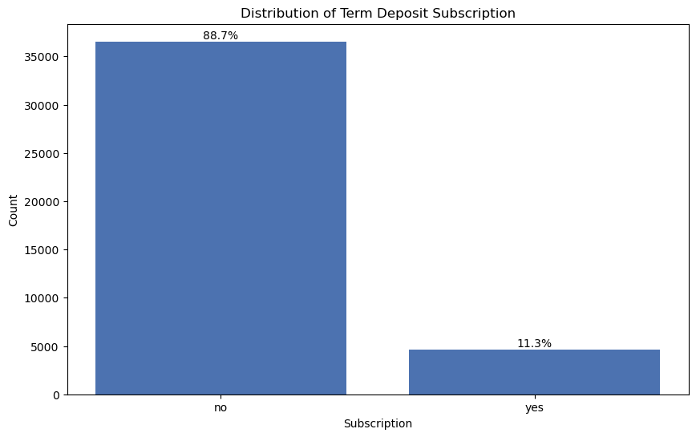
    


    
    Target Variable Distribution:
    y
    no     88.73%
    yes    11.27%
    Name: proportion, dtype: object
    


```python
# Step 3: Numerical Features Analysis
def analyze_numerical_features(df):
    # Get numerical features
    numerical_features = df.select_dtypes(include=['int64', 'float64']).columns
    print("\nNumerical Features:", numerical_features.tolist())
    
    # Create distribution plots
    num_features = len(numerical_features)
    num_rows = (num_features + 1) // 2
    
    fig, axes = plt.subplots(num_rows, 2, figsize=(20, num_rows * 5))
    axes = axes.flatten()
    
    for i, feature in enumerate(numerical_features):
        # Plot histogram with KDE
        sns.histplot(data=df, x=feature, kde=True, ax=axes[i])
        axes[i].set_title(f'Distribution of {feature}')
        
        # Add descriptive statistics
        mean_val = df[feature].mean()
        median_val = df[feature].median()
        axes[i].axvline(mean_val, color='r', linestyle='--', 
                       label=f'Mean: {mean_val:.2f}')
        axes[i].axvline(median_val, color='g', linestyle='--', 
                       label=f'Median: {median_val:.2f}')
        axes[i].legend()
    
    # Remove empty subplots
    for j in range(i + 1, len(axes)):
        fig.delaxes(axes[j])
    
    plt.tight_layout()
    plt.savefig('../reports/figures/Task_1/numerical_features_distribution.png')
    plt.show()
    plt.close()
    
    # Print summary statistics
    print("\nNumerical Features Summary Statistics:")
    print(df[numerical_features].describe())

analyze_numerical_features(df)
```

    
    Numerical Features: ['age', 'duration', 'campaign', 'pdays', 'previous', 'emp.var.rate', 'cons.price.idx', 'cons.conf.idx', 'euribor3m', 'nr.employed']
    


    
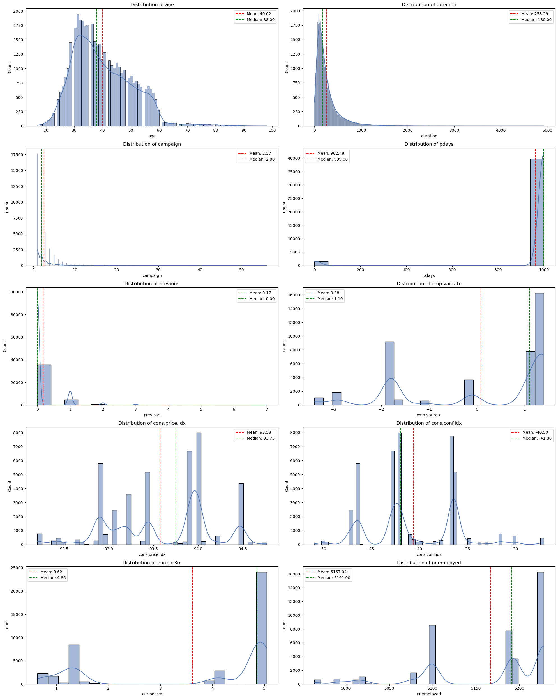
    


    
    Numerical Features Summary Statistics:
                   age      duration      campaign         pdays      previous  \
    count  41188.00000  41188.000000  41188.000000  41188.000000  41188.000000   
    mean      40.02406    258.285010      2.567593    962.475454      0.172963   
    std       10.42125    259.279249      2.770014    186.910907      0.494901   
    min       17.00000      0.000000      1.000000      0.000000      0.000000   
    25%       32.00000    102.000000      1.000000    999.000000      0.000000   
    50%       38.00000    180.000000      2.000000    999.000000      0.000000   
    75%       47.00000    319.000000      3.000000    999.000000      0.000000   
    max       98.00000   4918.000000     56.000000    999.000000      7.000000   
    
           emp.var.rate  cons.price.idx  cons.conf.idx     euribor3m   nr.employed  
    count  41188.000000    41188.000000   41188.000000  41188.000000  41188.000000  
    mean       0.081886       93.575664     -40.502600      3.621291   5167.035911  
    std        1.570960        0.578840       4.628198      1.734447     72.251528  
    min       -3.400000       92.201000     -50.800000      0.634000   4963.600000  
    25%       -1.800000       93.075000     -42.700000      1.344000   5099.100000  
    50%        1.100000       93.749000     -41.800000      4.857000   5191.000000  
    75%        1.400000       93.994000     -36.400000      4.961000   5228.100000  
    max        1.400000       94.767000     -26.900000      5.045000   5228.100000  
    


```python
# Step 4: Categorical Features Analysis
def analyze_categorical_features(df):
    # Get categorical features
    categorical_features = df.select_dtypes(include=['object']).columns
    print("\nCategorical Features:", categorical_features.tolist())
    
    # Create distribution plots
    for feature in categorical_features:
        plt.figure(figsize=(12, 6))
        
        # Create count plot
        sns.countplot(y=df[feature], order=df[feature].value_counts().index)
        plt.title(f'Distribution of {feature}')
        
        # Add percentage labels
        total = len(df)
        for p in plt.gca().patches:
            percentage = 100 * p.get_width()/total
            plt.gca().annotate(f'{percentage:.1f}%', 
                             (p.get_width(), p.get_y()+p.get_height()/2),
                             ha='left', va='center')
        
        plt.tight_layout()
        plt.savefig(f'../reports/figures/Task_1/categorical_{feature}_distribution.png')
        plt.show()
        plt.close()
        
        # Print value counts and percentages
        print(f"\nDistribution of {feature}:")
        print(df[feature].value_counts(normalize=True).mul(100).round(2).astype(str) + '%')

analyze_categorical_features(df)
```

    
    Categorical Features: ['job', 'marital', 'education', 'default', 'housing', 'loan', 'contact', 'month', 'day_of_week', 'poutcome', 'y']
    


    
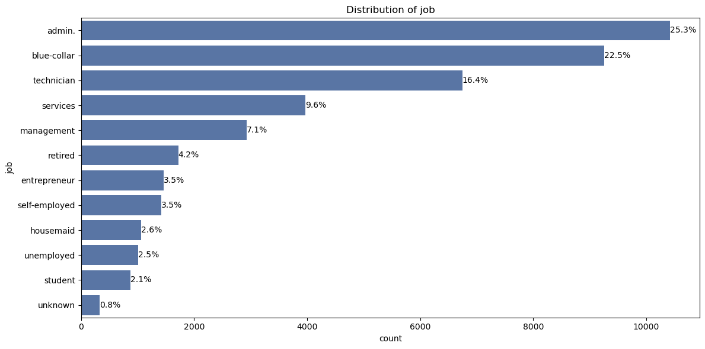
    


    
    Distribution of job:
    job
    admin.            25.3%
    blue-collar      22.47%
    technician       16.37%
    services          9.64%
    management         7.1%
    retired           4.18%
    entrepreneur      3.54%
    self-employed     3.45%
    housemaid         2.57%
    unemployed        2.46%
    student           2.12%
    unknown            0.8%
    Name: proportion, dtype: object
    


    
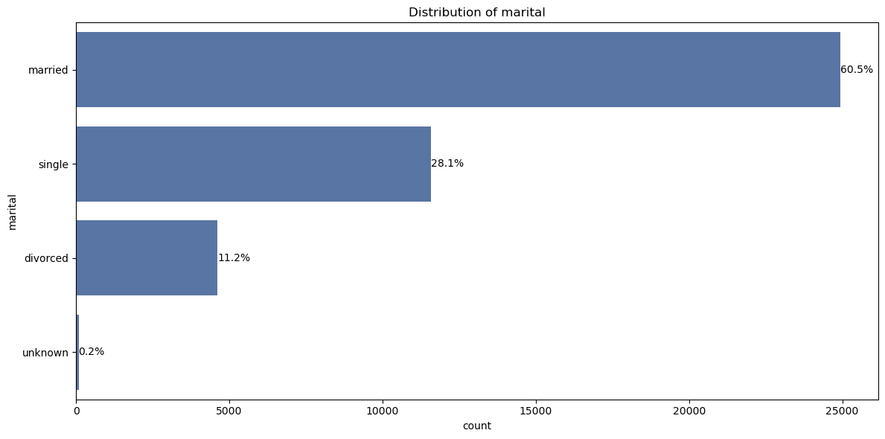
    


    
    Distribution of marital:
    marital
    married     60.52%
    single      28.09%
    divorced     11.2%
    unknown      0.19%
    Name: proportion, dtype: object
    


    
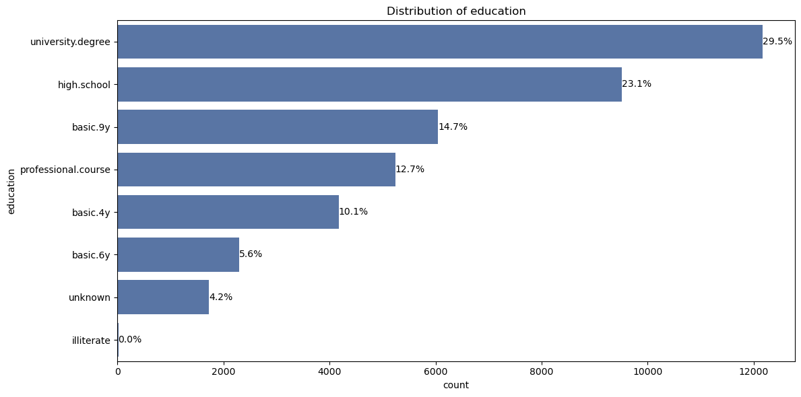
    


    
    Distribution of education:
    education
    university.degree      29.54%
    high.school             23.1%
    basic.9y               14.68%
    professional.course    12.73%
    basic.4y               10.14%
    basic.6y                5.56%
    unknown                  4.2%
    illiterate              0.04%
    Name: proportion, dtype: object
    


    
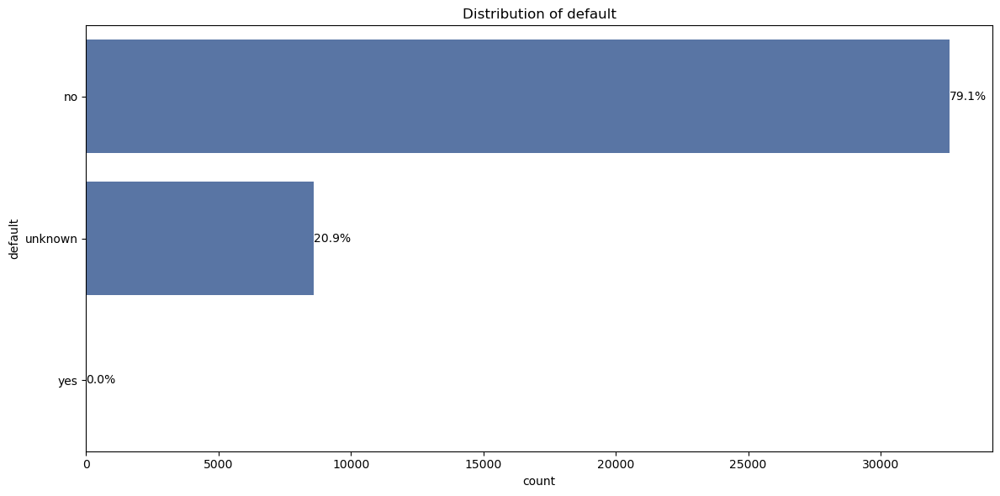
    


    
    Distribution of default:
    default
    no         79.12%
    unknown    20.87%
    yes         0.01%
    Name: proportion, dtype: object
    


    
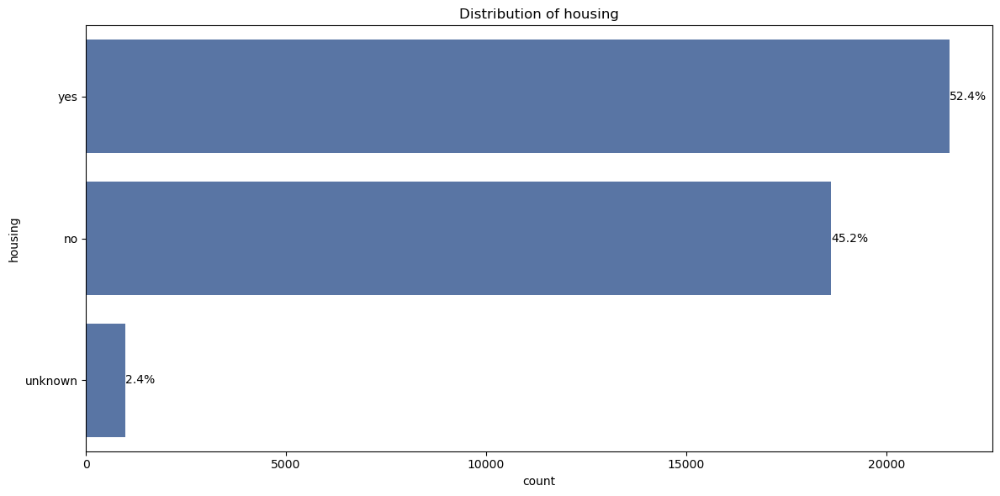
    


    
    Distribution of housing:
    housing
    yes        52.38%
    no         45.21%
    unknown      2.4%
    Name: proportion, dtype: object
    


    
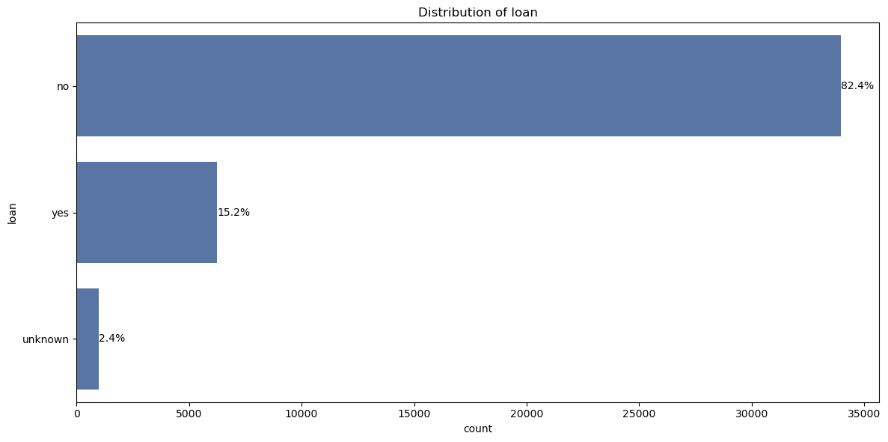
    


    
    Distribution of loan:
    loan
    no         82.43%
    yes        15.17%
    unknown      2.4%
    Name: proportion, dtype: object
    


    
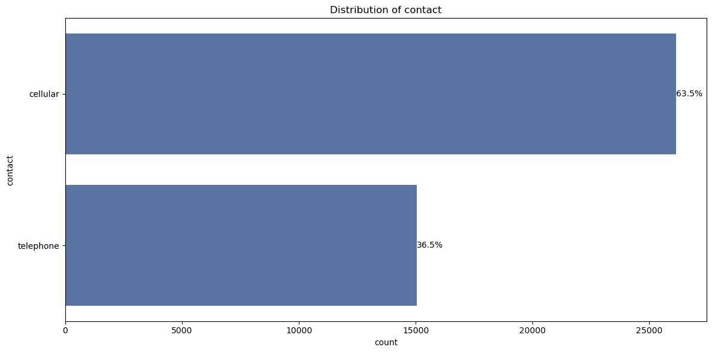
    


    
    Distribution of contact:
    contact
    cellular     63.47%
    telephone    36.53%
    Name: proportion, dtype: object
    


    
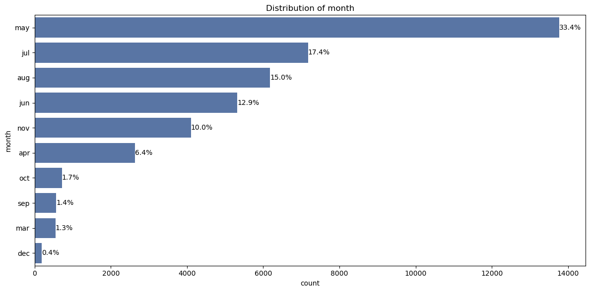
    


    
    Distribution of month:
    month
    may    33.43%
    jul    17.42%
    aug     15.0%
    jun    12.91%
    nov     9.96%
    apr     6.39%
    oct     1.74%
    sep     1.38%
    mar     1.33%
    dec     0.44%
    Name: proportion, dtype: object
    


    
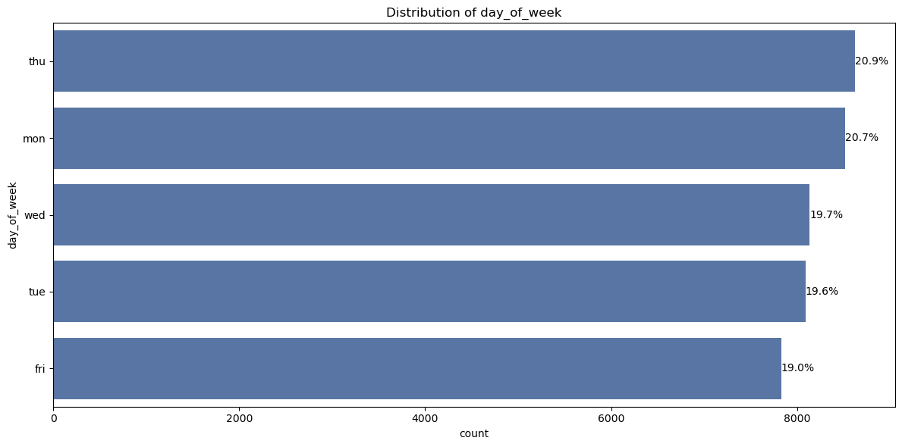
    


    
    Distribution of day_of_week:
    day_of_week
    thu    20.94%
    mon    20.67%
    wed    19.75%
    tue    19.64%
    fri     19.0%
    Name: proportion, dtype: object
    


    
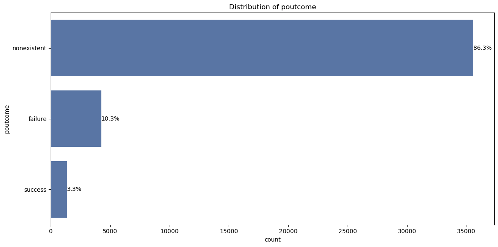
    


    
    Distribution of poutcome:
    poutcome
    nonexistent    86.34%
    failure        10.32%
    success         3.33%
    Name: proportion, dtype: object
    


    
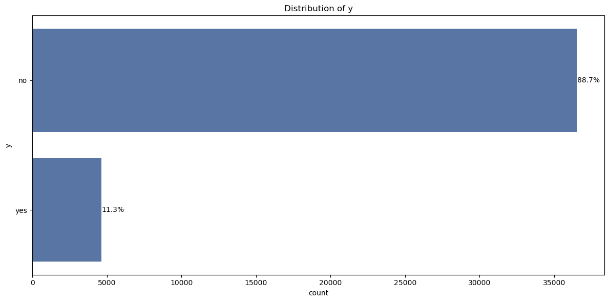
    


    
    Distribution of y:
    y
    no     88.73%
    yes    11.27%
    Name: proportion, dtype: object
    


```python
# Step 5: Correlation Analysis
def analyze_correlations(df):
    # Numerical correlations
    numerical_features = df.select_dtypes(include=['int64', 'float64']).columns
    correlation_matrix = df[numerical_features].corr()
    
    plt.figure(figsize=(12, 8))
    sns.heatmap(correlation_matrix, annot=True, cmap='Blues', fmt='.2f')
    plt.title('Correlation Matrix of Numerical Features')
    plt.savefig('../reports/figures/Task_1/correlation_matrix.png')
    plt.show()
    plt.close()
    
    # Print strong correlations
    print("\nStrong Correlations (|correlation| > 0.5):")
    strong_corr = []
    for i in range(len(correlation_matrix.columns)):
        for j in range(i):
            if abs(correlation_matrix.iloc[i, j]) > 0.5:
                strong_corr.append(f"{correlation_matrix.columns[i]} - "
                                 f"{correlation_matrix.columns[j]}: "
                                 f"{correlation_matrix.iloc[i, j]:.2f}")
    for corr in strong_corr:
        print(corr)

analyze_correlations(df)
```


    
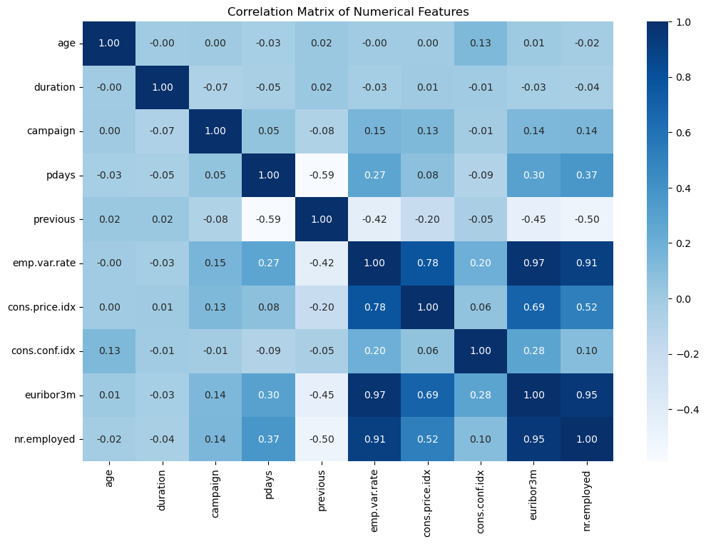
    


    
    Strong Correlations (|correlation| > 0.5):
    previous - pdays: -0.59
    cons.price.idx - emp.var.rate: 0.78
    euribor3m - emp.var.rate: 0.97
    euribor3m - cons.price.idx: 0.69
    nr.employed - previous: -0.50
    nr.employed - emp.var.rate: 0.91
    nr.employed - cons.price.idx: 0.52
    nr.employed - euribor3m: 0.95
    

### 3. Data Preparation

##### - The are features that are not label or do not have a definition in the documentation of the dataset.
##### - Therefore, in this steps the features that are not documented in the dataset will be drop from the dataset and keep the data features that had been labeled.
##### - The `duration` feature, the documentation specifically mentions that should be removed for a realistic predictive model. Since the data is known after a called is performed.

#### 3.1 Feature selection based on documentation.


```python
def select_documented_features(df):
    """
    Select only the features documented in the dataset description.
    
    Parameters:
        df (pd.DataFrame): Original dataset
    Returns:
        pd.DataFrame: Dataset with only documented features
    """
    features_to_keep = [
        # Bank client data
        'age', 'job', 'marital', 'education', 'default', 'housing', 'loan',
        
        # Campaign related
        'contact', 'day_of_week', 'month', 'campaign', 'pdays', 'previous', 'poutcome',
        
        # Target
        'y'
    ]
    
    df_clean = df[features_to_keep].copy()
    print("Clean dataset shape:", df_clean.shape)
    print("\nFeatures kept:")
    for col in df_clean.columns:
        print(f"- {col}")
        
    return df_clean

# Create initial clean dataset
df_clean = select_documented_features(df)
```

    Clean dataset shape: (41188, 15)
    
    Features kept:
    - age
    - job
    - marital
    - education
    - default
    - housing
    - loan
    - contact
    - day_of_week
    - month
    - campaign
    - pdays
    - previous
    - poutcome
    - y
    

#### 3.2 Feature Type Organization


```python
def organize_features(df):
    """
    Organize features by their types for preprocessing.
    
    Parameters:
        df (pd.DataFrame): Input dataset
    Returns:
        dict: Dictionary containing feature groups
    """
    feature_groups = {
        'categorical_features': [
            'job',        # Occupation type
            'marital',    # Marital status
            'education',  # Education level
            'contact',    # Contact type
            'poutcome',   # Previous campaign outcome
            'season',     # Will be created from month
            'age_group'   # Will be created from age
        ],
        'numerical_features': [
            'campaign_log'  # Will be created from campaign
        ],
        'binary_features': [
            'default',      # Credit in default
            'housing',      # Housing loan
            'loan',        # Personal loan
            'housing_unknown',  # Will be created
            'loan_unknown',     # Will be created
        ],
        'date_features': [
            'month',
            'day_of_week'
        ],
        'special_features': [
            'pdays',
            'previous'
        ],
        'target': 'y'
    }
    
    return feature_groups

feature_groups = organize_features(df_clean)
```

#### 3.3 Data Prepocessing Steps


```python
# Step 1: Handle Binary Features
def process_binary_features(df, binary_features):
    """
    Process binary features by handling unknown values.
    
    Parameters:
        df (pd.DataFrame): Input dataset
        binary_features (list): List of binary features
    Returns:
        pd.DataFrame: Dataset with processed binary features
    """
    df_processed = df.copy()
    
    for feature in binary_features:
        # Create unknown flag
        df_processed[f'{feature}_unknown'] = (df_processed[feature] == 'unknown').astype(int)
        # Replace unknown with mode
        df_processed[feature] = df_processed[feature].replace('unknown', df_processed[feature].mode()[0])
        # Convert to numeric
        le = LabelEncoder()
        df_processed[feature] = le.fit_transform(df_processed[feature])
        
    return df_processed

# Apply binary feature processing
df_processed = process_binary_features(df_clean, ['default', 'housing', 'loan'])
print("Binary features processed. Shape:", df_processed.shape)
```

    Binary features processed. Shape: (41188, 18)
    


```python
# Step 2: Process Contact History
def process_contact_history(df):
    """
    Create contact history feature from pdays and previous.
    
    Parameters:
        df (pd.DataFrame): Input dataset
    Returns:
        pd.DataFrame: Dataset with contact history feature
    """
    df_processed = df.copy()
    
    # Create binary flags
    df_processed['previously_contacted'] = (df_processed['pdays'] != 999).astype(int)
    df_processed['had_previous_contact'] = (df_processed['previous'] > 0).astype(int)
    
    # Create combined feature
    df_processed['contact_history'] = df_processed.apply(
        lambda x: 2 if (x['previously_contacted'] == 1 and x['had_previous_contact'] == 1)
        else 1 if (x['previously_contacted'] == 1 or x['had_previous_contact'] == 1)
        else 0, axis=1
    )
    
    # Drop original features
    df_processed = df_processed.drop(['pdays', 'previous', 'previously_contacted', 'had_previous_contact'], axis=1)
    
    return df_processed

df_processed = process_contact_history(df_processed)
print("Contact history feature created. Shape:", df_processed.shape)
```

    Contact history feature created. Shape: (41188, 17)
    


```python
# Step 3: Process Categorical Features
def process_categorical_features(df):
   """
   Process categorical features by combining categories and handling groups.
   
   Parameters:
       df (pd.DataFrame): Input dataset
   Returns:
       pd.DataFrame: Dataset with processed categorical features
   """
   df_processed = df.copy()
   
   # Education: Combine basic education levels
   education_mapping = {
       'basic.4y': 'basic',
       'basic.6y': 'basic', 
       'basic.9y': 'basic',
       'illiterate': 'basic'
   }
   df_processed['education'] = df_processed['education'].replace(education_mapping)
   
   # Job: Group low-frequency categories
   job_counts = df_processed['job'].value_counts()
   low_freq_jobs = job_counts[job_counts < 1000].index
   df_processed['job'] = df_processed['job'].replace(
       {job: 'other' for job in low_freq_jobs}
   )
   
   return df_processed

df_processed = process_categorical_features(df_processed)
print("Categorical features processed. Shape:", df_processed.shape)
```

    Categorical features processed. Shape: (41188, 17)
    


```python
# Step 4: Process Date Features
def process_date_features(df):
    """
    Process date features by creating seasonal and day-type features.
    
    Parameters:
        df (pd.DataFrame): Input dataset
    Returns:
        pd.DataFrame: Dataset with processed date features
    """
    df_processed = df.copy()
    
    # Create seasons from months
    season_mapping = {
        'mar': 'spring', 'apr': 'spring', 'may': 'spring',
        'jun': 'summer', 'jul': 'summer', 'aug': 'summer',
        'sep': 'autumn', 'oct': 'autumn', 'nov': 'autumn',
        'dec': 'winter'
    }
    df_processed['season'] = df_processed['month'].map(season_mapping)
    
    # Create day type features
    df_processed['is_weekstart'] = df_processed['day_of_week'].isin(['mon', 'tue']).astype(int)
    df_processed['is_weekmid'] = df_processed['day_of_week'].isin(['wed', 'thu']).astype(int)
    df_processed['is_weekend'] = df_processed['day_of_week'].isin(['fri']).astype(int)
    
    # Drop original date features
    df_processed = df_processed.drop(['month', 'day_of_week'], axis=1)
    
    return df_processed

df_processed = process_date_features(df_processed)
print("Date features processed. Shape:", df_processed.shape)
```

    Date features processed. Shape: (41188, 19)
    


```python
# Step 5: Process Numerical Features
def process_numerical_features(df):
    """
    Process numerical features by creating age groups and transforming campaign.
    
    Parameters:
        df (pd.DataFrame): Input dataset
    Returns:
        pd.DataFrame: Dataset with processed numerical features
    """
    df_processed = df.copy()
    
    # Create age groups
    df_processed['age_group'] = pd.cut(
        df_processed['age'],
        bins=[0, 25, 35, 45, 55, np.inf],
        labels=['young', 'young_adult', 'adult', 'senior', 'elderly']
    )
    
    # Log transform campaign
    df_processed['campaign_log'] = np.log1p(df_processed['campaign'])
    
    # Drop original numerical features
    df_processed = df_processed.drop(['age', 'campaign'], axis=1)
    
    return df_processed

df_processed = process_numerical_features(df_processed)
print("Numerical features processed. Shape:", df_processed.shape)
```

    Numerical features processed. Shape: (41188, 19)
    


```python
# Step 6: Final Pipeline Setup
def create_preprocessing_pipeline(df_processed):
    """
    Create the final preprocessing pipeline.
    
    Parameters:
        df_processed (pd.DataFrame): Processed dataset
    Returns:
        tuple: Preprocessor, feature lists, and feature information
    """
    # Define final feature groups
    categorical_features = [
        'job', 'marital', 'education', 'contact', 'poutcome', 
        'season', 'age_group'
    ]
    
    numerical_features = ['campaign_log']
    
    binary_features = [
        'default', 'housing', 'loan', 
        'housing_unknown', 'loan_unknown',
        'is_weekstart', 'is_weekmid', 'is_weekend',
        'contact_history'
    ]
    
    # Create transformers
    numeric_transformer = StandardScaler()
    categorical_transformer = OneHotEncoder(drop='first', sparse_output=False)
    
    # Create preprocessor
    preprocessor = ColumnTransformer(
        transformers=[
            ('num', numeric_transformer, numerical_features),
            ('cat', categorical_transformer, categorical_features)
        ],
        remainder='passthrough'  # Keep binary features as is
    )
    
    # Save feature information
    feature_info = {
        'categorical_features': categorical_features,
        'numerical_features': numerical_features,
        'binary_features': binary_features
    }
    
    return preprocessor, feature_info

preprocessor, feature_info = create_preprocessing_pipeline(df_processed)
```


```python
# Step 7: Save Processed Data
import json


def save_processed_data(df_processed, feature_info):
    """
    Save the processed data and feature information.
    
    Parameters:
        df_processed (pd.DataFrame): Processed dataset
        feature_info (dict): Feature group information
    """
    # Save processed dataset
    df_processed.to_csv('../data/Task_1_processed/processed_data.csv', index=False)
    
    # Save feature information
    with open('../data/Task_1_processed/feature_info.json', 'w') as f:
        json.dump(feature_info, f, indent=4)
    
    print("\nProcessing completed and saved!")
    print(f"Final dataset shape: {df_processed.shape}")
    print("\nFeature counts:")
    for feature_type, features in feature_info.items():
        print(f"{feature_type}: {len(features)}")

# Save the processed data
save_processed_data(df_processed, feature_info)
```

    
    Processing completed and saved!
    Final dataset shape: (41188, 19)
    
    Feature counts:
    categorical_features: 7
    numerical_features: 1
    binary_features: 9
    


```python
def validate_preprocessing(df_original, df_processed, feature_info):
    """
    Validate the preprocessing results with multiple checks.
    
    Parameters:
        df_original (pd.DataFrame): Original dataset
        df_processed (pd.DataFrame): Processed dataset
        feature_info (dict): Feature information dictionary
    Returns:
        bool: True if all validations pass
    """
    print("Running Preprocessing Validation Checks...")
    validation_results = []
    
    # 1. Basic Data Validation
    print("\n1. Basic Data Validation:")
    rows_match = len(df_original) == len(df_processed)
    print(f"Row count preserved: {rows_match}")
    validation_results.append(rows_match)
    
    has_nulls = df_processed.isnull().any().any()
    print(f"No missing values: {not has_nulls}")
    validation_results.append(not has_nulls)
    
    # 2. Feature Type Validation
    print("\n2. Feature Type Validation:")
    all_expected_features = (
        feature_info['categorical_features'] + 
        feature_info['numerical_features'] + 
        feature_info['binary_features']
    )
    features_present = all(f in df_processed.columns for f in all_expected_features)
    print(f"All expected features present: {features_present}")
    validation_results.append(features_present)
    
    # 3. Binary and Categorical Features Validation
    print("\n3. Feature Value Validation:")
    
    # Modified to handle contact_history separately
    for feature in feature_info['binary_features']:
        if feature == 'contact_history':
            valid_values = df_processed[feature].isin([0, 1, 2]).all()
            print(f"{feature} has valid values (0,1,2): {valid_values}")
            validation_results.append(valid_values)
        else:
            unique_values = df_processed[feature].unique()
            is_binary = len(unique_values) == 2 and set(unique_values).issubset({0, 1})
            print(f"{feature} is binary (0/1): {is_binary}")
            validation_results.append(is_binary)
    
    # 4. Categorical Features Validation
    print("\n4. Categorical Features Validation:")
    for feature in feature_info['categorical_features']:
        if feature == 'education':
            valid_categories = {'basic', 'high.school', 'university.degree', 
                              'professional.course', 'unknown'}
            actual_categories = set(df_processed[feature].unique())
            is_valid = actual_categories.issubset(valid_categories)
            print(f"{feature} has expected categories: {is_valid}")
            validation_results.append(is_valid)
    
    # 5. Numerical Features Validation
    print("\n5. Numerical Features Validation:")
    for feature in feature_info['numerical_features']:
        if feature == 'campaign_log':
            # Check if values are non-negative and finite
            is_valid = (df_processed[feature] >= 0).all() and np.isfinite(df_processed[feature]).all()
            print(f"{feature} has valid values: {is_valid}")
            validation_results.append(is_valid)
    
    # 6. Target Variable Validation
    print("\n6. Target Variable Validation:")
    original_target_dist = df_original['y'].value_counts(normalize=True)
    processed_target_dist = df_processed['y'].value_counts(normalize=True)
    target_preserved = np.allclose(original_target_dist, processed_target_dist)
    print(f"Target distribution preserved: {target_preserved}")
    validation_results.append(target_preserved)
    
    # 7. Data Quality Validation
    print("\n7. Data Quality Validation:")
    has_inf = np.isinf(df_processed.select_dtypes(include=np.number)).any().any()
    print(f"No infinite values: {not has_inf}")
    validation_results.append(not has_inf)
    
    categorical_check = True
    for feature in feature_info['categorical_features']:
        n_unique = df_processed[feature].nunique()
        if n_unique < 2:
            categorical_check = False
            print(f"Warning: {feature} has only {n_unique} unique values")
    print(f"Categorical features have sufficient unique values: {categorical_check}")
    validation_results.append(categorical_check)
    
    # Final Validation Result
    all_validations_passed = all(validation_results)
    print(f"\nFinal Validation Result: {'PASSED' if all_validations_passed else 'FAILED'}")
    print(f"Passed {sum(validation_results)}/{len(validation_results)} checks")
    
    return all_validations_passed

# Let's also fix the preprocessing steps that caused the validation failures:

def process_contact_history(df):
    """
    Create contact history feature from pdays and previous.
    Now ensures values are 0, 1, or 2.
    """
    df_processed = df.copy()
    
    # Create binary flags
    df_processed['previously_contacted'] = (df_processed['pdays'] != 999).astype(int)
    df_processed['had_previous_contact'] = (df_processed['previous'] > 0).astype(int)
    
    # Create combined feature ensuring only 0, 1, 2 values
    df_processed['contact_history'] = df_processed.apply(
        lambda x: 2 if (x['previously_contacted'] == 1 and x['had_previous_contact'] == 1)
        else 1 if (x['previously_contacted'] == 1 or x['had_previous_contact'] == 1)
        else 0, axis=1
    )
    
    # Verify values
    assert df_processed['contact_history'].isin([0, 1, 2]).all(), "Invalid contact_history values"
    
    # Drop original features
    df_processed = df_processed.drop(['pdays', 'previous', 'previously_contacted', 'had_previous_contact'], axis=1)
    
    return df_processed

def process_numerical_features(df):
    """
    Process numerical features with proper validation.
    """
    df_processed = df.copy()
    
    # Create age groups
    df_processed['age_group'] = pd.cut(
        df_processed['age'],
        bins=[0, 25, 35, 45, 55, np.inf],
        labels=['young', 'young_adult', 'adult', 'senior', 'elderly']
    )
    
    # Log transform campaign with validation
    campaign_values = df_processed['campaign']
    assert (campaign_values > 0).all(), "Campaign values must be positive"
    df_processed['campaign_log'] = np.log1p(campaign_values)
    
    # Drop original numerical features
    df_processed = df_processed.drop(['age', 'campaign'], axis=1)
    
    return df_processed
```


```python
# Rerun preprocessing with fixed functions
df_processed = process_binary_features(df_clean, ['default', 'housing', 'loan'])
df_processed = process_contact_history(df_processed)
df_processed = process_categorical_features(df_processed)
df_processed = process_date_features(df_processed)
df_processed = process_numerical_features(df_processed)

# Run validation again
validation_passed = validate_preprocessing(df, df_processed, feature_info)
```

    Running Preprocessing Validation Checks...
    
    1. Basic Data Validation:
    Row count preserved: True
    No missing values: True
    
    2. Feature Type Validation:
    All expected features present: True
    
    3. Feature Value Validation:
    default is binary (0/1): True
    housing is binary (0/1): True
    loan is binary (0/1): True
    housing_unknown is binary (0/1): True
    loan_unknown is binary (0/1): True
    is_weekstart is binary (0/1): True
    is_weekmid is binary (0/1): True
    is_weekend is binary (0/1): True
    contact_history has valid values (0,1,2): True
    
    4. Categorical Features Validation:
    education has expected categories: True
    
    5. Numerical Features Validation:
    campaign_log has valid values: True
    
    6. Target Variable Validation:
    Target distribution preserved: True
    
    7. Data Quality Validation:
    No infinite values: True
    Categorical features have sufficient unique values: True
    
    Final Validation Result: PASSED
    Passed 17/17 checks
    


```python
# Display Preprocessed Dataset Overview
def display_preprocessed_summary(df_processed):
    """
    Display comprehensive summary of the preprocessed dataset.
    """
    print("1. Preprocessed Dataset Overview")
    print("-" * 50)
    print(f"Dataset Shape: {df_processed.shape}")
    print("\nFeature Types:")
    print(df_processed.dtypes)
    
    print("\n2. Feature Distributions")
    print("-" * 50)
    
    # Categorical Features
    print("\nCategorical Features:")
    categorical_cols = df_processed.select_dtypes(include=['object']).columns
    for col in categorical_cols:
        print(f"\n{col}:")
        print(df_processed[col].value_counts(normalize=True).round(3) * 100, "%")
    
    # Numerical Features
    print("\nNumerical Features:")
    numerical_cols = df_processed.select_dtypes(include=['float64', 'int64']).columns
    print(df_processed[numerical_cols].describe())
    
    # Binary Features
    print("\nBinary Features:")
    binary_cols = [col for col in numerical_cols 
                  if set(df_processed[col].unique()).issubset({0, 1, 2})]
    for col in binary_cols:
        print(f"\n{col}:")
        print(df_processed[col].value_counts(normalize=True).round(3) * 100, "%")

display_preprocessed_summary(df_processed)
```

    1. Preprocessed Dataset Overview
    --------------------------------------------------
    Dataset Shape: (41188, 19)
    
    Feature Types:
    job                  object
    marital              object
    education            object
    default               int32
    housing               int32
    loan                  int32
    contact              object
    poutcome             object
    y                    object
    default_unknown       int32
    housing_unknown       int32
    loan_unknown          int32
    contact_history       int64
    season               object
    is_weekstart          int32
    is_weekmid            int32
    is_weekend            int32
    age_group          category
    campaign_log        float64
    dtype: object
    
    2. Feature Distributions
    --------------------------------------------------
    
    Categorical Features:
    
    job:
    job
    admin.           25.3
    blue-collar      22.5
    technician       16.4
    services          9.6
    management        7.1
    retired           4.2
    entrepreneur      3.5
    self-employed     3.5
    other             2.9
    housemaid         2.6
    unemployed        2.5
    Name: proportion, dtype: float64 %
    
    marital:
    marital
    married     60.5
    single      28.1
    divorced    11.2
    unknown      0.2
    Name: proportion, dtype: float64 %
    
    education:
    education
    basic                  30.4
    university.degree      29.5
    high.school            23.1
    professional.course    12.7
    unknown                 4.2
    Name: proportion, dtype: float64 %
    
    contact:
    contact
    cellular     63.5
    telephone    36.5
    Name: proportion, dtype: float64 %
    
    poutcome:
    poutcome
    nonexistent    86.3
    failure        10.3
    success         3.3
    Name: proportion, dtype: float64 %
    
    y:
    y
    no     88.7
    yes    11.3
    Name: proportion, dtype: float64 %
    
    season:
    season
    summer    45.3
    spring    41.1
    autumn    13.1
    winter     0.4
    Name: proportion, dtype: float64 %
    
    Numerical Features:
           contact_history  campaign_log
    count     41188.000000  41188.000000
    mean          0.173351      1.118991
    std           0.465694      0.491402
    min           0.000000      0.693147
    25%           0.000000      0.693147
    50%           0.000000      1.098612
    75%           0.000000      1.386294
    max           2.000000      4.043051
    
    Binary Features:
    
    contact_history:
    contact_history
    0    86.3
    1    10.0
    2     3.7
    Name: proportion, dtype: float64 %
    


```python
# Save Preprocessing State and Information
def save_preprocessing_state(df_processed, feature_info):
    """
    Save the preprocessed dataset and related information.
    """
    # Create directories if they don't exist
    os.makedirs('../data/Task_1_processed/model_ready', exist_ok=True)
    
    # Save preprocessed data
    df_processed.to_csv('../data/Task_1_processed/model_ready/preprocessed_data.csv', 
                       index=False)
    
    # Save feature information
    with open('../data/Task_1_processed/model_ready/feature_info_2.json', 'w') as f:
        json.dump(feature_info, f, indent=4)
        
    # Save data description
    with open('../data/Task_1_processed/model_ready/data_description.txt', 'w') as f:
        f.write("Preprocessed Dataset Description\n")
        f.write("=" * 30 + "\n\n")
        f.write(f"Number of samples: {len(df_processed)}\n")
        f.write(f"Number of features: {len(df_processed.columns)-1}\n\n")
        f.write("Feature Types:\n")
        for feature_type, features in feature_info.items():
            f.write(f"\n{feature_type}:\n")
            for feature in features:
                f.write(f"- {feature}\n")

save_preprocessing_state(df_processed, feature_info)
```

### 4.Data Modelling

#### 4.1 Data Split Strategy


```python
# 4.1 Data Split Strategy
def create_model_splits(df_processed, test_size=0.2, random_state=42):
    """
    Create two independent sets:
    - Set A (80%): For model development (will be split into train/val/test)
    - Set B (20%): For final evaluation only
    
    Parameters:
        df_processed: Preprocessed dataframe
        test_size: Size of final holdout set
        random_state: For reproducibility
    """
    
    # Encode target variable
    label_encoder = LabelEncoder()
    df_processed = df_processed.copy()
    df_processed['y'] = label_encoder.fit_transform(df_processed['y'])
    
    # First split: Separate development set and final evaluation set
    df_development, df_evaluation = train_test_split(
        df_processed,
        test_size=test_size,
        random_state=random_state,
        stratify=df_processed['y']
    )
    
    # Second split: Split development set into train, validation, and test
    # First, separate features and target
    X_dev = df_development.drop('y', axis=1)
    y_dev = df_development['y']
    
    # Split into train and temp
    X_train, X_temp, y_train, y_temp = train_test_split(
        X_dev, 
        y_dev,
        test_size=0.3,  # 70% for training
        random_state=random_state,
        stratify=y_dev
    )
    
    # Split temp into validation and test
    X_val, X_test, y_val, y_test = train_test_split(
        X_temp,
        y_temp,
        test_size=0.5,  # Split remaining 30% equally
        random_state=random_state,
        stratify=y_temp
    )
    
    # Save final evaluation set separately
    X_eval = df_evaluation.drop('y', axis=1)
    y_eval = df_evaluation['y']
    
    # Print split sizes
    print("Data Split Sizes:")
    print(f"Training set: {len(X_train)} samples")
    print(f"Validation set: {len(X_val)} samples")
    print(f"Test set: {len(X_test)} samples")
    print(f"Final evaluation set: {len(X_eval)} samples")
    
    return {
        'development': {
            'train': (X_train, y_train),
            'val': (X_val, y_val),
            'test': (X_test, y_test)
        },
        'evaluation': (X_eval, y_eval)
    }

# Create the splits
splits = create_model_splits(df_processed)
```

    Data Split Sizes:
    Training set: 23065 samples
    Validation set: 4942 samples
    Test set: 4943 samples
    Final evaluation set: 8238 samples
    


```python
# 4.2 Create Preprocessing Pipeline for Models
def create_model_pipeline(categorical_features, numerical_features):
    """
    Create preprocessing pipeline for model features.
    """
    # Create preprocessor
    preprocessor = ColumnTransformer(
        transformers=[
            ('num', StandardScaler(), numerical_features),
            ('cat', OneHotEncoder(drop='first', sparse_output=False), 
             categorical_features)
        ],
        remainder='passthrough'  # Keep other features as is
    )
    
    return preprocessor

# Create pipeline for our features
preprocessor = create_model_pipeline(
    categorical_features=feature_info['categorical_features'],
    numerical_features=feature_info['numerical_features']
)
```


```python
# 4.3 Model Selection and Training
from sklearn.ensemble import RandomForestClassifier
from sklearn.linear_model import LogisticRegression
from sklearn.metrics import accuracy_score, precision_score, recall_score, f1_score
from sklearn.model_selection import cross_val_score

def train_and_evaluate_model(model, X_train, y_train, X_val, y_val, preprocessor):
    """
    Train model and evaluate on validation set.
    """
    # Create pipeline
    pipeline = Pipeline([
        ('preprocessor', preprocessor),
        ('classifier', model)
    ])
    
    # Train model
    pipeline.fit(X_train, y_train)
    
    # Make predictions
    y_pred = pipeline.predict(X_val)
    
    # Calculate metrics
    metrics = {
        'accuracy': accuracy_score(y_val, y_pred),
        'precision': precision_score(y_val, y_pred, pos_label=1),
        'recall': recall_score(y_val, y_pred, pos_label=1),
        'f1': f1_score(y_val, y_pred, pos_label=1)
    }
    
    return pipeline, metrics

# Train multiple models
models = {
    'random_forest': RandomForestClassifier(random_state=42),
    'logistic_regression': LogisticRegression(random_state=42)
}

model_results = {}
for name, model in models.items():
    print(f"\nTraining {name}...")
    pipeline, metrics = train_and_evaluate_model(
        model,
        splits['development']['train'][0],
        splits['development']['train'][1],
        splits['development']['val'][0],
        splits['development']['val'][1],
        preprocessor
    )
    model_results[name] = {
        'pipeline': pipeline,
        'metrics': metrics
    }
    print(f"Validation metrics for {name}:")
    for metric, value in metrics.items():
        print(f"{metric}: {value:.4f}")
```

    
    Training random_forest...
    Validation metrics for random_forest:
    accuracy: 0.8766
    precision: 0.4036
    recall: 0.1993
    f1: 0.2668
    
    Training logistic_regression...
    Validation metrics for logistic_regression:
    accuracy: 0.8926
    precision: 0.5774
    recall: 0.1741
    f1: 0.2676
    

### 5.Evaluation


```python
# 4.2 Advanced Evaluation Metrics
from sklearn.metrics import roc_curve, precision_recall_curve, auc
import matplotlib.pyplot as plt
import seaborn as sns

def evaluate_model_performance(model, X, y, model_name):
    """
    Calculate and visualize advanced model performance metrics.
    
    Parameters:
        model: Trained model pipeline
        X: Features
        y: True labels
        model_name: Name of the model for plotting
    """
    # Get predictions and probabilities
    y_pred = model.predict(X)
    y_prob = model.predict_proba(X)[:, 1]
    
    # 1. ROC Curve
    fpr, tpr, _ = roc_curve(y, y_prob, pos_label=1)
    roc_auc = auc(fpr, tpr)
    
    plt.figure(figsize=(10, 6))
    plt.plot(fpr, tpr, label=f'ROC curve (AUC = {roc_auc:.2f})')
    plt.plot([0, 1], [0, 1], 'k--')
    plt.xlim([0.0, 1.0])
    plt.ylim([0.0, 1.05])
    plt.xlabel('False Positive Rate')
    plt.ylabel('True Positive Rate')
    plt.title(f'ROC Curve - {model_name}')
    plt.legend(loc="lower right")
    plt.savefig(f'../reports/figures/Task_1/{model_name}_roc_curve.png')
    plt.show()
    
    # 2. Precision-Recall Curve
    precision, recall, _ = precision_recall_curve(y, y_prob, pos_label=1)  # Specify pos_label
    pr_auc = auc(recall, precision)
    
    plt.figure(figsize=(10, 6))
    plt.plot(recall, precision, label=f'PR curve (AUC = {pr_auc:.2f})')
    plt.xlabel('Recall')
    plt.ylabel('Precision')
    plt.title(f'Precision-Recall Curve - {model_name}')
    plt.legend(loc="lower left")
    plt.savefig(f'../reports/figures/Task_1/{model_name}_pr_curve.png')
    plt.show()
    
    return {'roc_auc': roc_auc, 'pr_auc': pr_auc}

# Apply evaluation to each model
for name, model_dict in model_results.items():
    print(f"\nEvaluating {name}...")
    metrics = evaluate_model_performance(
        model_dict['pipeline'],
        splits['development']['test'][0],
        splits['development']['test'][1],
        name
    )
    model_results[name]['advanced_metrics'] = metrics
```

    
    Evaluating random_forest...
    


    
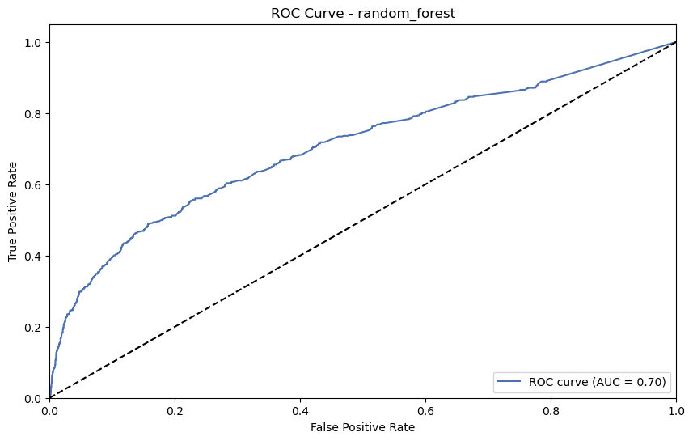
    


    
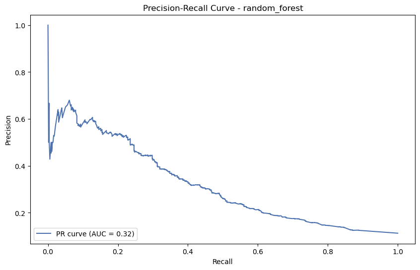
    


    
    Evaluating logistic_regression...
    


    
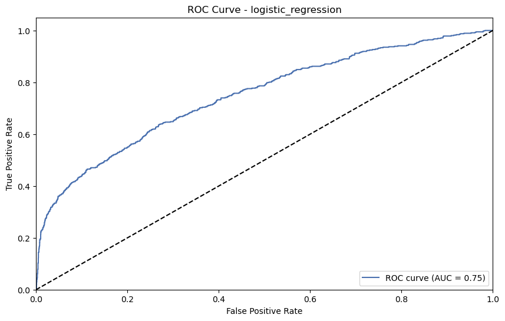
    


    
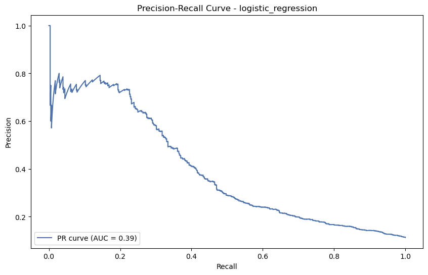
    


```python
# 4.3 Feature Importance Analysis
def analyze_feature_importance(model, preprocessor, feature_names, model_name):
    """
    Analyze and visualize feature importance.
    """
    if hasattr(model, 'feature_importances_'):
        # For tree-based models
        importances = model.feature_importances_
    else:
        # For linear models
        importances = np.abs(model.coef_[0])
    
    # Get feature names after preprocessing
    if hasattr(preprocessor, 'get_feature_names_out'):
        feature_names = preprocessor.get_feature_names_out()
    
    # Create importance dataframe
    importance_df = pd.DataFrame({
        'feature': feature_names,
        'importance': importances
    })
    importance_df = importance_df.sort_values('importance', ascending=False)
    
    # Plot feature importance
    plt.figure(figsize=(12, 6))
    sns.barplot(data=importance_df.head(15), x='importance', y='feature')
    plt.title(f'Top 15 Most Important Features - {model_name}')
    plt.xlabel('Importance')
    plt.ylabel('Feature')
    plt.tight_layout()
    plt.savefig(f'../reports/figures/Task_1/{model_name}_feature_importance.png')
    plt.show()
    
    return importance_df

# Analyze feature importance for each model
for name, model_dict in model_results.items():
    print(f"\nAnalyzing feature importance for {name}...")
    importance_df = analyze_feature_importance(
        model_dict['pipeline'].named_steps['classifier'],
        model_dict['pipeline'].named_steps['preprocessor'],
        feature_names = None,  # Will be determined by preprocessor
        model_name=name
    )
    model_results[name]['feature_importance'] = importance_df
```

    
    Analyzing feature importance for random_forest...
    


    
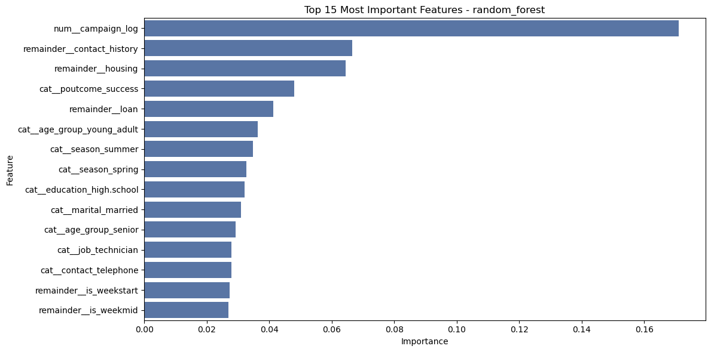
    


    
    Analyzing feature importance for logistic_regression...
    


    
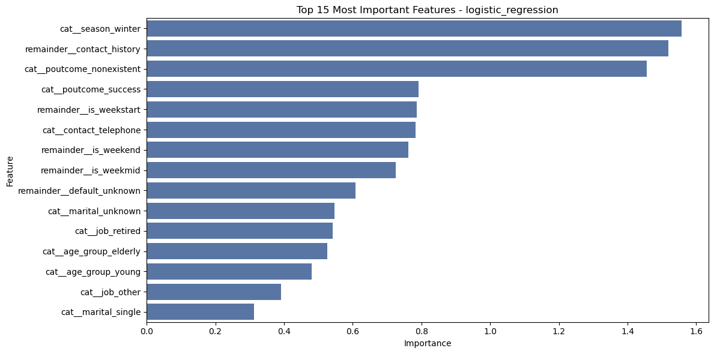
    


```python
# 4.4 Final Model Selection and Evaluation
def select_best_model(model_results):
    """
    Select the best model based on multiple metrics.
    """
    model_scores = {}
    for name, results in model_results.items():
        # Combine all metrics
        score = (results['metrics']['f1'] + 
                results['advanced_metrics']['roc_auc'] + 
                results['advanced_metrics']['pr_auc']) / 3
        model_scores[name] = score
    
    best_model = max(model_scores.items(), key=lambda x: x[1])[0]
    return best_model, model_scores

# Select best model
best_model_name, model_scores = select_best_model(model_results)
print("\nModel Comparison:")
for name, score in model_scores.items():
    print(f"{name}: {score:.4f}")
print(f"\nBest model: {best_model_name}")

# Final evaluation on holdout set
best_model = model_results[best_model_name]['pipeline']
X_eval, y_eval = splits['evaluation']

print("\nFinal Evaluation on Holdout Set:")
final_metrics = evaluate_model_performance(
    best_model,
    X_eval,
    y_eval,
    f"{best_model_name}_final"
)

# Save final model and results
import joblib
joblib.dump(best_model, f'../models/final_model.joblib')

# Create final evaluation report
evaluation_report = {
    'best_model': best_model_name,
    'model_comparisons': model_scores,
    'final_metrics': final_metrics,
    'feature_importance': model_results[best_model_name]['feature_importance'].to_dict()
}

# Save evaluation report
import json
with open('../reports/model_evaluation.json', 'w') as f:
    json.dump(evaluation_report, f, indent=4)
```

    
    Model Comparison:
    random_forest: 0.4287
    logistic_regression: 0.4700
    
    Best model: logistic_regression
    
    Final Evaluation on Holdout Set:
    


    
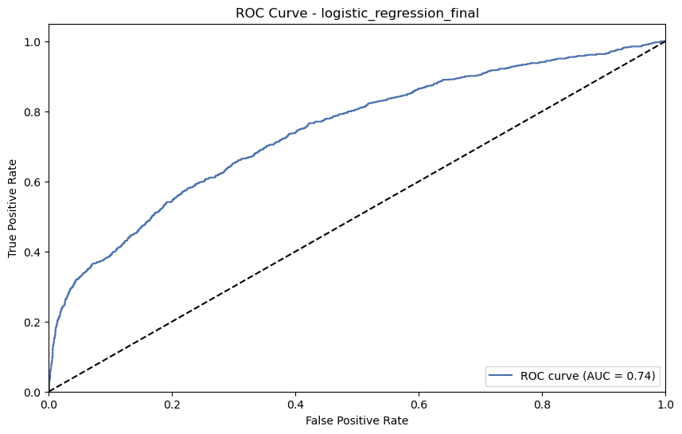
    


    
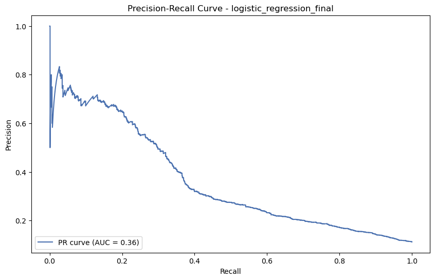
    

